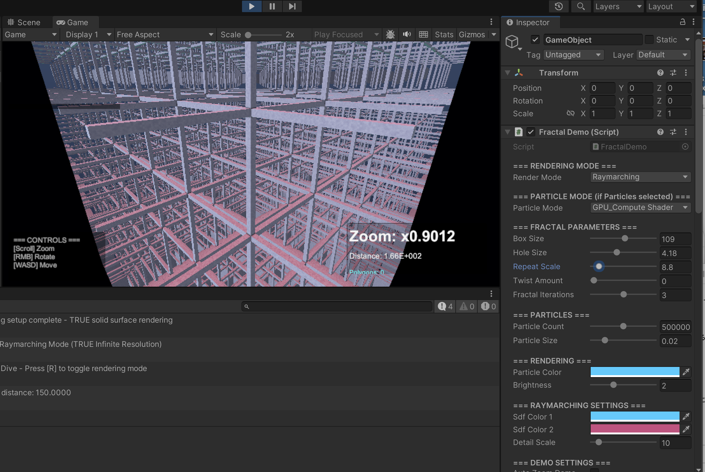

# ALICE-SDF

**A.L.I.C.E. - Adaptive Lightweight Implicit Compression Engine**

> "Don't send polygons. Send the law of shapes."

## Overview

ALICE-SDF is a 3D/spatial data specialist that transmits **mathematical descriptions of shapes** (Signed Distance Functions) instead of polygon meshes. This enables:

- **10-1000x compression** compared to traditional mesh formats
- **Infinite resolution** - shapes are mathematically perfect at any scale
- **CSG operations** - boolean operations on shapes without mesh overhead
- **Real-time raymarching** - GPU-accelerated rendering

## Core Concepts

### SDF (Signed Distance Function)

An SDF returns the shortest distance from any point to the surface:
- **Negative** = inside the shape
- **Zero** = on the surface
- **Positive** = outside the shape

### SdfNode Tree Structure

```
SdfNode
  ├─ Primitive: Sphere(r), Box(w,h,d), Cylinder(r,h), Torus(R,r), Plane(n,d), Capsule(a,b,r)
  ├─ Operation: Union, Intersection, Subtraction, SmoothUnion, SmoothIntersection, SmoothSubtraction
  ├─ Transform: Translate, Rotate, Scale
  └─ Modifier:  Twist, Bend, Repeat, Noise
```

## Installation

### Rust

```bash
cargo add alice-sdf
```

### Python

```bash
pip install alice-sdf
```

## Usage

### Rust

```rust
use alice_sdf::prelude::*;

// Create a sphere
let sphere = SdfNode::sphere(1.0);

// Create a box
let box3d = SdfNode::box3d(2.0, 1.0, 1.0);

// Subtract box from sphere
let result = sphere.subtract(box3d);

// Translate the result
let translated = result.translate(1.0, 0.0, 0.0);

// Evaluate SDF at a point
let distance = translated.eval(glam::Vec3::new(0.5, 0.0, 0.0));

// Convert to mesh (marching cubes)
let mesh = sdf_to_mesh(&translated, 0.1, (-2.0, 2.0));

// Save to file
save_asdf(&translated, "model.asdf")?;
save_asdf_json(&translated, "model.asdf.json")?;
```

### Python

```python
import alice_sdf as sdf

# Create primitives
sphere = sdf.sphere(1.0)
box3d = sdf.box3d(2.0, 1.0, 1.0)

# CSG operations
result = sdf.subtract(sphere, box3d)

# Transform
translated = sdf.translate(result, 1.0, 0.0, 0.0)

# Evaluate at points (NumPy array)
import numpy as np
points = np.array([[0.5, 0.0, 0.0], [1.0, 1.0, 1.0]], dtype=np.float32)
distances = sdf.eval_batch(translated, points)

# Convert to mesh
vertices, indices = sdf.to_mesh(translated, resolution=0.1, bounds=(-2.0, 2.0))

# Save/Load
sdf.save("model.asdf", translated)
loaded = sdf.load("model.asdf")
```

## File Formats

### .asdf (ALICE SDF Binary)

Compact binary format with CRC32 integrity check.

```
Header (16 bytes):
  - Magic: "ASDF" (4 bytes)
  - Version: u16 (2 bytes)
  - Flags: u16 (2 bytes)
  - Node count: u32 (4 bytes)
  - CRC32: u32 (4 bytes)

Body:
  - Bincode-serialized SdfTree
```

### .asdf.json (ALICE SDF JSON)

Human-readable JSON format for debugging and interoperability.

```json
{
  "version": "0.1.0",
  "root": {
    "type": "Subtract",
    "children": [
      { "type": "Sphere", "radius": 1.0 },
      { "type": "Box", "size": [2.0, 1.0, 1.0] }
    ]
  }
}
```

## Core Functions

| Function | Description |
|----------|-------------|
| `mesh_to_sdf()` | Convert polygon mesh to SDF tree |
| `sdf_to_mesh()` | Convert SDF to mesh via marching cubes |
| `sdf_eval()` | Evaluate distance at a point |
| `sdf_raycast()` | Raymarching for real-time rendering |

## Integration

### ALICE-View

ALICE-SDF integrates with ALICE-View for GPU-accelerated raymarching:

```rust
use alice_view::decode_asdf;

let content = decode_asdf("model.asdf")?;
viewer.render(content);
```

### ALICE-Zip

Use Perlin noise from ALICE-Zip for procedural deformation:

```rust
use alice_sdf::modifiers::NoiseModifier;

let noisy = sphere.modify(NoiseModifier::perlin(0.1, 42));
```

## Performance

Benchmarked on Apple M3 Max, Rust 1.75+, `--release` build.

### Single Point Evaluation

| Primitive | Time |
|-----------|------|
| Sphere | 6.1 ns |
| Box3D | 5.0 ns |
| Cylinder | 8.0 ns |
| Torus | 9.3 ns |

| Operation | Time |
|-----------|------|
| Union (2 nodes) | 13.3 ns |
| Smooth Union | 21.4 ns |
| Complex tree (5 nodes) | 12.6 ns |
| Complex tree (10 nodes) | 51.5 ns |
| Complex tree (20 nodes) | 66.5 ns |

### Batch Evaluation Comparison (1M points)

| Mode | Throughput | ns/point | Feature |
|------|------------|----------|---------|
| CPU JIT SIMD | 977 M/s | 1.0 ns | `--features jit` |
| CPU Scalar | 307 M/s | 3.3 ns | default |
| CPU SIMD (VM) | 252 M/s | 4.0 ns | default |
| GPU Compute | 101 M/s | 9.9 ns | `--features gpu` |

### JIT Compilation

The JIT compiler generates native SIMD machine code using Cranelift, achieving the highest throughput.

```bash
# Run CLI benchmark
cargo run --features "cli,jit" --release -- bench --points 1000000
```

| Points | JIT SIMD | SIMD (VM) | Speedup |
|--------|----------|-----------|---------|
| 100K | 330 M/s | 197 M/s | 1.7x |
| 1M | 977 M/s | 252 M/s | 3.9x |

### SIMD 8-wide Evaluation

| Mode | Time (8 points) | Speedup |
|------|-----------------|---------|
| Scalar | 563 ns | 1.0x |
| SIMD | 143 ns | 3.9x |

### Marching Cubes (Sphere, bounds ±2.0)

| Resolution | Time |
|------------|------|
| 16³ | 140 µs |
| 32³ | 390 µs |
| 64³ | 1.64 ms |

### Raymarching

| Shape | Time per ray |
|-------|--------------|
| Sphere | 62 ns |
| Complex (smooth union + twist) | 178 ns |

### GPU Compute (WebGPU)

The GPU module provides WebGPU compute shaders. Due to data transfer overhead, GPU is most effective for very large batches or when the CPU is busy with other tasks.

**When to use GPU vs CPU:**

| Batch Size | Recommended | Reason |
|------------|-------------|--------|
| < 100K | CPU JIT SIMD | GPU transfer overhead dominates |
| 100K - 1M | CPU JIT SIMD | JIT still faster on M3 Max |
| > 1M | Test both | Depends on hardware and shape complexity |

Note: GPU performance varies significantly by hardware. On discrete GPUs, crossover point may be lower.

```rust
use alice_sdf::prelude::*;
use alice_sdf::compiled::{GpuEvaluator, WgslShader};

let shape = SdfNode::sphere(1.0).smooth_union(SdfNode::box3d(0.5, 0.5, 0.5), 0.2);

// Create GPU evaluator (compiles SDF to WGSL)
let gpu = GpuEvaluator::new(&shape).unwrap();

// Evaluate batch of points on GPU
let points: Vec<Vec3> = (0..100000)
    .map(|i| Vec3::new(i as f32 * 0.01, 0.0, 0.0))
    .collect();
let distances = gpu.eval_batch(&points).unwrap();

// Or get WGSL source for custom use
let shader = WgslShader::transpile(&shape);
println!("{}", shader.source);
```

Enable with: `cargo build --features gpu`

Run GPU example: `cargo run --example gpu_eval --features gpu`

| Mode | Throughput (1M pts) |
|------|---------------------|
| CPU JIT SIMD | ~977 M/s |
| CPU SIMD (VM) | ~252 M/s |
| GPU Compute | ~101 M/s |

## WebAssembly (Browser)

ALICE-SDF runs in the browser via WebAssembly with WebGPU/Canvas2D support.

### Building the WASM Demo

```bash
cd examples/wasm-demo
wasm-pack build --target web
python3 -m http.server 8080
# Open http://localhost:8080
```

### Features

- **WebGPU Compute**: Hardware-accelerated evaluation (Chrome 113+, Edge 113+)
- **Canvas2D Fallback**: CPU raymarching for older browsers
- **Real-time Visualization**: Interactive shape editing and rendering

### Browser Compatibility

| Browser | WebGPU | Canvas2D |
|---------|--------|----------|
| Chrome 113+ | ✅ | ✅ |
| Edge 113+ | ✅ | ✅ |
| Firefox Nightly | ✅ (flag) | ✅ |
| Safari 18+ | ✅ | ✅ |
| Older browsers | ❌ | ✅ |

## Benchmarking

Run benchmarks to compare evaluation modes:

```bash
# CPU benchmarks (interpreter, SIMD, BVH)
cargo bench --bench sdf_eval

# JIT + SoA throughput benchmarks
cargo bench --bench sdf_eval --features jit -- soa_throughput

# GPU vs CPU comparison
cargo bench --bench gpu_vs_cpu --features "jit,gpu"

# CLI quick benchmark
cargo run --features "cli,jit,gpu" --release -- bench --points 1000000

# View HTML report
open target/criterion/report/index.html
```

## Unity Demo: SDF Universe

The `unity-sdf-universe/` directory contains a full Unity demo showcasing ALICE-SDF capabilities:

**"5MB Procedural Universe"** - An entire procedural universe using only 5MB of code.


*10M+ Particles simulated on GPU at 60 FPS*


*Infinite Resolution Fractal Zoom - No polygons, just mathematics*

### Features

| Feature | Description |
|---------|-------------|
| **10M+ Particles** | GPU Compute Shader particle system at 60+ FPS |
| **4 Scene Types** | Cosmic, Terrain, Abstract, Fractal |
| **Infinite Resolution** | Raymarching + Procedural Texturing |
| **The Fractal Dive** | Microscope demo with x10,000+ zoom |

### Quick Start

```bash
# 1. Build Rust library
cargo build --release

# 2. Copy to Unity
cp target/release/libalice_sdf.dylib unity-sdf-universe/Assets/Plugins/  # macOS

# 3. Open in Unity 2022.3+
# 4. Open Assets/Scenes/SdfUniverse.unity
# 5. Press Play
```

### The Fractal Dive (Microscope Demo)

Demonstrates TRUE infinite resolution via raymarching:

- **SDF Formula**: `Subtract(Box, Repeat(Cross))` - single mathematical object
- **Raymarching**: Per-pixel SDF evaluation (128 steps)
- **Procedural Texturing**: Colors from FBM noise (never pixelates)
- **[R] key**: Toggle between Raymarching and Particles mode

See `unity-sdf-universe/README.md` for full documentation.

## License

**Open Core Model** - Free for creators, licensed for infrastructure.

| Component | License | Use Case |
|-----------|---------|----------|
| **Core Engine** (Rust) | MIT License | Hack away! |
| **Unity Integration** | ALICE Community License | Free for Indie & Game Dev |
| **Enterprise / Cloud Infra** | Commercial License | Contact for pricing |

### Free Use (No License Required)

- Personal projects
- Indie game development (any revenue)
- AAA game studios (shipped games)
- Educational & research
- Open source projects

### Commercial License Required

- Metaverse platforms (10,000+ MAU)
- Cloud streaming services (SaaS/PaaS)
- Infrastructure providers
- Competing products

See [LICENSE](LICENSE) (MIT) and [LICENSE-COMMUNITY](LICENSE-COMMUNITY) for details.

**Content you create (.asdf files, worlds, games) is 100% yours. No royalties.**

---

Copyright (c) 2025 Moroya Sakamoto
