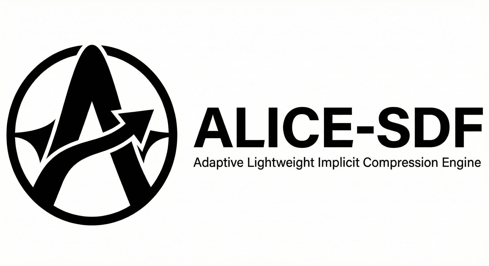

# ALICE-SDF

<p align="center">
  
</p>

Signed distance functions for Rust. A shape is a tree of primitives,
CSG operations, transforms and modifiers. The crate evaluates the tree on the
CPU (scalar, SIMD, BVH and JIT evaluators), transpiles it to GLSL, WGSL, HLSL
and Metal, and turns it into meshes and file formats.

English | [日本語](README_JP.md)

[](https://crates.io/crates/alice-sdf)
[](https://docs.rs/alice-sdf)
[](#minimum-supported-rust-version)
[](https://github.com/ext-sakamoro/ALICE-SDF/actions/workflows/ci.yml)
[](#license)

The same tree drives every backend, and the CPU evaluators return the same
bits as each other on every platform CI tests. That makes the tree usable as
the single description of a shape: the shader that renders it, the collider
that a physics engine queries, and the mesh that is exported or printed are
all computed from it, not from separate approximations.
<!-- claim-test: every_cpu_evaluator_is_bit_identical -->

It is not a mesh modeller or a renderer. The GPU shaders are not bit-exact
with the CPU (they agree within a tolerance), the value after some modifiers
(twist, bend, displacement and similar) is a bound on the distance rather than
the distance itself, and turning a field into a fine mesh costs time and memory
that grow with the resolution.

## Contents

- [Installation](#installation)
- [Example](#example)
- [Determinism](#determinism)
- [What is included](#what-is-included)
- [Validation and known defects](#validation-and-known-defects)
- [Cargo features](#cargo-features)
- [Bindings](#bindings)
- [Performance](#performance)
- [Minimum supported Rust version](#minimum-supported-rust-version)
- [Building and testing](#building-and-testing)
- [Related crates](#related-crates)
- [License](#license)

## Installation

```sh
cargo add alice-sdf
```

Without the command-line tool (the `cli` feature, on by default):

```sh
cargo add alice-sdf --no-default-features
```

Python bindings are on PyPI:

```sh
pip install alice-sdf
```

## Example

A sphere with a box cut out of it, evaluated, compiled and meshed. The same
code is the crate-level doctest in `src/lib.rs`, so it is compiled and run by
`cargo test`.

```rust
use alice_sdf::prelude::*;

// A unit sphere minus a box (box3d takes full extents)
let shape = SdfNode::sphere(1.0).subtract(SdfNode::box3d(1.0, 1.0, 1.0));

// Signed distance: negative inside, zero on the surface, positive outside
let p = Vec3::new(0.9, 0.0, 0.0);
let d = eval(&shape, p);
assert!(d < 0.0);

// Compiled to bytecode for repeated evaluation, with the same bits
let compiled = CompiledSdf::compile(&shape);
assert_eq!(eval_compiled(&compiled, p).to_bits(), d.to_bits());

// A triangle mesh by marching cubes
let mesh = sdf_to_mesh(
    &shape,
    Vec3::splat(-1.5),
    Vec3::splat(1.5),
    &MarchingCubesConfig::default(),
);
assert!(!mesh.indices.is_empty());
```

More programs are in [`examples/`](examples/), and a longer walkthrough
(recipes, Python, the LOL language) is in
[`docs/GETTING_STARTED.md`](docs/GETTING_STARTED.md).

## Determinism

The CPU evaluators (the tree evaluator, compiled scalar, 8-wide SIMD, BVH and
the Cranelift JIT) return bit-identical distances for the same tree and point.
Two rules make that hold across platforms:

- Every transcendental (`sin`, `atan2`, `exp`, `powf`, …) goes through
  [`alice-det-math`](https://crates.io/crates/alice-det-math), never the
  platform `libm`.
- `a * b + c` is always two roundings; nothing is fused into a multiply-add.

`scripts/det_math_guard.py` fails CI on a platform `libm` call or a `mul_add`
in the evaluator and law directories.

| Test | What it pins | Where it runs in CI |
|------|--------------|---------------------|
| `tests/test_det_parity.rs` | every CPU evaluator against the tree evaluator, bit for bit | macOS (ARM64), Linux (x86_64), Windows (x86_64); the JIT with `--features jit` |
| `tests/test_det_golden.rs` | a SHA-256 of the tree evaluator's bits per corpus shape | the same three |
| `tests/test_gpu_law_parity.rs` | WGSL against the CPU within a tolerance; axis ties of `atan2` exactly | Linux, on a software Vulkan device (lavapipe) |
<!-- claim-test: tree_evaluator_bits_match_recorded_hashes -->

**Not covered.** `wasm32` is built in CI but the tests above are not run on
it. The GPU shaders (WGSL, GLSL, HLSL, Metal) are a tolerance domain, not a
bit-exact one. Targets that do not follow IEEE 754 for the basic operations,
and builds with fast-math style flags, are outside the guarantee.

**Determinism is not correctness.** Matching bits say every machine computes
the same numbers; whether the numbers are right is checked separately, see
[Validation and known defects](#validation-and-known-defects).

## What is included

Every public module, grouped by area with a one-line summary and the feature it
needs, is listed in [`docs/MODULES.md`](docs/MODULES.md). API details are on
[docs.rs](https://docs.rs/alice-sdf).

| Area | Highlights |
|------|-----------|
| Shapes | primitives including Platonic and Archimedean solids, TPMS surfaces and extruded 2D shapes; `MetricBall`, whose norm is a parameter |
| Operations | union, intersection, subtraction and their smooth, chamfer, stairs, exponential and column variants; XOR, morph; `MetricBlend` |
| Transforms and modifiers | translate, rotate, scale, projective, lattice deformation, skinning; twist, bend, repetition, mirror and symmetry folds, displacement, shell, IFS |
| Evaluation | tree evaluator, compiled bytecode (scalar, SIMD, BVH), Cranelift JIT, GPU compute through wgpu; interval arithmetic, analytic and automatic gradients, Lipschitz bounds |
| Shader output | GLSL, WGSL, HLSL, Metal (from the WGSL output through naga), BlinkScript, and dependency-free Rust source |
| Meshing | marching cubes (uniform, adaptive, GPU), dual contouring, decimation, LOD chains, manifold repair, UV unwrap, meshlets, meshopt-compatible codecs |
| File formats | `.asdf` / `.asdf.json` trees; OBJ, glTF, FBX, USD, Alembic, STL, PLY, 3MF, STEP, IGES, MagicaVoxel, Gaussian splats, OpenVDB |
| Analysis | printability (erosion proof with a three-valued verdict, wall thickness, overhang), volume and surface area, tight bounding boxes, SDF-to-SDF collision |
| Worlds | sparse voxel octree, voxel destruction, terrain with erosion, cone-traced global illumination |

## Validation and known defects

Tests in `tests/` compare results with closed-form values or with an
independent computation: smooth operations, metric fields, interval enclosures
(`test_interval_soundness.rs`), tight bounds, printability, mesh orientation and
topology, STEP export, the meshopt codecs against the reference library's
vectors, and file-format round trips. Shader output is compiled with naga (and
Metal) in CI. Golden hashes only detect change, so they are kept separate from
these tests.

[`docs/oracle-status.md`](docs/oracle-status.md) is generated from `tests/` and
lists every test by status, including tests kept red on purpose
(`#[ignore = "known defect: …"]`) until the implementation is fixed.

[`docs/wiring-status.md`](docs/wiring-status.md) lists public items that
nothing outside the tests calls. `scripts/wiring_guard.py` fails CI when a new
one appears without a reason.

`scripts/ci_test_coverage_check.py` fails CI when a test file gated on a feature
is not run by any CI step with that feature, so a feature-gated test cannot
report green by running zero tests.

## Cargo features

Features marked **AGPL** link a crate licensed `AGPL-3.0-or-later`; see
[License](#license). All other features, including the defaults, pull in only
permissively licensed crates.

<!-- readme-sync: features -->
| Feature | Default | Description |
|---------|:-------:|-------------|
| `cli` | yes | The `alice-sdf` command-line tool (clap). |
| `image` | | PNG / JPEG decoding for heightmaps and texture fitting. |
| `texture-fit` | | Fit a bitmap texture with procedural noise formulas. Implies `image` and `cli`. |
| `jit` | | Native evaluation through Cranelift (scalar and 8-wide). |
| `gpu` | | GPU evaluation and WGSL output through wgpu. |
| `gpu-mesh` | | Marching cubes on the GPU. Implies `gpu`. |
| `volume` | | Bake a field into a 3D texture. Implies `gpu`. |
| `glsl` | | GLSL output (Unity, OpenGL, Vulkan, Shadertoy). |
| `hlsl` | | HLSL output (Unreal Engine, DirectX). |
| `msl` | | Metal Shading Language output, converted from WGSL with naga. Implies `gpu`. |
| `blinkscript` | | BlinkScript output for Nuke. Implies `hlsl`. |
| `rust` | | Dependency-free Rust source (`fn sdf`, `fn normal`) bit-identical to `eval_compiled`, for `build.rs`. |
| `all-shaders` | | `gpu`, `glsl`, `hlsl`, `msl` and `blinkscript`. |
| `svo` | | Sparse voxel octree. |
| `svo-gpu` | | Sparse voxel octree with GPU support. Implies `svo` and `gpu`. |
| `destruction` | | Voxel destruction. |
| `terrain` | | Heightmap terrain with erosion and caves. |
| `gi` | | Cone-traced global illumination. Implies `svo`. |
| `aaa` | | `volume`, `gpu-mesh`, `svo-gpu`, `destruction`, `terrain` and `gi`. |
| `ffi` | | C ABI for C, C++, C#, Unity and Unreal Engine. |
| `unity` | | `ffi` and `glsl`. |
| `unreal` | | `ffi`, `hlsl`, `glsl` and `gpu`: what the Unreal Engine plugin calls. |
| `python` | | Python bindings (PyO3 + NumPy). |
| `godot` | | Godot 4 GDExtension. |
| `wasm` | | WebAssembly bindings through `wasm-bindgen` (built for `wasm32` only). |
| `openvdb` | | OpenVDB float grid input and output. |
| `physics` | | **AGPL.** SDF colliders and simulation modifiers for [`alice-physics`](https://crates.io/crates/alice-physics). |
| `codec` | | **AGPL.** Volume compression with [`alice-codec`](https://crates.io/crates/alice-codec). |
| `sdf-cache` | | **AGPL.** Evaluation cache with [`alice-cache`](https://crates.io/crates/alice-cache). |
| `asp` | | ALICE Streaming Protocol packets with [`libasp`](https://crates.io/crates/libasp) (its default features only). |
| `font` | | Glyph outlines from `alice-font`. Inert on crates.io: also needs `--cfg alice_font_bridge` and a local `alice-font`. |

## Bindings

| Target | Where | Notes |
|--------|-------|-------|
| C / C++ | [`include/alice_sdf.h`](include/alice_sdf.h) | `--features ffi` |
| C# / Unity | [`bindings/AliceSdf.cs`](bindings/AliceSdf.cs), [`unity-sdf-universe/`](unity-sdf-universe/README.md) | P/Invoke over the C ABI |
| Unreal Engine 5 / 6 | [`unreal-plugin/`](unreal-plugin/README.md) | `--features unreal` |
| VRChat | [`vrchat-package/`](vrchat-package/README.md) | a VRChat package: SDF surfaces players can walk on and collide with |
| Godot 4 | [`docs/GODOT_GUIDE.md`](docs/GODOT_GUIDE.md) | `--features godot` |
| Python | [`python/`](python/), [`docs/PYTHON_GUIDE.md`](docs/PYTHON_GUIDE.md) | `--features python`; NumPy batch evaluation and mesh export |
| WebAssembly / Three.js | [`docs/WASM_GUIDE.md`](docs/WASM_GUIDE.md), [`npm/`](npm/README.md) | `--features wasm` |
| iOS / Android | [`mobile/`](mobile/README.md) | XCFramework and Kotlin bindings over the C ABI |
| Bevy, Blender, Houdini, Maya, Nuke, Cinema 4D, OpenXR, visionOS | [`bindings/`](bindings/README.md), [`docs/INTEGRATIONS.md`](docs/INTEGRATIONS.md) | reference integrations |

CI checks the C ABI against its consumers: `scripts/abi_decl_check.py` and
`scripts/unreal-abi-check.sh` compare every exported function with the C
header, the C# bindings and the Unreal Engine plugin.

The Text-to-3D server and the ALICE-View viewer are applications built on the
crate; see [`docs/TEXT_TO_3D.md`](docs/TEXT_TO_3D.md).

## Performance

Benchmarks are in [`benches/`](benches/) (criterion):

```sh
cargo bench --bench sdf_eval
cargo bench --bench gpu_vs_cpu --features gpu
```

No numbers are listed here. The figures in older documents were measured
before the evaluators were made bit-exact (which removed fused multiply-adds)
and have not been measured again since. Run the benchmarks on your target
before quoting a number.

## Minimum supported Rust version

Minimum supported Rust version: **1.85** (the `rust-version` in `Cargo.toml`). <!-- readme-sync: msrv -->

A CI job checks the library with exactly this version for the default features
and the docs.rs feature set. Raising the MSRV is a minor-version change, never
a patch.

## Building and testing

```sh
cargo build --release
cargo test
cargo test --features jit --test test_det_parity
cargo test --features "gpu,glsl,gpu-mesh,texture-fit"
```

`scripts/preflight.sh` reproduces the CI checks locally (`--quick` skips the
integration and oracle tests).

## Related crates

| Crate | Role |
|-------|------|
| [alice-det-math](https://github.com/ext-sakamoro/ALICE-DetMath) | the deterministic transcendental functions this crate and ALICE-Physics both use |
| [ALICE-LOL](https://github.com/ext-sakamoro/ALICE-LOL) | a language that parses to the same `SdfNode` tree, with a law verifier (see [Getting started](docs/GETTING_STARTED.md#two-front-ends-this-crates-api-or-the-lol-language)) |
| [ALICE-Physics](https://github.com/ext-sakamoro/ALICE-Physics) | deterministic physics; with the `physics` feature it collides against the same field that is rendered |
| [ALICE-View](https://github.com/ext-sakamoro/ALICE-View) | a real-time viewer for `.asdf` files |

Keep a single version of `alice-det-math` in your dependency graph. Two
versions mean two implementations of the same function, and determinism is
lost. Check with `cargo tree -i alice-det-math`.

Release history is in [`CHANGELOG.md`](CHANGELOG.md). Planned work is in
[`docs/ROADMAP.md`](docs/ROADMAP.md).

## License

The crate is dual-licensed under `MIT OR Apache-2.0`
([LICENSE-MIT](LICENSE-MIT), [LICENSE-APACHE](LICENSE-APACHE)).

The `physics`, `codec` and `sdf-cache` features link crates licensed
`AGPL-3.0-or-later`. A build that enables any of them is subject to the AGPL as
a whole. The default features and every other feature do not.

The Unity integration ([`unity-sdf-universe/`](unity-sdf-universe/)) and the
VRChat package ([`vrchat-package/`](vrchat-package/)) are under the ALICE
Community License ([LICENSE-COMMUNITY](LICENSE-COMMUNITY)): free for personal
use, game development (including commercial games), education and open source;
a commercial licence is required for infrastructure services (cloud, metaverse
platforms, streaming) as that licence defines them. Commercial licence enquiries:
<contact@extoria.co.jp>

Content you create with the crate (trees, meshes, worlds) is yours.

Many distance functions follow published forms by Inigo Quilez, Mercury
(hg_sdf) and Ken Perlin; the list and scope are in
[THIRD-PARTY-NOTICES.md](THIRD-PARTY-NOTICES.md).

Copyright (C) 2025-2026 Moroya Sakamoto
