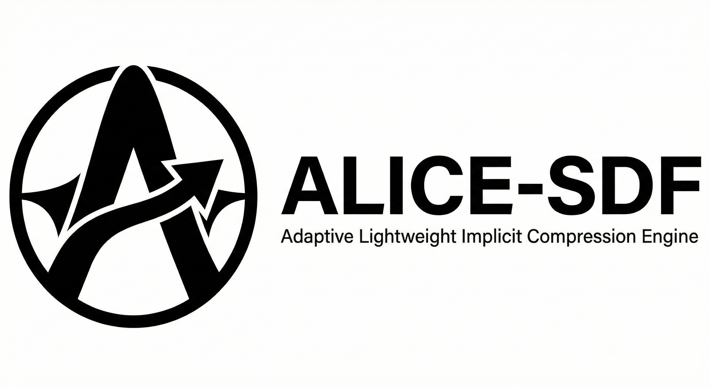

# ALICE-SDF

<p align="center">
  
</p>

[English](README.md) | **日本語**

**A.L.I.C.E. - Adaptive Lightweight Implicit Compression Engine**

> "ポリゴンを送るな。形の法則を送れ。"

## 概要

ALICE-SDFは、ポリゴンメッシュの代わりに**形状の数学的記述**（符号付き距離関数 = SDF）を伝送する3D/空間データスペシャリストです。これにより以下が実現されます:

- **10〜1000倍の圧縮** - 従来のメッシュフォーマットと比較
- **無限解像度** - あらゆるスケールで数学的に完全な形状
- **CSG演算** - メッシュオーバーヘッドなしの形状ブーリアン演算
- **リアルタイムレイマーチング** - GPU加速レンダリング
- **PBRマテリアル** - UE5/Unity/Godot互換のメタリック-ラフネスワークフロー
- **キーフレームアニメーション** - タイムライントラック付きパラメトリック変形
- **アセットパイプライン** - OBJ、glTF 2.0 (.glb)、FBX、USD、Alembic、Nanite、STL、PLY、3MF、ABM、Unity、UE5エクスポート
- **マニフォールドメッシュ保証** - バリデーション、修復、品質メトリクス
- **適応型マーチングキューブ** - オクツリーベースのメッシュ生成、必要な箇所にディテールを集中
- **Dual Contouring** - QEFベースのメッシュ生成、シャープエッジとコーナーを保持
- **V-HACD凸分解** - 物理用自動凸包分解
- **属性保存デシメーション** - UV/タンジェント/マテリアル境界保護付きQEM
- **デシメーションベースLOD** - 高解像度ベースメッシュからのプログレッシブLODチェーン
- **72プリミティブ、24演算、7トランスフォーム、23モディファイア**（126 total） - 業界最高水準のシェイプボキャブラリ
- **5層メッシュ永続化** - ABMバイナリフォーマット、LODチェーン永続化、FIFO排出チャンクキャッシュ、Unity/UE5ネイティブエクスポート
- **Chamfer & Stairsブレンド** - ハードエッジベベルおよびステップ状CSG遷移
- **区間演算（Interval Arithmetic）** - 空間プルーニング用の保守的AABB評価とリプシッツ定数追跡
- **緩和球トレーシング（Relaxed Sphere Tracing）** - リプシッツ適応ステップサイズによるオーバーリラクゼーション
- **ニューラルSDF** - 複雑シーンを~10-100倍高速に近似する純Rust MLP
- **SDF対SDFコリジョン** - 区間演算AABBプルーニング付きグリッドベース接触検出
- **CSGツリー最適化** - 恒等変換/モディファイア除去、ネスト変換マージ、Smooth→Standard降格
- **解析的勾配（Analytic Gradient）** - 連鎖律とヤコビアン伝播による単一パス勾配計算（9解析+44数値フォールバックプリミティブ）
- **自動微分（Automatic Differentiation）** - 双対数前方モードAD、ヘッシアン推定、平均曲率計算
- **2D SDFモジュール** - 純粋2Dプリミティブ（circle、rect、bezier、フォントグリフ）とバイリニアサンプリング
- **CSGツリーDiff/Patch** - アンドゥ/リドゥおよびネットワーク同期用のSDFツリー構造差分
- **パラメトリック拘束ソルバー** - 幾何拘束（固定、距離、和、比率）のガウス-ニュートン最適化
- **距離場ヒートマップ** - 4カラーマップ（coolwarm、binary、viridis、magma）による断面スライス
- **Shell / Offset Surface** - 内側/外側オフセット制御付き可変厚シェルモディファイア
- **体積・表面積** - 決定論的PRNGと標準誤差を用いたモンテカルロ推定
- **ALICE-Fontブリッジ** - フォントグリフ → 2D/3D SDF変換、テキストレイアウト、3D押し出し（`--features font`）
- **自動タイトAABB** - 区間演算＋二分探索によるSDF表面を含む最小バウンディングボックス計算
- **7つの評価モード** - インタプリタ、コンパイルVM、SIMD 8-wide、BVH、SoAバッチ、JIT、GPU
- **3つのシェーダーターゲット** - GLSL、WGSL、HLSLトランスパイル
- **エンジン統合** - Unity、Unreal Engine 5、VRChat、Godot、WebAssembly

## Text-to-3D パイプライン（サーバー）

ALICE-SDFには、LLM生成のSDFツリーを通じて**自然言語テキストを実際の3Dジオメトリに変換する**FastAPIサーバーが含まれています。

```
ユーザー: "中世の城"  →  LLM (Claude/Gemini)  →  SDF JSON  →  ALICE-SDF  →  GLB/OBJ
         テキスト           ~5-50秒              20ノード      <55ms        メッシュ
```

### アーキテクチャ

```
┌─────────────┐     ┌──────────────┐     ┌───────────────┐     ┌──────────┐
│  FastAPI     │     │  LLMサービス │     │  SDFサービス  │     │  出力    │
│  サーバー    │────▶│  Claude API  │────▶│  from_json()  │────▶│  GLB     │
│              │     │  Gemini API  │     │  compile()    │     │  OBJ     │
│  POST /gen   │     │  システム    │     │  to_mesh()    │     │  JSON    │
│  WS /ws/gen  │     │  プロンプト  │     │  export_glb() │     │  ビューア│
│  GET /viewer │     └──────────────┘     └───────────────┘     └──────────┘
└─────────────┘
```

### APIエンドポイント

| メソッド | パス | 説明 |
|--------|------|-------------|
| `POST` | `/api/generate` | テキスト → 3Dメッシュ (GLB/OBJ/JSON) |
| `POST` | `/api/validate` | SDF JSON構造のバリデーション |
| `POST` | `/api/mesh` | SDF JSON → メッシュ (GLB/OBJ) |
| `GET` | `/api/examples` | Few-shotサンプルシーン一覧 |
| `GET` | `/api/viewer` | Three.js GLBビューア（ブラウザ） |
| `GET` | `/api/health` | サーバーヘルスチェック |
| `WS` | `/ws/generate` | プログレッシブプレビュー付きストリーミング生成 |

### 生成シーンギャラリー

Gemini 2.5 Flashが自然言語プロンプトから生成したシーン:

| プロンプト | ノード数 | 頂点数 | 三角形数 | LLM時間 |
|--------|-------|----------|-----------|----------|
| "A medieval castle with towers" | 18 | 2,105 | 4,248 | 49.4秒 |
| "A robot standing on a platform" | 18 | 750 | 1,184 | 17.5秒 |
| "An underwater coral reef scene" | 15 | 2,666 | 5,166 | 63.3秒 |
| "A simple mushroom on grass" | 9 | 8,237 | 16,224 | 6.6秒 |
| "火山地帯に宇宙船" | 22 | 10,466 | 20,618 | 20.5秒 |

手作りFew-shotサンプル（LLMシステムプロンプトで使用）:

| シーン | 説明 | ノード数 | 頂点数 | 三角形数 |
|-------|-------------|-------|----------|-----------|
| `sphere_on_ground` | 平面上の球体 (Union + Plane) | 4 | 1,270 | 2,448 |
| `snowman` | 3球体の雪だるま (SmoothUnion) | 8 | 422 | 840 |
| `castle_tower` | 胸壁付きの塔 (PolarRepeat) | 11 | 1,030 | 2,244 |
| `alien_mushroom_forest` | キノコグリッド (RepeatFinite + Torusステム) | 9 | 4,167 | 7,854 |
| `twisted_pillar` | ねじれた箱 + 浮遊する中空球 (Twist + Onion) | 7 | 510 | 968 |
| `mechanical_gear` | 歯と軸穴のあるギア (PolarRepeat + Subtraction) | 9 | 465 | 912 |

シーンJSONファイルは [`server/examples/scenes/`](server/examples/scenes/) に格納されています。

### クイックスタート（サーバー）

```bash
# 1. Pythonバインディングをビルド
cd /path/to/ALICE-SDF
python -m venv .venv && source .venv/bin/activate
maturin develop --features python

# 2. サーバー依存関係をインストール
pip install -r server/requirements.txt

# 3. APIキーを設定
export ANTHROPIC_API_KEY="sk-..."   # Claude用
export GOOGLE_API_KEY="AI..."       # Gemini用

# 4. サーバー起動
uvicorn server.main:app --reload

# 5. テキストから3D生成
curl -X POST http://localhost:8000/api/generate \
  -H "Content-Type: application/json" \
  -d '{"prompt": "雪だるま", "provider": "gemini", "resolution": 64}' \
  -o snowman.glb

# 6. ブラウザビューアを開く
open http://localhost:8000/api/viewer
```

### LLMプロバイダー

| プロバイダー | モデル | 速度 | 最適な用途 |
|----------|-------|-------|----------|
| Claude | Haiku 4.5 | ~2-5秒 | シンプルなシーン、高速イテレーション |
| Claude | Sonnet 4.5 | ~5-15秒 | 複雑なシーン、高精度 |
| Gemini | 2.5 Flash | ~5-50秒 | 複雑なシーン（思考モデル） |
| Gemini | 2.5 Pro | ~10-60秒 | 最高品質 |

### パフォーマンスバジェット

| ステップ | 時間 | 備考 |
|------|------|-------|
| LLM推論 | 2-60秒 | モデルと複雑さに依存 |
| JSON解析 | <1ms | serde_json |
| SDFコンパイル | ~1ms | SdfNode → CompiledSdf |
| メッシュ生成 (res=64) | ~45ms | 並列マーチングキューブ |
| GLBエクスポート | ~5ms | |
| **合計（LLM除く）** | **<55ms** | リアルタイム対応可能 |

### 堅牢性機能

- **JSON修復**: 切り詰められたLLM出力の括弧自動補完
- **構造バリデーション**: ブーリアン演算(a/b)とトランスフォーム(child)をRust serdeの前に事前検証
- **フィードバック付きリトライ**: エラーメッセージをLLMにフィードバックして最大2回リトライ
- **レート制限処理**: 429エラー時の自動待機リトライ
- **複雑度制約**: システムプロンプトでシーンを15-20ノード、ネスト深度≤6に制限

### サーバーディレクトリ構造

```
server/
├── main.py                  # FastAPIアプリ、REST + WebSocketエンドポイント
├── config.py                # APIキー、モデル設定（環境変数）
├── models.py                # Pydantic リクエスト/レスポンスモデル
├── services/
│   ├── llm_service.py       # Claude/Gemini API（リトライロジック付き）
│   └── sdf_service.py       # alice_sdfラッパー（パース、メッシュ、エクスポート）
├── prompts/
│   ├── system_prompt.py     # 36ノードタイプのSDF文法（LLM用）
│   └── examples.py          # 6つのFew-shotサンプル
├── examples/
│   └── scenes/              # ビルド済みシーンJSONファイル
│       ├── sphere_on_ground.json
│       ├── snowman.json
│       ├── castle_tower.json
│       ├── alien_mushroom_forest.json
│       ├── twisted_pillar.json
│       └── mechanical_gear.json
├── static/
│   └── viewer.html          # Three.js GLBビューア
├── tests/
│   ├── test_api.py          # 7つのAPIエンドポイントテスト
│   ├── test_llm_service.py  # 17のJSON抽出/バリデーションテスト
│   └── test_sdf_service.py  # 13のSDFパイプラインテスト
└── requirements.txt
```

### テスト実行

```bash
source .venv/bin/activate
python -m pytest server/tests/ -v   # 37テスト、全パス
```

## ALICE-View（リアルタイム3Dビューア）

**[ALICE-View](../ALICE-View)** はwgpuで構築されたネイティブGPUレイマーチングビューアです。WGSLトランスパイルにより、メッシュ変換なしでSDFツリーをGPU上で直接レンダリングします。

```
SDF JSON → ALICE-SDF (WGSLトランスパイル) → wgpu GPUレイマーチング → リアルタイム3D
              ~1ms                               60 FPS
```

### 機能

- **GPUレイマーチング** — SdfNodeツリーをWGSLシェーダーにトランスパイル、GPU上でピクセルごとに評価
- **ドラッグ&ドロップ** — `.json` / `.asdf` / `.asdf.json` ファイルをウィンドウにドロップ
- **ファイルダイアログ** — File > Open (Ctrl+O) フォーマットフィルター付き
- **カメラ操作** — マウスオービット、スクロールズーム、WASD移動
- **ライブSDFパネル** — ノード数、レイマーチングパラメータ（最大ステップ、イプシロン、AO）

### サポートフォーマット

| 拡張子 | フォーマット | 説明 |
|-----------|--------|-------------|
| `.json` | SDF JSON | Text-to-3Dパイプライン出力、Few-shotサンプル |
| `.asdf.json` | ALICE SDF JSON | ネイティブALICE-SDF JSONフォーマット |
| `.asdf` | ALICE SDFバイナリ | CRC32付きコンパクトバイナリ |
| `.alice` / `.alz` | ALICEレガシー | 手続き型コンテンツ（Perlin、Fractal） |

### クイックスタート

```bash
cd /path/to/ALICE-View

# 特定のファイルを開く
cargo run --bin alice-view -- path/to/scene.json

# 空で起動してファイルをドラッグ&ドロップ
cargo run --bin alice-view
```

### キーボードショートカット

| キー | アクション |
|-----|--------|
| `W/A/S/D` | カメラ移動 |
| `マウスドラッグ` | カメラオービット |
| `スクロール` | ズームイン/アウト |
| `Ctrl+O` | ファイルダイアログを開く |
| `Q` | 終了 |

### Text-to-3D結果の閲覧

Text-to-3Dパイプラインで生成されたシーンJSONファイルを直接閲覧できます:

```bash
# 生成シーンを表示
cargo run --bin alice-view -- /path/to/ALICE-SDF/server/examples/scenes/snowman.json

# または以下のファイルをウィンドウにドラッグ:
#   server/examples/scenes/castle_tower.json
#   server/examples/scenes/mechanical_gear.json
#   server/examples/scenes/alien_mushroom_forest.json
```

---

## コアコンセプト

### SDF（符号付き距離関数）

SDFは任意の点から表面までの最短距離を返します:
- **負** = 形状の内部
- **ゼロ** = 表面上
- **正** = 形状の外部

### SdfNodeツリー構造

```
SdfNode
  |-- プリミティブ (68): Sphere, Box3D, Cylinder, Torus, Plane, Capsule, Cone, Ellipsoid,
  |                    RoundedCone, Pyramid, Octahedron, HexPrism, Link, Triangle, Bezier,
  |                    RoundedBox, CappedCone, CappedTorus, InfiniteCylinder, RoundedCylinder,
  |                    TriangularPrism, CutSphere, CutHollowSphere, DeathStar, SolidAngle,
  |                    Rhombus, Horseshoe, Vesica, InfiniteCone, Heart, Gyroid,
  |                    Tube, Barrel, Diamond, ChamferedCube, SchwarzP, Superellipsoid, RoundedX,
  |                    Pie, Trapezoid, Parallelogram, Tunnel, UnevenCapsule, Egg,
  |                    ArcShape, Moon, CrossShape, BlobbyCross, ParabolaSegment,
  |                    RegularPolygon, StarPolygon, Stairs, Helix,
  |                    Tetrahedron, Dodecahedron, Icosahedron,                    ← プラトン立体 (GDF)
  |                    TruncatedOctahedron, TruncatedIcosahedron,                 ← アルキメデス立体
  |                    BoxFrame,                                                   ← IQワイヤーフレームボックス
  |                    DiamondSurface, Neovius, Lidinoid, IWP, FRD,              ← TPMS曲面
  |                    FischerKochS, PMY,                                          ← TPMS曲面
  |                    Circle2D, Rect2D, Segment2D, Polygon2D,                   ← 2Dプリミティブ（押し出し）
  |                    RoundedRect2D, Annular2D                                    ← 2Dプリミティブ（押し出し）
  |-- 演算 (24): Union, Intersection, Subtraction,
  |              SmoothUnion, SmoothIntersection, SmoothSubtraction,
  |              ChamferUnion, ChamferIntersection, ChamferSubtraction,
  |              StairsUnion, StairsIntersection, StairsSubtraction,
  |              ExpSmoothUnion, ExpSmoothIntersection, ExpSmoothSubtraction,     ← IQ指数スムース
  |              XOR, Morph,                                                       ← ブーリアン/補間
  |              ColumnsUnion, ColumnsIntersection, ColumnsSubtraction,            ← hg_sdfカラム
  |              Pipe, Engrave, Groove, Tongue                                     ← hg_sdf高度操作
  |-- トランスフォーム (7): Translate, Rotate, Scale, ScaleNonUniform,
  |                        ProjectiveTransform,                                    ← 逆行列付き射影変換
  |                        LatticeDeform,                                          ← 自由形状変形（FFD）グリッド
  |                        SdfSkinning                                             ← ボーンウェイトスケルタル変形
  |-- モディファイア (23): Twist, Bend, RepeatInfinite, RepeatFinite, Noise, Round, Onion, Elongate,
  |                   Mirror, Revolution, Extrude, Taper, Displacement, PolarRepeat, SweepBezier,
  |                   Shear,                                                       ← 3軸せん断変形
  |                   OctantMirror,                                                ← 48重対称性
  |                   IcosahedralSymmetry,                                         ← 120重正二十面体対称性
  |                   IFS,                                                         ← 反復関数系フラクタル
  |                   HeightmapDisplacement,                                       ← ハイトマップ駆動表面変位
  |                   SurfaceRoughness,                                            ← FBMノイズラフネス
  |                   Animated,                                                    ← タイムライン駆動パラメータアニメーション
  |                   WithMaterial                                                 ← PBRマテリアル割り当て
```

## インストール

### Rust

```bash
cargo add alice-sdf
```

### Python

```bash
pip install alice-sdf
```

## 使い方

### Rust

```rust
use alice_sdf::prelude::*;

// 半径1の球体を作成
let sphere = SdfNode::sphere(1.0);

// 箱でくり抜く
let result = sphere.subtract(SdfNode::box3d(1.5, 1.5, 1.5));

// ある点での距離を評価
let distance = eval(&result, glam::Vec3::ZERO);

// メッシュに変換
let mesh = sdf_to_mesh(
    &result,
    glam::Vec3::splat(-2.0),
    glam::Vec3::splat(2.0),
    &MarchingCubesConfig::default()
);
```

### Python

```python
import alice_sdf as sdf

# プリミティブを作成
sphere = sdf.SdfNode.sphere(1.0)
box3d = sdf.SdfNode.box3d(2.0, 1.0, 1.0)

# CSG演算（メソッド構文）
result = sphere.subtract(box3d)

# 演算子オーバーロード（Python的な構文）
a = sdf.SdfNode.sphere(1.0)
b = sdf.SdfNode.box3d(0.5, 0.5, 0.5)
union     = a | b    # a.union(b)
intersect = a & b    # a.intersection(b)
subtract  = a - b    # a.subtract(b)

# トランスフォーム
translated = result.translate(1.0, 0.0, 0.0)

# 点群で評価（NumPy配列）
import numpy as np
points = np.array([[0.5, 0.0, 0.0], [1.0, 1.0, 1.0]], dtype=np.float32)
distances = sdf.eval_batch(translated, points)

# コンパイル評価（繰り返し使用時2-5倍高速）
compiled = sdf.compile_sdf(sphere)
distances = compiled.eval_batch(points)               # コンパイルバッチ
vertices, indices = compiled.to_mesh((-2,-2,-2), (2,2,2), resolution=64)  # コンパイルメッシュ

# メッシュに変換
vertices, indices = sdf.to_mesh(translated, (-2.0, -2.0, -2.0), (2.0, 2.0, 2.0))

# 複数フォーマットにエクスポート
sdf.export_obj(vertices, indices, "model.obj")
sdf.export_glb(vertices, indices, "model.glb")
sdf.export_fbx(vertices, indices, "model.fbx")
sdf.export_usda(vertices, indices, "model.usda")
sdf.export_alembic(vertices, indices, "model.abc")

# UV展開 → (positions[N,3], uvs[N,2], indices[M])
positions, uvs, indices = sdf.uv_unwrap(vertices, indices)
```

## マテリアルシステム

glTF 2.0、UE5、Unity HDRP、Godot互換のPBRメタリック-ラフネスマテリアルシステム。

### マテリアルプロパティ

| プロパティ | 型 | 説明 |
|----------|------|-------------|
| `base_color` | `[f32; 4]` | RGBAベースカラー（リニア空間） |
| `metallic` | `f32` | 0.0 = 誘電体、1.0 = 金属 |
| `roughness` | `f32` | 0.0 = 鏡面、1.0 = 拡散 |
| `emission` | `[f32; 3]` | 発光色（RGB） |
| `emission_strength` | `f32` | 発光強度乗数 |
| `opacity` | `f32` | 0.0 = 透明、1.0 = 不透明 |
| `ior` | `f32` | 屈折率（ガラス=1.5、水=1.33） |
| `normal_scale` | `f32` | ノーマルマップ強度 |

### 使用例

```rust
use alice_sdf::prelude::*;

// マテリアルを作成
let gold = Material::metal("Gold", 1.0, 0.766, 0.336, 0.3);
let glass = Material::glass("Glass", 1.5);
let glow = Material::emissive("Neon", 0.0, 1.0, 0.0, 10.0);

// マテリアルライブラリ
let mut lib = MaterialLibrary::new();
let gold_id = lib.add(gold);

// マテリアルを形状に割り当て
let sphere = SdfNode::sphere(1.0).with_material(gold_id);

// AAA頂点フォーマットでメッシュ生成（UV、タンジェント、カラー、material_id）
let mesh = sdf_to_mesh(&sphere, Vec3::splat(-2.0), Vec3::splat(2.0), &MarchingCubesConfig::aaa(64));
```

### 頂点フォーマット

AAA品質レンダリングに必要な全属性を含むメッシュ頂点:

| 属性 | 型 | 説明 |
|-----------|------|-------------|
| `position` | `Vec3` | 3D位置 |
| `normal` | `Vec3` | 表面法線 |
| `uv` | `Vec2` | トリプラナー投影テクスチャ座標 |
| `tangent` | `Vec4` | タンジェント（xyz=方向、w=利き手） |
| `color` | `[f32; 4]` | 頂点カラー（RGBAリニア） |
| `material_id` | `u32` | マテリアルライブラリインデックス |

## アニメーションシステム

リアルタイム変形、モーフィング、シネマティックシーケンス向けのキーフレームベースSDFパラメータアニメーション。

### 機能

- **補間モード**: Linear、Cubic Bezier（Hermite）、Step
- **ループモード**: Once、Loop、PingPong
- **タイムライン**: 名前付きパラメータによる複数トラック
- **AnimatedSdf**: 時間変化するSDF評価
- **モーフ**: 2つのSDF形状間のスムーズブレンド

### 使用例

```rust
use alice_sdf::prelude::*;

// バウンドする球体アニメーションを作成
let sphere = SdfNode::sphere(1.0);

let mut timeline = Timeline::new("bounce");

let mut ty = Track::new("translate.y").with_loop(LoopMode::PingPong);
ty.add_keyframe(Keyframe::new(0.0, 0.0));
ty.add_keyframe(Keyframe::cubic(0.5, 3.0, 0.0, 0.0));
ty.add_keyframe(Keyframe::new(1.0, 0.0));
timeline.add_track(ty);

let animated = AnimatedSdf::new(sphere, timeline);

// 時刻t=0.25で評価
let node_at_t = animated.evaluate_at(0.25);
let distance = eval(&node_at_t, Vec3::ZERO);

// 2つの形状間をモーフ
let sphere = SdfNode::sphere(1.0);
let cube = SdfNode::box3d(1.0, 1.0, 1.0);
let morphed = morph(&sphere, &cube, 0.5); // 50%ブレンド
```

### サポートされるトラック名

| トラック | 説明 |
|-------|-------------|
| `translate.x/y/z` | 平行移動オフセット |
| `rotate.x/y/z` | オイラー回転（ラジアン） |
| `scale` | 均一スケール係数 |
| `twist` | ねじり強度 |
| `bend` | 曲げ曲率 |

## ファイルフォーマット

### .asdf（ALICE SDFバイナリ）

CRC32整合性チェック付きコンパクトバイナリフォーマット。

```
ヘッダー（16バイト）:
  - マジック: "ASDF"（4バイト）
  - バージョン: u16（2バイト）
  - フラグ: u16（2バイト）
  - ノード数: u32（4バイト）
  - CRC32: u32（4バイト）

ボディ:
  - Bincodeシリアライズ済みSdfTree
```

### .asdf.json（ALICE SDF JSON）

デバッグ、相互運用性、LLM生成用の人間が読めるJSONフォーマット。

```json
{
  "version": "0.1.0",
  "root": {
    "Subtraction": {
      "a": {"Sphere": {"radius": 1.0}},
      "b": {"Box3d": {"half_extents": [1.5, 1.5, 1.5]}}
    }
  },
  "metadata": null
}
```

これはText-to-3Dパイプラインで使用されるのと同じフォーマットです — LLMがこのJSONを直接生成します。

### .obj（Wavefront OBJ）

マテリアル(.mtl)サポート付き標準メッシュフォーマット。

```rust
use alice_sdf::prelude::*;

let mesh = sdf_to_mesh(&shape, min, max, &MarchingCubesConfig::aaa(64));
export_obj(&mesh, "model.obj", &ObjConfig::default(), Some(&mat_lib))?;
```

### .glb（glTF 2.0バイナリ）

PBRマテリアル付き業界標準3Dフォーマット。UE5、Unity、Blender、Godot、Webビューアと互換。

```rust
use alice_sdf::prelude::*;

let mesh = sdf_to_mesh(&shape, min, max, &MarchingCubesConfig::aaa(64));
export_glb(&mesh, "model.glb", &GltfConfig::aaa(), Some(&mat_lib))?;
```

### アセットパイプラインまとめ

| フォーマット | インポート | エクスポート | マテリアル | 説明 |
|--------|--------|--------|-----------|-------------|
| `.asdf` | 対応 | 対応 | - | ネイティブSDFバイナリ（CRC32） |
| `.asdf.json` | 対応 | 対応 | - | ネイティブSDF JSON |
| `.obj` | 対応 | 対応 | .mtl | Wavefront OBJ（汎用DCCツール） |
| `.glb` | - | 対応 | PBR | glTF 2.0バイナリ（ゲームエンジン） |
| `.fbx` | - | 対応 | PBR | FBX 7.4 ASCII/バイナリ（DCCツール） |
| `.usda` | - | 対応 | UsdPreviewSurface | USD ASCII（Pixar/Omniverse/Houdini/Maya/Blender） |
| `.abc` | - | 対応 | - | Alembic Ogawaバイナリ（Maya/Houdini/Nuke/Blender） |
| `.nanite` | - | 対応 | - | UE5 Nanite階層クラスタバイナリ + JSONマニフェスト |
| `.stl` | 対応 | 対応 | - | STL ASCII/バイナリ（3Dプリント、CAD） |
| `.ply` | 対応 | 対応 | - | PLY ASCII/バイナリ（点群、スキャニング） |
| `.3mf` | - | 対応 | PBR | 3MF XML（PBRマテリアル付き最新3Dプリント） |
| `.abm` | 対応 | 対応 | - | ALICE Binary Mesh（コンパクト、CRC32、LODチェーン対応） |
| `.unity_mesh` | - | 対応 | - | Unity ネイティブJSON/バイナリメッシュ（左手系、Z反転） |
| `.ue5_mesh` | - | 対応 | - | UE5 ネイティブJSON/バイナリメッシュ（Z-up、センチメートル） |

## アーキテクチャ

ALICE-SDFはレイヤードアーキテクチャを使用しています。各SDFプリミティブ/演算は16のコアレイヤー全てに実装され、さらに専門モジュールが追加されています:

```
Layer 1:  types.rs          -- SdfNode列挙型（AST定義）
Layer 2:  primitives/       -- SDF数学公式（Inigo Quilez）
Layer 3:  eval/             -- 再帰インタプリタ
Layer 4:  compiled/opcode   -- VM用OpCode列挙型
Layer 5:  compiled/instr    -- 命令エンコーディング（32バイトアライン）
Layer 6:  compiled/compiler -- AST → 命令コンパイル
Layer 7:  compiled/eval     -- スタックベースVMエバリュエータ
Layer 8:  compiled/eval_simd-- SIMD 8-wideエバリュエータ（AVX2/NEON）
Layer 9:  compiled/eval_bvh -- BVH加速エバリュエータ（AABBプルーニング）
Layer 10: compiled/glsl     -- GLSLトランスパイラ（Unity/OpenGL/Vulkan）
Layer 11: compiled/wgsl     -- WGSLトランスパイラ（WebGPU）
Layer 12: compiled/hlsl     -- HLSLトランスパイラ（DirectX/Unreal）
Layer 13: compiled/jit      -- JITネイティブコードスカラー（Cranelift）
Layer 14: compiled/jit_simd -- JIT SIMD 8-wideネイティブコード（Cranelift）
Layer 15: crispy.rs         -- ハードウェアネイティブ数学（ブランチレス、BitMask64、BloomFilter）
Layer 16: interval.rs       -- 区間演算評価 + リプシッツ定数

専門モジュール:
  neural.rs     -- ニューラルSDF（MLP近似、訓練、推論）
  collision.rs  -- SDF対SDF接触検出（区間演算プルーニング付き）
  eval/gradient -- 解析的勾配（連鎖律、ヤコビアン伝播）
  mesh/dual_contouring -- Dual Contouring（QEF頂点配置、シャープエッジ）
  optimize.rs   -- CSGツリー最適化（恒等変換除去、変換マージ）
  tight_aabb.rs -- 自動タイトAABB（区間演算＋二分探索）

解析・計測:
  autodiff.rs   -- 双対数AD（Dual、Dual3）、ヘッシアン、平均曲率
  measure.rs    -- モンテカルロ体積/表面積/重心推定
  heatmap.rs    -- カラーマップ付き距離場断面スライス
  shell.rs      -- 可変厚シェル/オフセットサーフェスモディファイア
  constraint.rs -- ガウス-ニュートンパラメトリック拘束ソルバー
  diff.rs       -- CSGツリー構造差分とパッチ（アンドゥ/リドゥ、同期）
  sdf2d.rs      -- 純粋2Dモジュール（circle、rect、bezier、フォントグリフ）
  font_bridge.rs-- ALICE-Fontグリフ → SDF変換（`font`フィーチャー必須）
```

### 評価モード

| モード | 説明 | ユースケース |
|------|-------------|----------|
| **インタプリタ** | 再帰ツリーウォーク | デバッグ、プロトタイピング |
| **コンパイルVM** | スタックベースバイトコード | 汎用 |
| **SIMD 8-wide** | 8点並列処理（Vec3x8） | バッチ評価 |
| **BVH加速** | AABB空間プルーニング | 複雑なシーン |
| **SoAバッチ** | Structure-of-Arraysメモリレイアウト | キャッシュ最適SIMDバッチ |
| **JITネイティブ** | Craneliftマシンコード | 最大スループット |
| **GPUコンピュート** | WGSLコンピュートシェーダー | 大量バッチ |

### シェーダートランスパイラ

| ターゲット | 出力 | ユースケース |
|--------|--------|----------|
| **GLSL** | OpenGL/Vulkanシェーダー | Unity、カスタムエンジン |
| **WGSL** | WebGPUシェーダー | ブラウザ、wgpu |
| **HLSL** | DirectXシェーダー | Unreal Engine、DirectX |

#### エンジン固有シェーダーエクスポート

| メソッド | 出力 | ターゲットエンジン |
|--------|--------|---------------|
| `HlslShader::export_ue5_material_function()` | `.ush` Material Functionインクルード | Unreal Engine 5（Custom Expression） |
| `GlslShader::export_unity_shader_graph()` | `.hlsl` Custom Functionノード | Unity Shader Graph（HDRP/URP） |

## メッシュモジュール

### 変換

| 関数 | 説明 |
|----------|-------------|
| `sdf_to_mesh()` | 並列マーチングキューブによるSDF→メッシュ（Zスラブ並列化） |
| `sdf_to_mesh_compiled()` | コンパイルVMパス — SIMDバッチグリッド評価 + グリッド有限差分法線 |
| `marching_cubes_compiled()` | `eval_compiled_batch_simd_parallel`グリッド評価のコンパイルMC |
| `adaptive_marching_cubes()` | オクツリー適応型MC（インタプリタ）— 三角形60-80%削減 |
| `adaptive_marching_cubes_compiled()` | オクツリー適応型MC（コンパイルVM）— 2-5倍高速 |
| `mesh_to_sdf()` | カプセル近似によるメッシュ→SDF（エッジベース） |
| `mesh_to_sdf_exact()` | BVH精密距離によるメッシュ→SDF（O(log n)クエリ） |

### 高度な機能

| 機能 | モジュール | 説明 |
|---------|--------|-------------|
| **エルミートデータ** | `mesh/hermite` | Dual Contouring用の位置+法線抽出 |
| **プリミティブフィッティング** | `mesh/primitive_fitting` | メッシュデータ内の球/箱/円柱検出（CSG再構成用） |
| **Naniteクラスタ** | `mesh/nanite` | UE5 Nanite互換階層クラスタ生成（Dual Contouring、タイトAABB、マテリアルID、曲率適応密度） |
| **LOD生成** | `mesh/lod` | 効率的レンダリング用LODチェーン生成 |
| **デシメーションLOD** | `mesh/lod` | 高解像度ベースメッシュからのプログレッシブデシメーションLOD |
| **適応型MC** | `mesh/sdf_to_mesh` | 表面適応細分化を備えたオクツリーベースマーチングキューブ |
| **メッシュデシメーション** | `mesh/decimate` | UV/タンジェント/マテリアル境界保護付きQEMデシメーション |
| **凸分解** | `mesh/collision` | 物理用V-HACD体積凸分解 |
| **コリジョンプリミティブ** | `mesh/collision` | AABB、バウンディングスフィア、凸包、簡略化コリジョン |
| **ライトマップUV** | `mesh/lightmap` | 自動ライトマップUV生成（UVチャンネル1） |
| **頂点最適化** | `mesh/optimize` | 頂点キャッシュ最適化と重複排除 |
| **メッシュBVH** | `mesh/bvh` | 精密符号付き距離クエリ用バウンディングボリューム階層 |
| **マニフォールドバリデーション** | `mesh/manifold` | トポロジーバリデーション、修復、品質メトリクス |
| **UV展開** | `mesh/uv_unwrap` | LCSMコンフォーマルUV展開（シーム検出、チャートパッキング） |

### メッシュ永続化（5層アーキテクチャ）

| レイヤー | モジュール | 説明 |
|---------|--------|-------------|
| **ABMバイナリフォーマット** | `io/abm` | ALICE Binary Mesh — CRC32付きコンパクトバイナリ、法線/UV/タンジェント/カラーオプション、LODチェーン対応 |
| **LODチェーン永続化** | `mesh/lod_persist` | LODチェーン全体（メッシュ＋遷移距離）をSDFハッシュ検証付きで保存/読込 |
| **チャンクメッシュキャッシュ** | `cache/chunked` | スレッドセーフなFIFO排出キャッシュ、ダーティ追跡、ディスク永続化 |
| **Unityエクスポート** | `io/unity_mesh` | 左手座標系変換（Z反転、ワインディング反転、スケール）付きJSON/バイナリ出力 |
| **UE5エクスポート** | `io/ue5_asset` | Z-up座標変換（メートル→センチメートル）、マルチLOD対応JSON/バイナリ出力 |

```rust
use alice_sdf::prelude::*;
use alice_sdf::io::{save_abm, load_abm, export_unity_mesh, export_ue5_mesh, UnityMeshConfig, Ue5MeshConfig};

// ABMバイナリメッシュの保存/読込
save_abm(&mesh, "model.abm")?;
let loaded = load_abm("model.abm")?;

// Unityエクスポート（左手系、Z反転）
export_unity_mesh(&mesh, "model.unity_mesh", &UnityMeshConfig::default())?;

// UE5エクスポート（Z-up、センチメートル）
export_ue5_mesh(&mesh, "model.ue5_mesh", &Ue5MeshConfig::default())?;
```

## 新機能: プラトン立体、TPMS曲面、高度CSG (v2.0)

### プラトン立体・アルキメデス立体 (GDF)

hg_sdfのGDF（一般化距離関数）アプローチによる5種の新プラトン/アルキメデス立体。面法線との絶対内積の最大値でSDFを定義。

| プリミティブ | 法線数 | 説明 |
|-------------|--------|------|
| `Tetrahedron` | 4 | 正四面体 |
| `Dodecahedron` | 6 | 正十二面体 (12正五角形面) |
| `Icosahedron` | 10 | 正二十面体 (20三角形面) |
| `TruncatedOctahedron` | 7 | 切頂八面体 (8六角形+6正方形面) |
| `TruncatedIcosahedron` | 16 | サッカーボール/C60 (12五角形+20六角形) |

全5種はネイティブSIMD 8-wide評価（スカラーフォールバックなし）— 純粋FMA + max演算。

### BoxFrame

IQの`sdBoxFrame` — エッジのみ表示するワイヤーフレームボックス。

### TPMS曲面 (7種新規 + 2種既存)

格子/スキャフォールド生成用の三重周期極小曲面。`scale`（空間周波数）と`thickness`（シェル半厚）で制御。

| 曲面 | 説明 |
|------|------|
| `DiamondSurface` | ダイアモンド曲面 |
| `Neovius` | ネオヴィウス曲面 |
| `Lidinoid` | リディノイド曲面 |
| `IWP` | I-WP (I-graph and Wrapped Package) 曲面 |
| `FRD` | F-RD (面心立方、菱形十二面体) 曲面 |
| `FischerKochS` | フィッシャー-コッホS曲面 |
| `PMY` | PMY曲面 |

**倍角公式**（`cos(2x) = 2cos²(x)-1`）で冗長なtrig呼び出しを排除。**ネイティブSIMD**で`sin_approx`/`cos_approx`を使用。

### 高度CSG演算 (9種新規)

| 演算 | 数式 | 出典 |
|------|------|------|
| `XOR` | `min(a,b).max(-max(a,b))` | IQ |
| `Morph` | `a*(1-t) + b*t` | libfive/Curv |
| `ColumnsUnion/Intersection/Subtraction` | カラム形状ブレンド | hg_sdf |
| `Pipe` | `length(vec2(a,b)) - r` | hg_sdf |
| `Engrave` / `Groove` / `Tongue` | 表面装飾演算 | hg_sdf |

### OctantMirrorモディファイア

48重対称性: 全座標の`abs()` + 降順ソート (`x ≥ y ≥ z`)。完全八面体対称群。

### Nanite強化

| 機能 | 説明 |
|------|------|
| **Dual Contouring** | シャープエッジ形状向けDCメッシュ生成 |
| **タイトAABB** | 区間演算による自動バウンド縮小 |
| **マテリアルID** | クラスタ毎のマテリアル割り当て |
| **曲率適応** | 高曲率領域のクラスタ密度を自動細分化 |
| **HLSLマテリアルエクスポート** | UE5用`.usf`ファイル生成 |

### 2Dプリミティブ（6種新規）

UI、デカール、断面図向けの押し出し2D形状。XY平面で評価し、Z軸に沿って押し出し。

| プリミティブ | パラメータ | 説明 |
|-------------|-----------|------|
| `Circle2D` | `radius` | 2D円 |
| `Rect2D` | `half_width, half_height` | 2D矩形 |
| `Segment2D` | `a: Vec2, b: Vec2` | 線分 |
| `Polygon2D` | `vertices: Vec<Vec2>` | 任意多角形 |
| `RoundedRect2D` | `half_width, half_height, radius` | 角丸矩形 |
| `Annular2D` | `outer_radius, inner_radius` | リング/環状 |

全2DプリミティブはSIMD評価およびGLSL/HLSL/WGSLトランスパイルを完全サポート。

### ExpSmooth演算（3種新規）

IQの指数スムースmin/max — 指数減衰によるC-無限滑らかなブレンド。有機的形状には多項式スムースより効果的。

| 演算 | 数式 | 説明 |
|------|------|------|
| `ExpSmoothUnion` | `exp(-k*a) + exp(-k*b)` → `-ln(sum)/k` | 指数スムースユニオン |
| `ExpSmoothIntersection` | 反転ExpSmoothUnion | 指数スムースインターセクション |
| `ExpSmoothSubtraction` | ExpSmoothIntersection(a, -b) | 指数スムースサブトラクション |

### Shearトランスフォーム

3軸せん断変形: `y' = y - shear.x * x`, `z' = z - shear.y * x - shear.z * y`。イタリック文字、建築的傾斜、非剛体変形に有用。

### Animatedモディファイア

タイムライン駆動パラメータアニメーションモディファイア。キーフレームアニメーショントラック（translate, rotate, scale, twist, bend）で子SDFをラップ。指定時刻`t`でタイムラインをサンプリングして評価。

### STL / PLY / 3MF I/O

| フォーマット | インポート | エクスポート | 説明 |
|-------------|-----------|-------------|------|
| STL | ASCII + バイナリ | ASCII + バイナリ | 標準3Dプリントフォーマット |
| PLY | ASCII + バイナリ | ASCII + バイナリ | 点群・スキャニングフォーマット |
| 3MF | - | XML | PBRマテリアル付き最新3Dプリントフォーマット |

### パフォーマンス最適化 (v2.1)

| 最適化 | 対象 | 効果 |
|--------|------|------|
| **Schraudolph高速exp** | SIMD評価（ExpSmooth） | ~25 → ~3 cycles/lane（~0.3%誤差） |
| **IEEE 754高速ln** | SIMD評価（ExpSmooth） | 指数抽出 + Padé近似（~0.4%誤差） |
| **高速逆数** | SIMD評価（atan2） | ビットトリック + Newton-Raphson（~0.02%誤差） |
| **Ellipsoid除算半減** | SIMD評価 | 6 → 3除算（事前計算済み逆数） |
| **トリプラナーUV除算追放** | メッシュ生成 | `1/scale`を三角形ごとに1回事前計算 |
| **ゼロコピーNumPy** | Pythonバインディング | `with_numpy_as_vec3()`で中間Vec割り当て排除 |

### smooth_min_root (IQ)

C-無限滑らかな平方根型スムースミニマム: `0.5 * (a + b - sqrt((b-a)² + k²))`。多項式版と異なり、入力分離に関わらず一定のブレンド幅。

## 区間演算（Interval Arithmetic）

軸平行バウンディングボックス（AABB）上でのSDFの保守的評価。距離場の `[lo, hi]` 範囲を返します — `lo > 0` なら領域全体が表面外のためスキップ可能。

```rust
use alice_sdf::interval::{eval_interval, eval_lipschitz, Interval, Vec3Interval};
use alice_sdf::prelude::*;

let shape = SdfNode::sphere(1.0).subtract(SdfNode::box3d(0.5, 0.5, 0.5));

// 空間領域上で評価
let region = Vec3Interval::from_bounds(Vec3::new(2.0, 2.0, 2.0), Vec3::new(3.0, 3.0, 3.0));
let bounds = eval_interval(&shape, region);
// bounds.lo > 0 → 領域全体が外部、スキップ

// 適応ステップサイズ用リプシッツ定数
let lip = eval_lipschitz(&shape); // 距離保存形状なら1.0
```

全68プリミティブ、24演算、トランスフォーム、モディファイアをサポート。緩和球トレーシングとSDF対SDFコリジョンの空間プルーニングに内部使用。

## ニューラルSDF

SDFツリーを近似する純Rust MLP（多層パーセプトロン）。外部ML依存なし。多ノードの複雑なツリーの評価高速化に有用。

```rust
use alice_sdf::neural::{NeuralSdf, NeuralSdfConfig};
use alice_sdf::prelude::*;

let complex_scene = SdfNode::sphere(1.0)
    .smooth_union(SdfNode::box3d(0.5, 0.5, 0.5).translate(1.5, 0.0, 0.0), 0.3);

// 訓練（ランダム点サンプリング → ツリー評価 → MLPフィッティング）
let config = NeuralSdfConfig::default(); // 3層、64幅、位置エンコーディング
let nsdf = NeuralSdf::train(&complex_scene, Vec3::splat(-3.0), Vec3::splat(3.0), &config);

// 評価（複雑シーンでツリーより~10-100倍高速）
let d = nsdf.eval(Vec3::new(0.0, 0.0, 0.0));

// バイナリ重みの保存/読み込み
let mut buf = Vec::new();
nsdf.save(&mut buf).unwrap();
let loaded = NeuralSdf::load(&mut &buf[..]).unwrap();
```

機能: Xavier初期化、Adamオプティマイザ、位置エンコーディング、ReLU活性化、コンパクトバイナリシリアライゼーション（`b"NSDF"`フォーマット）。

## SDF対SDFコリジョン

区間演算AABBプルーニング付きの2つのSDF場間のグリッドベース接触検出。

```rust
use alice_sdf::prelude::*;
use alice_sdf::collision::*;

let a = SdfNode::sphere(1.0);
let b = SdfNode::sphere(1.0).translate(1.5, 0.0, 0.0);
let aabb = Aabb { min: Vec3::splat(-3.0), max: Vec3::splat(3.0) };

// 高速ブーリアンオーバーラップテスト（早期終了）
if sdf_overlap(&a, &b, &aabb, 16) {
    // 詳細な接触点（深度順、最深から）
    let contacts = sdf_collide(&a, &b, &aabb, 32);
    for c in &contacts {
        println!("点={}, 法線={}, 深度={}", c.point, c.normal, c.depth);
    }
}

// 最小分離距離（オーバーラップ時は0.0）
let dist = sdf_distance(&a, &b, &aabb, 16);
```

| 関数 | 説明 |
|----------|-------------|
| `sdf_overlap()` | 早期終了付きブーリアン交差テスト |
| `sdf_collide()` | 位置・法線・貫通深度付き接触点 |
| `sdf_distance()` | 最小分離距離（上界） |

全関数で区間演算によりいずれかのSDFが正であることが証明可能なセルをスキップし、通常80-95%のセルをプルーニング。

## 解析的勾配（Analytic Gradient）

連鎖律とヤコビアン転置伝播による単一パス勾配計算。デフォルトの6評価有限差分法を、可能な限り解析的導関数で置き換えます。

```rust
use alice_sdf::prelude::*;

let shape = SdfNode::sphere(1.0)
    .smooth_union(SdfNode::box3d(0.5, 0.5, 0.5).translate(1.0, 0.0, 0.0), 0.3);

// 解析的勾配（単一ツリーパス）
let grad = eval_gradient(&shape, Vec3::new(0.5, 0.0, 0.0));

// 解析的法線（正規化勾配）
let n = eval_normal(&shape, Vec3::new(0.5, 0.0, 0.0));
```

| コンポーネント | 手法 | カバレッジ |
|-----------|--------|----------|
| **9プリミティブ** | 閉形式解析解 | Sphere, Box3d, Plane, Cylinder, Torus, Capsule, InfiniteCylinder, Gyroid, SchwarzP |
| **44プリミティブ** | 数値フォールバック（6リーフeval） | 残りの全複雑プリミティブ |
| **12演算** | 連鎖律 | Union, Intersection, Subtraction + Smooth/Chamfer/Stairs変種 |
| **4トランスフォーム** | ヤコビアン転置 | Translate, Rotate, Scale, ScaleNonUniform |
| **10モディファイア** | 解析的ヤコビアン | Round, Onion, Elongate, Mirror, Revolution, Extrude, Twist, Bend, RepeatInfinite, RepeatFinite |
| **5モディファイア** | 数値フォールバック | Noise, Taper, Displacement, PolarRepeat, SweepBezier |

深さDでNリーフノードを持つツリーの場合、標準的な数値勾配は`6 × (フルツリー評価)`を要します。解析的勾配は最大N回のリーフ評価+複雑リーフあたり~6回で済み、深いツリーでは大幅にコスト削減できます。

## Dual Contouring

Dual Contouringは各セルにQEF（二次誤差関数）最小化で1頂点を配置し、マーチングキューブよりもシャープエッジとコーナーを正確に再現するメッシュを生成します。

```rust
use alice_sdf::prelude::*;

let shape = SdfNode::box3d(1.0, 1.0, 1.0)
    .subtract(SdfNode::cylinder(0.3, 2.0));

let config = DualContouringConfig {
    resolution: 64,
    ..Default::default()
};

let mesh = dual_contouring(&shape, Vec3::splat(-2.0), Vec3::splat(2.0), &config);

// コンパイル版で2-5倍高速化
let compiled = CompiledSdf::compile(&shape);
let mesh_fast = dual_contouring_compiled(&compiled, Vec3::splat(-2.0), Vec3::splat(2.0), &config);
```

| 特徴 | マーチングキューブ | Dual Contouring |
|------|-------------------|-----------------|
| シャープエッジ | 丸められる | 保持される |
| 頂点配置 | エッジ交差点 | QEF最適化（セルごと） |
| トポロジー | ルックアップテーブルから三角形 | 共有エッジから四角形 |
| 最適な用途 | 有機的形状 | ハードサーフェス / CADモデル |

## CSGツリー最適化

評価やメッシュ生成の前に冗長ノードを除去し、SDFツリーサイズを削減します。

```rust
use alice_sdf::prelude::*;
use alice_sdf::optimize::{optimize, optimization_stats};

let shape = SdfNode::sphere(1.0)
    .translate(0.0, 0.0, 0.0)  // 恒等変換 → 除去
    .scale(1.0)                 // 恒等変換 → 除去
    .translate(1.0, 0.0, 0.0)
    .translate(0.0, 2.0, 0.0); // マージ → Translate(1, 2, 0)

let optimized = optimize(&shape);
let stats = optimization_stats(&shape, &optimized);
println!("{}", stats); // "5 → 2 nodes (3 removed, 60.0% reduction)"
```

| 最適化 | 変換前 | 変換後 |
|-------|--------|-------|
| `Translate(0,0,0)` | 2ノード | 1ノード（子のみ） |
| `Scale(1.0)` / `Rotate(identity)` | 2ノード | 1ノード |
| `Translate(Translate(c,a),b)` | 3ノード | 2ノード（`Translate(c,a+b)`） |
| `Scale(Scale(c,a),b)` | 3ノード | 2ノード（`Scale(c,a*b)`） |
| `SmoothUnion(k=0)` | 3ノード | 3ノード（`Union`に降格） |
| `Round(0.0)` / `Twist(0.0)` | 2ノード | 1ノード |

## 自動タイトAABB

区間演算と二分探索を使用して、任意のSDFツリーの最小軸平行バウンディングボックスを計算します。メッシュ生成バウンドの自動決定、空間インデックス、カリングに有用。

```rust
use alice_sdf::prelude::*;
use alice_sdf::tight_aabb::{compute_tight_aabb, compute_tight_aabb_with_config, TightAabbConfig};

let shape = SdfNode::sphere(1.0).translate(2.0, 0.0, 0.0);
let aabb = compute_tight_aabb(&shape);
// aabb ≈ (1.0, -1.0, -1.0) to (3.0, 1.0, 1.0)

// 大きな形状用のカスタム設定
let config = TightAabbConfig {
    initial_half_size: 50.0,   // 探索範囲 [-50, 50]³
    bisection_iterations: 25,  // ~1e-7 精度
    coarse_subdivisions: 16,   // より細かい初期スキャン
};
let aabb = compute_tight_aabb_with_config(&shape, &config);
```

| パラメータ | デフォルト | 説明 |
|-----------|---------|-------------|
| `initial_half_size` | 10.0 | 探索立方体 `[-h, h]³`。形状を含む必要あり |
| `bisection_iterations` | 20 | 精度 ≈ `2h / 2^iters` per axis |
| `coarse_subdivisions` | 8 | 二分探索前の粗スキャン分割数 |

### マニフォールドメッシュ保証

物理、レンダリング、3Dプリントに適した水密マニフォールドメッシュを保証。

```rust
use alice_sdf::prelude::*;

let mesh = sdf_to_mesh(&shape, min, max, &MarchingCubesConfig::default());

// バリデーション
let report = validate_mesh(&mesh);
println!("{}", report); // 完全なバリデーションレポートを表示

// 修復
let repaired = MeshRepair::repair_all(&mesh, 1e-6);

// 品質メトリクス
let quality = compute_quality(&repaired);
println!("平均アスペクト比: {}", quality.avg_aspect_ratio);
```

| 関数 | 説明 |
|----------|-------------|
| `validate_mesh()` | 非マニフォールドエッジ検出、境界エッジ、退化三角形、重複頂点、法線整合性 |
| `MeshRepair::remove_degenerate_triangles()` | ゼロ面積三角形の除去 |
| `MeshRepair::merge_duplicate_vertices()` | 空間ハッシュベースの頂点溶接 |
| `MeshRepair::fix_normals()` | 不整合な巻き順の修正 |
| `MeshRepair::repair_all()` | 全修復を順次実行 |
| `compute_quality()` | アスペクト比と面積の統計 |

## テクスチャフィッティング（テクスチャ→数式変換）

ビットマップテクスチャ（PNG/JPG）を解像度非依存の手続き的ノイズ公式に変換します。フィッティング済みの公式は、元の画像なしで**任意の解像度**でGPU上でレンダリングできます。

```
texture(u,v) ≈ bias + Σᵢ aᵢ · noise(uv · fᵢ + φᵢ, seedᵢ)
```

CPUノイズ実装（`hash_noise_3d`）はWGSL/HLSL/GLSLのGPU版と完全に一致し、CPUフィッティング=GPUレンダリングを保証します。

### パイプライン

1. 画像読み込み → グレースケールf32
2. DCT周波数分析 → 支配的帯域
3. 貪欲オクターブごとのフィッティング（Nelder-Mead、SIMD f32x8 + rayon並列）
4. JSONパラメータおよび/またはスタンドアロンシェーダー関数としてエクスポート

### CLI

```bash
# 基本: テクスチャフィッティングして結果を表示
alice-sdf texture-fit granite.png

# JSONパラメータ + HLSLシェーダーをエクスポート
alice-sdf texture-fit granite.png -o params.json --shader hlsl --shader-output granite.hlsl

# 高品質: より多いオクターブ、より高いPSNR目標
alice-sdf texture-fit marble.png --octaves 12 --target-psnr 35.0 --iterations 2000
```

### Rust API

```rust
use alice_sdf::texture::{fit_texture, generate_shader, ShaderLanguage, TextureFitConfig};
use std::path::Path;

let config = TextureFitConfig {
    max_octaves: 8,
    target_psnr_db: 28.0,
    iterations_per_octave: 500,
    tileable: true,
};

let result = fit_texture(Path::new("granite.png"), &config).unwrap();
println!("PSNR: {:.1} dB, {} オクターブ", result.psnr_db, result.octaves[0].len());

// スタンドアロンWGSLシェーダーを生成
let shader = generate_shader(&result, ShaderLanguage::Wgsl, "granite.png");
```

### 出力シェーダー言語

| ターゲット | 関数シグネチャ | ユースケース |
|--------|-------------------|----------|
| **WGSL** | `fn procedural_texture(uv: vec2<f32>) -> f32` | WebGPU、wgpu |
| **HLSL** | `float procedural_texture(float2 uv)` | Unity、Unreal、DirectX |
| **GLSL** | `float procedural_texture(vec2 uv)` | OpenGL、Vulkan |

## レイマーチング

専用最適化を備えたSDF-レイ交差のスフィアトレーシング:

| 関数 | 説明 |
|----------|-------------|
| `raymarch()` | スフィアトレーシングによる単一レイ交差 |
| `raymarch_relaxed()` | リプシッツ適応オーバーリラクゼーション付き緩和球トレーシング |
| `raymarch_batch()` | バッチレイ評価 |
| `raymarch_batch_parallel()` | Rayonによる並列バッチ |
| `render_depth()` | 深度バッファレンダリング |
| `render_normals()` | 法線マップレンダリング |

機能: 専用Shadow/AOループ（法線計算をスキップ）、ハードシャドウ用早期終了、`RaymarchConfig`による設定可能な反復回数制限。

### 緩和球トレーシング（Relaxed Sphere Tracing）

`RaymarchConfig::relaxed(node)` でSDFツリーからリプシッツ定数を自動計算し、安全性フォールバック付きオーバーリラクゼーション（ω ∈ [1, 2)）を適用:

```rust
use alice_sdf::prelude::*;

let shape = SdfNode::sphere(1.0).twist(0.5);
let config = RaymarchConfig::relaxed(&shape); // リプシッツ定数を自動計算
let ray = Ray::new(Vec3::new(-5.0, 0.0, 0.0), Vec3::X);
let hit = raymarch_with_config(&shape, ray, 20.0, &config);
```

ステップ公式: `step = d / L × ω`（安全チェック付き — `d < prev_step - prev_dist` の場合は `d / L` にフォールバック）。標準スフィアトレーシングと比較して、通常30-50%少ないステップで表面に到達。

## FFI & 言語バインディング

### C/C++（`include/alice_sdf.h`）

```c
#include "alice_sdf.h"

// SDF評価
AliceSdfHandle sdf = alice_sdf_sphere(1.0);
float dist = alice_sdf_eval(sdf, 0.5, 0.0, 0.0);

// メッシュを1回生成、複数フォーマットにエクスポート
MeshHandle mesh = alice_sdf_generate_mesh(sdf, 64, 2.0);
alice_sdf_export_glb(mesh, NULL, "model.glb", 0, 0);
alice_sdf_export_fbx(mesh, NULL, "model.fbx", 0, 0);
alice_sdf_export_obj(mesh, NULL, "model.obj", 0, 0);

// --- メッシュ永続化 ---

// ABMバイナリメッシュの保存/読込
alice_sdf_save_abm(mesh, NULL, "model.abm");
MeshHandle loaded = alice_sdf_load_abm("model.abm");

// Unityエクスポート（左手系、Z反転、scale=1.0）
alice_sdf_export_unity(mesh, NULL, "model.unity_mesh", 1/*flip_z*/, 1/*flip_winding*/, 1.0f);
alice_sdf_export_unity_binary(mesh, NULL, "model.unity_mesh_bin", 1, 1, 1.0f);

// UE5エクスポート（Z-up、センチメートル、scale=100.0）
alice_sdf_export_ue5(mesh, NULL, "model.ue5_mesh", 100.0f);
alice_sdf_export_ue5_binary(mesh, NULL, "model.ue5_mesh_bin", 100.0f);

// LODチェーンの保存/読込（複数ディテールレベル）
MeshHandle lods[4] = { mesh_lod0, mesh_lod1, mesh_lod2, mesh_lod3 };
float distances[4] = { 0.0f, 10.0f, 30.0f, 100.0f };
alice_sdf_save_lod_chain(lods, distances, 4, "asset_lod");

MeshHandle out_lods[8];
float out_dist[8];
int count = alice_sdf_load_lod_chain("asset_lod", out_lods, out_dist, 8);

alice_sdf_free_mesh(loaded);
alice_sdf_free_mesh(mesh);
alice_sdf_free(sdf);
```

### C# / Unity（`bindings/AliceSdf.cs`）

```csharp
using AliceSdf;

// --- 基本SDF ---
var sdf = AliceSdf.Sphere(1.0f);
float dist = sdf.Eval(new Vector3(0.5f, 0f, 0f));

// --- メッシュ生成 & エクスポート ---
var mesh = sdf.GenerateMesh(resolution: 64, bounds: 2.0f);

// ABMバイナリ保存（アセットキャッシュに最適）
mesh.SaveAbm("Assets/Cache/sphere.abm");

// ABM読込
var cached = AliceSdf.LoadAbm("Assets/Cache/sphere.abm");

// Unityエクスポート（自動で左手座標系に変換）
mesh.ExportUnity("Assets/Meshes/sphere.unity_mesh");
mesh.ExportUnity("Assets/Meshes/sphere.unity_mesh", flipZ: true, flipWinding: true, scale: 1.0f);

// UE5エクスポート（自動でZ-up + cm変換）
mesh.ExportUE5("sphere.ue5_mesh", scale: 100.0f);

// --- LODチェーン ---
var lod0 = sdf.GenerateMesh(resolution: 128, bounds: 2.0f);
var lod1 = sdf.GenerateMesh(resolution: 64,  bounds: 2.0f);
var lod2 = sdf.GenerateMesh(resolution: 32,  bounds: 2.0f);

AliceSdf.SaveLodChain(
    meshes: new[] { lod0, lod1, lod2 },
    distances: new[] { 0f, 15f, 50f },
    path: "Assets/LOD/sphere_lod"
);

var (lodMeshes, lodDistances) = AliceSdf.LoadLodChain("Assets/LOD/sphere_lod");
// lodMeshes[0] = 最高ディテール（distance >= 0）
// lodMeshes[2] = 最低ディテール（distance >= 50）
```

### Python（PyO3）

```bash
pip install alice-sdf  # または: maturin develop --features python
```

```python
import alice_sdf as sdf
import numpy as np

# --- 基本SDF ---
node = sdf.sphere(1.0)
d = node.eval(0.0, 0.0, 0.0)       # -1.0

# 解析的勾配（GIL解放）
gx, gy, gz = node.gradient(1.0, 0.0, 0.0)  # (1.0, 0.0, 0.0)

# 自動タイトAABB（Rayon並列、GIL解放）
(min_xyz, max_xyz) = node.tight_aabb()      # ((-1.0,-1.0,-1.0), (1.0,1.0,1.0))

# CSGツリー最適化（GIL解放）
optimized = node.translate(0, 0, 0).optimize()  # 恒等変換除去

# Dual Contouringメッシュ（シャープエッジ保持、GIL解放、NumPyゼロコピー）
verts, indices = sdf.to_mesh_dual_contouring(node, (-2,-2,-2), (2,2,2), resolution=64)
```

#### Python: メッシュ永続化 & エンジンエクスポート

```python
import alice_sdf as sdf

# 形状を作成してメッシュ生成
shape = sdf.SdfNode.sphere(1.0) - sdf.SdfNode.box3d(0.5, 0.5, 0.5)
verts, indices = sdf.to_mesh(shape, (-2,-2,-2), (2,2,2))

# --- ABMバイナリフォーマット ---
# 高速保存/読込（GIL解放、OBJの約10倍高速）
sdf.save_abm(verts, indices, "model.abm")
verts2, indices2 = sdf.load_abm("model.abm")  # Zero-Copy NumPy返却

# --- Unityエクスポート ---
# 自動で左手座標系に変換（Z反転 + ワインディング反転）
sdf.export_unity(verts, indices, "model.unity_mesh")

# カスタムパラメータ
sdf.export_unity(verts, indices, "model.unity_mesh",
    flip_z=True,          # Unityは左手系（デフォルト: True）
    flip_winding=True,    # 三角形ワインディング反転（デフォルト: True）
    scale=1.0             # スケール係数（デフォルト: 1.0）
)

# --- UE5エクスポート ---
# 自動でZ-up + メートル→センチメートル変換
sdf.export_ue5(verts, indices, "model.ue5_mesh")

# カスタムスケール（UE5はセンチメートル単位、デフォルト: 100.0）
sdf.export_ue5(verts, indices, "model.ue5_mesh", scale=100.0)

# --- チャンクメッシュキャッシュ ---
# スレッドセーフ、FIFO排出（ストリーミング/オープンワールドに有用）
cache = sdf.PyMeshCache(max_chunks=256, chunk_size=1.0)
print(f"チャンク数: {len(cache)}, 空: {cache.is_empty()}")
print(f"メモリ: {cache.memory_usage()} バイト")
cache.clear()  # キャッシュ全クリア
```

#### Python: フルワークフロー例

```python
import alice_sdf as sdf

# 1. CSGで形状を設計
base = sdf.SdfNode.box3d(2.0, 0.2, 2.0)          # 床
pillar = sdf.SdfNode.cylinder(0.15, 1.5)           # 柱
pillars = pillar.repeat_finite(1.5, 0.0, 1.5, 2, 0, 2)  # 3x3グリッド
roof = sdf.SdfNode.box3d(2.5, 0.1, 2.5).translate(0, 1.6, 0)
temple = base | pillars | roof                      # union（演算子オーバーロード）

# 2. メッシュ生成
verts, indices = sdf.to_mesh(temple, (-4,-1,-4), (4,3,4))

# 3. 全エンジンに同時エクスポート
sdf.export_obj(verts, indices, "temple.obj")       # Blender / DCCツール
sdf.export_glb(verts, indices, "temple.glb")       # Web / glTFビューア
sdf.save_abm(verts, indices, "temple.abm")         # 高速バイナリキャッシュ
sdf.export_unity(verts, indices, "temple.unity_mesh")   # Unity
sdf.export_ue5(verts, indices, "temple.ue5_mesh")       # Unreal Engine 5
```

### FFIメッシュエクスポート

| 関数 | フォーマット | 説明 |
|----------|--------|-------|
| `alice_sdf_generate_mesh` | — | メッシュを1回生成（`MeshHandle`を返す） |
| `alice_sdf_export_obj` | `.obj` | Wavefront OBJ |
| `alice_sdf_export_glb` | `.glb` | バイナリglTF 2.0 |
| `alice_sdf_export_fbx` | `.fbx` | Autodesk FBX |
| `alice_sdf_export_usda` | `.usda` | Universal Scene Description |
| `alice_sdf_export_alembic` | `.abc` | Alembic（Ogawa） |
| `alice_sdf_save_abm` | `.abm` | ALICE Binary Mesh保存 |
| `alice_sdf_load_abm` | `.abm` | ABM読込→MeshHandle |
| `alice_sdf_export_unity` | `.unity_mesh` | Unity JSONメッシュ |
| `alice_sdf_export_unity_binary` | `.unity_mesh_bin` | Unity バイナリメッシュ |
| `alice_sdf_export_ue5` | `.ue5_mesh` | UE5 JSONメッシュ |
| `alice_sdf_export_ue5_binary` | `.ue5_mesh_bin` | UE5 バイナリメッシュ |
| `alice_sdf_save_lod_chain` | `.abm` + `.json` | LODチェーン保存 |
| `alice_sdf_load_lod_chain` | `.abm` + `.json` | LODチェーン読込 |
| `alice_sdf_free_mesh` | — | メッシュハンドルを解放 |

全エクスポート関数は`MeshHandle`（事前生成）または`SdfHandle`（オンザフライ生成）を受け付けます。

### FFIパフォーマンス階層

| 関数 | 速度 | ユースケース |
|----------|-------|----------|
| `alice_sdf_eval_soa` | 最速 | 物理、パーティクル、トレーシング |
| `alice_sdf_eval_compiled_batch` | 高速 | 汎用バッチ評価 |
| `alice_sdf_eval_batch` | 中速 | 利便性（自動コンパイル） |
| `alice_sdf_eval` | 低速 | デバッグ専用 |

## フィーチャーフラグ

| フィーチャー | 説明 | 依存関係 |
|---------|-------------|--------------|
| `cli`（デフォルト） | コマンドラインインターフェース | clap |
| `python` | Pythonバインディング | pyo3, numpy |
| `jit` | JITネイティブコードコンパイル | cranelift |
| `gpu` | WebGPUコンピュートシェーダー | wgpu, pollster, bytemuck |
| `glsl` | GLSLシェーダートランスパイラ | - |
| `hlsl` | HLSLシェーダートランスパイラ | - |
| `ffi` | C/C++/C# FFIバインディング | lazy_static |
| `unity` | Unity統合 | ffi + glsl |
| `unreal` | Unreal Engine統合 | ffi + hlsl |
| `all-shaders` | 全シェーダートランスパイラ | gpu + hlsl + glsl |
| `texture-fit` | テクスチャ→数式変換 | image, rayon, wide |

```bash
# 例
cargo build --features "jit,gpu"          # JIT + GPU
cargo build --features unity              # Unity (FFI + GLSL)
cargo build --features unreal             # Unreal (FFI + HLSL)
cargo build --features "all-shaders,jit"  # 全部入り
```

## テスト

全モジュールにまたがる1,079以上のテスト（プリミティブ、演算、トランスフォーム、モディファイア、コンパイラ、エバリュエータ、BVH、I/O、メッシュ、シェーダートランスパイラ、マテリアル、アニメーション、マニフォールド、OBJ、glTF、FBX、USD、Alembic、Nanite、STL、PLY、3MF、ABM、UV展開、メッシュコリジョン、デシメーション、LOD、適応型MC、Dual Contouring、CSG最適化、タイトAABB、crispyユーティリティ、BloomFilter、区間演算、リプシッツ定数、緩和球トレーシング、ニューラルSDF、SDF対SDFコリジョン、解析的勾配、2Dプリミティブ、ExpSmooth演算、Shearトランスフォーム、Animatedモディファイア、メッシュ永続化、チャンクキャッシュ、Unity/UE5エクスポート、FFIバインディング）。`--features jit`で900以上のテスト（JITスカラーおよびJIT SIMDバックエンド含む）。

```bash
cargo test
```

## CLI

```bash
# ファイル情報を表示
alice-sdf info model.asdf

# フォーマット変換（.asdf ↔ .asdf.json）
alice-sdf convert model.asdf -o model.asdf.json

# SDFをメッシュにエクスポート（拡張子から自動判定）
alice-sdf export model.asdf -o model.glb
alice-sdf export model.asdf -o model.obj --resolution 128 --bounds 3.0
alice-sdf export model.asdf -o scene.usda
alice-sdf export model.asdf -o anim.abc
alice-sdf export model.asdf -o model.fbx
alice-sdf export model.asdf -o model.stl
alice-sdf export model.asdf -o model.3mf
alice-sdf export model.asdf -o model.ply

# 3Dプリント: SDF → 印刷用メッシュ（自動バウンド検出、高解像度）
alice-sdf print model.asdf.json                     # → model.3mf (デフォルト)
alice-sdf print model.asdf.json -o basket.stl       # → STL形式
alice-sdf print model.asdf.json -r 256              # より高い解像度
alice-sdf print model.asdf.json -r 256 -b 150.0     # 手動バウンド (mm)

# デモSDF生成
alice-sdf demo -o demo.asdf

# ベンチマーク
alice-sdf bench --points 1000000
```

対応エクスポート形式: `.obj`, `.glb`, `.fbx`, `.usda`, `.abc`, `.stl`, `.ply`, `.3mf`

## パフォーマンス

Apple M3 Max、Rust 1.75+、`--release`ビルドでベンチマーク。

### 単一点評価

| プリミティブ | 時間 |
|-----------|------|
| Sphere | 6.1 ns |
| Box3D | 5.0 ns |
| Cylinder | 8.0 ns |
| Torus | 9.3 ns |

| 演算 | 時間 |
|-----------|------|
| Union（2ノード） | 13.3 ns |
| Smooth Union | 21.4 ns |
| 複合ツリー（5ノード） | 12.6 ns |
| 複合ツリー（10ノード） | 51.5 ns |
| 複合ツリー（20ノード） | 66.5 ns |

### バッチ評価比較（100万点）

| モード | スループット | ns/点 | フィーチャー |
|------|------------|----------|---------|
| CPU JIT SIMD | 977 M/s | 1.0 ns | `--features jit` |
| CPUスカラー | 307 M/s | 3.3 ns | デフォルト |
| CPU SIMD (VM) | 252 M/s | 4.0 ns | デフォルト |
| GPUコンピュート | 101 M/s | 9.9 ns | `--features gpu` |

### JITコンパイル

JITコンパイラはCraneliftを使用してネイティブSIMDマシンコードを生成し、最高スループットを実現します。オリジナルの15プリミティブはJITスカラーとJIT SIMD（8-wide）バックエンドの両方で完全サポートされています。16の新しいIQプリミティブは、インタプリタ、コンパイルVM、シェーダートランスパイラモードでサポートされています。

**Deep Fried v2最適化:**
- **Division Exorcism** - 全ランタイム除算をコンパイル時に逆数乗算として事前計算
- **ブランチレスSIMDセレクション** - `bitcast`/`sshr`/`bitselect`による符号ビット抽出（SSE/AVX/NEONでゼロオーバーヘッド）
- **FMAフュージョン** - 複雑なプリミティブ（Cone、RoundedCone、Pyramid）でのレイテンシ削減のための融合積和演算

### crispy.rs — ハードウェアネイティブ数学ユーティリティ

ホットインナーループ向けの低レベルブランチレス演算。スループットのためにsub-ULP精度を犠牲にします。

| 関数 | 説明 |
|----------|-------------|
| `fast_recip(x)` | ハードウェアrcpss + Newton-Raphsonによる高速`1/x`（~0.02%誤差） |
| `fast_inv_sqrt(x)` | Quake III逆平方根 + NRイテレーション（~0.175%誤差） |
| `fast_normalize_2d(gx, gz)` | 高速逆平方根を使用した2D勾配正規化 |
| `select_f32(cond, a, b)` | ビット操作によるブランチレスcmov |
| `branchless_min/max/clamp/abs` | `select_f32`によるゼロブランチ算術 |
| `BitMask64` | 64要素バッチマスク（AND/OR/NOT/popcntをハードウェアで） |
| `BloomFilter` | 4KB Bloom Filter、FNV-1aダブルハッシュ、O(1)メンバーシップテスト |
| `fnv1a_hash(data)` | FNV-1a 64ビットハッシュ（高速、良分布） |

### コンパイルマーチングキューブのパフォーマンス

コンパイルMCパス（`sdf_to_mesh_compiled`）は2つの主要な最適化を適用:

1. **SIMDバッチグリッド評価** — 全グリッドポイントを`Vec<Vec3>`に収集し、`eval_compiled_batch_simd_parallel`（8-wide SIMD + Rayon）で一括評価。ポイントごとの関数呼び出しオーバーヘッドを排除。

2. **グリッド有限差分法線** — 頂点法線を隣接グリッド値（`values[x+1] - values[x-1]`）から計算。頂点ごとに6回の追加`eval_compiled`呼び出しの代わり。内部セルは法線計算にゼロeval呼び出し、境界セルは解析的法線にフォールバック。

```bash
# CLIベンチマーク実行
cargo run --features "cli,jit" --release -- bench --points 1000000
```

| 点数 | JIT SIMD | SIMD (VM) | 高速化率 |
|--------|----------|-----------|---------|
| 100K | 330 M/s | 197 M/s | 1.7x |
| 1M | 977 M/s | 252 M/s | 3.9x |

### SIMD 8-wide評価

| モード | 時間（8点） | 高速化率 |
|------|-----------------|---------|
| スカラー | 563 ns | 1.0x |
| SIMD | 143 ns | 3.9x |

### マーチングキューブ（Sphere、bounds +/-2.0）

| 解像度 | 時間 |
|------------|------|
| 16^3 | 140 us |
| 32^3 | 390 us |
| 64^3 | 1.64 ms |

### レイマーチング

| 形状 | レイあたりの時間 |
|-------|--------------|
| Sphere | 62 ns |
| 複合（smooth union + twist） | 178 ns |

### GPUコンピュート（WebGPU）

GPUモジュールは、繰り返し評価用の永続バッファプーリングを備えたWebGPUコンピュートシェーダーを提供します。

**GPU vs CPUの使い分け:**

| バッチサイズ | 推奨 | 理由 |
|------------|-------------|--------|
| < 100K | CPU JIT SIMD | GPU転送オーバーヘッドが支配的 |
| 100K - 1M | CPU JIT SIMD | M3 MaxではまだJITが高速 |
| > 1M | 両方テスト | ハードウェアと形状の複雑さに依存 |

注: GPUパフォーマンスはハードウェアにより大きく異なります。ディスクリートGPUではクロスオーバーポイントが低くなる場合があります。

```rust
use alice_sdf::prelude::*;
use alice_sdf::compiled::{GpuEvaluator, WgslShader, GpuBufferPool};

let shape = SdfNode::sphere(1.0).smooth_union(SdfNode::box3d(0.5, 0.5, 0.5), 0.2);

// GPUエバリュエータを作成（SDFをWGSLにコンパイル）
let gpu = GpuEvaluator::new(&shape).unwrap();

// ワンショットバッチ評価
let points: Vec<Vec3> = (0..100000)
    .map(|i| Vec3::new(i as f32 * 0.01, 0.0, 0.0))
    .collect();
let distances = gpu.eval_batch(&points).unwrap();

// 繰り返し評価用永続バッファプール（2-5倍高速）
let mut pool = gpu.create_buffer_pool(100000);
for frame in 0..60 {
    let distances = gpu.eval_batch_pooled(&points, &mut pool).unwrap();
}

// 自動チューニングバッチ（大バッチを最適チャンクに分割）
let distances = gpu.eval_batch_auto(&points, &mut pool).unwrap();
```

有効化: `cargo build --features gpu`

| モード | スループット（100万点） |
|------|---------------------|
| CPU JIT SIMD | ~977 M/s |
| CPU SIMD (VM) | ~252 M/s |
| GPUコンピュート | ~101 M/s |

## WebAssembly（ブラウザ）

ALICE-SDFはWebAssemblyでブラウザ上で動作し、WebGPU/Canvas2Dをサポートします。

### npmパッケージ（`@alice-sdf/wasm`）

```bash
npm install @alice-sdf/wasm
```

TypeScript型定義を完備。68プリミティブ、24 CSG演算、トランスフォーム、メッシュ変換、シェーダー生成（WGSL/GLSL）を全サポート。

### WASMデモのビルド

```bash
cd examples/wasm-demo
wasm-pack build --target web
python3 -m http.server 8080
# http://localhost:8080 を開く
```

### 機能

- **WebGPUコンピュート**: ハードウェアアクセラレーション評価（Chrome 113+、Edge 113+）
- **Canvas2Dフォールバック**: 旧ブラウザ向けCPUレイマーチング
- **リアルタイムビジュアライゼーション**: インタラクティブな形状編集とレンダリング

### ブラウザ互換性

| ブラウザ | WebGPU | Canvas2D |
|---------|--------|----------|
| Chrome 113+ | 対応 | 対応 |
| Edge 113+ | 対応 | 対応 |
| Firefox Nightly | 対応（フラグ） | 対応 |
| Safari 18+ | 対応 | 対応 |
| 旧ブラウザ | 非対応 | 対応 |

## ベンチマーク

評価モードを比較するベンチマークの実行:

```bash
# CPUベンチマーク（インタプリタ、SIMD、BVH）
cargo bench --bench sdf_eval

# JIT + SoAスループットベンチマーク
cargo bench --bench sdf_eval --features jit -- soa_throughput

# GPU vs CPU比較
cargo bench --bench gpu_vs_cpu --features "jit,gpu"

# CLIクイックベンチマーク
cargo run --features "cli,jit,gpu" --release -- bench --points 1000000

# HTMLレポートを表示
open target/criterion/report/index.html
```

## Unityデモ: SDF Universe

`unity-sdf-universe/` ディレクトリにはALICE-SDFの機能を紹介するフルUnityデモが含まれています:

**"5MBプロシージャルユニバース"** - わずか5MBのコードで完全なプロシージャルユニバースを実現。

### 機能

| 機能 | 説明 |
|---------|-------------|
| **1000万以上のパーティクル** | GPUコンピュートシェーダーパーティクルシステム（60+ FPS） |
| **4つのシーンタイプ** | Cosmic、Terrain、Abstract、Fractal |
| **無限解像度** | レイマーチング + プロシージャルテクスチャリング |
| **フラクタルダイブ** | x10,000以上のズームを持つ顕微鏡デモ |

### クイックスタート

```bash
# 1. Rustライブラリをビルド
cargo build --release

# 2. Unityにコピー
cp target/release/libalice_sdf.dylib unity-sdf-universe/Assets/Plugins/  # macOS

# 3. Unity 2022.3+で開く
# 4. Assets/Scenes/SdfUniverse.unityを開く
# 5. Playを押す
```

### フラクタルダイブ（顕微鏡デモ）

レイマーチングによるTRUE無限解像度のデモンストレーション:

- **SDF公式**: `Subtract(Box, Repeat(Cross))` - 単一の数学オブジェクト
- **レイマーチング**: ピクセルごとのSDF評価（128ステップ）
- **プロシージャルテクスチャリング**: FBMノイズからの色（ピクセル化なし）
- **[R]キー**: レイマーチングとパーティクルモードの切り替え

詳細は`unity-sdf-universe/README.md`を参照。

## VRChat統合

`vrchat-package/` ディレクトリはVRChat SDK向けのSDF世界・アバターパッケージを提供します。

- **ALICE-Shader** - 動的LOD付きHLSLレイマーチングカーネル
- **ALICE-Udon** - 純粋C#数学のUdonSharp SDFコライダー
- **ALICE-Baker v0.3** - `.asdf.json`から最適化シェーダー + Udonを生成するエディタツール
- **7つのサンプルワールド** - Basic、Cosmic、Fractal、Mix、DeformableWall、Mochi、TerrainSculpt

詳細は`vrchat-package/README.md`を参照。

## Unreal Engine 5統合

ALICE-SDFはHLSLトランスパイラとC FFIバインディングによるフルUE5サポートを提供します。

```bash
# プラグインDLLをビルド
cargo build --release --features unreal
```

- **HLSLトランスパイラ** - Custom Material Expressionノードの生成
- **C++ FFI** - `alice_sdf.h`ヘッダー付きネイティブプラグイン
- **Blueprintレディ** - ビジュアルスクリプティング用UFunctionラッパー

詳細なセットアップ手順は`docs/UNREAL_ENGINE.md`を参照。

## Godot統合

ALICE-SDFはglTF 2.0インポートとGDExtension FFI経由でGodotと連携します。

- **glTFパイプライン** - `.glb`をエクスポートしてGodotに直接インポート
- **GDNative/GDExtension** - C FFI経由で`libalice_sdf`をリンク
- **ビジュアルシェーダー** - GLSLトランスパイラ出力をシェーダーノードで使用

統合ガイドは`docs/GODOT_GUIDE.md`を参照。

## ドキュメント

| ドキュメント | 説明 |
|----------|-------------|
| [ALICE-View](../ALICE-View) | リアルタイムGPUレイマーチングビューア（wgpu、ドラッグ&ドロップ） |
| [クイックスタート](docs/QUICKSTART.md) | 全プラットフォーム向け5分入門ガイド |
| [アーキテクチャ](docs/ARCHITECTURE.md) | 13層アーキテクチャ詳細 |
| [APIリファレンス](docs/API_REFERENCE.md) | 完全なAPIリファレンス |
| [Unreal Engine](docs/UNREAL_ENGINE.md) | UE5セットアップ・統合ガイド |
| [Pythonガイド](docs/PYTHON_GUIDE.md) | Python・Blender統合 |
| [WASMガイド](docs/WASM_GUIDE.md) | WebAssemblyデプロイガイド |
| [Godotガイド](docs/GODOT_GUIDE.md) | Godot統合ガイド |
| [Unityセットアップ](unity-sdf-universe/SETUP_GUIDE.md) | Unityプロジェクトセットアップ |
| [VRChatパッケージ](vrchat-package/README.md) | VRChat SDK統合 |

## SDF アセット配信ネットワーク

ALICE-SDF + [ALICE-CDN](https://github.com/ext-sakamoro/ALICE-CDN) + [ALICE-Cache](https://github.com/ext-sakamoro/ALICE-Cache) の統合により、従来のglTF配信と比較して **200-800倍の帯域幅削減** を実現。

> "2MBの三角形を転送する必要があるか？80バイトの数学で十分だ。"

### アーキテクチャ

```
クライアントリクエスト (asset_id + VivaldiCoord)
    │
    ▼
┌──────────────────────────────────────┐
│  ALICE-CDN (Vivaldi ルーティング)     │
│  ・VivaldiCoord → 最近傍ノード (RTT)  │
│  ・IndexedLocator: O(log n + k)       │
│  ・ランデブーハッシュ + 距離重み       │
└──────────┬───────────────────────────┘
           │
           ▼
┌──────────────────────────────────────┐
│  ALICE-Cache (Markov プリフェッチ)    │
│  ・256シャード並列キャッシュ          │
│  ・SharedOracle: ロックフリー予測     │
│  ・TinyLFU サンプルドエビクション     │
└──────────┬───────────────────────────┘
           │ キャッシュミス → オリジン
           ▼
┌──────────────────────────────────────┐
│  ALICE-SDF (ASDF バイナリ形式)        │
│  ・16バイトヘッダー + bincode本体     │
│  ・CRC32 整合性検証                   │
│  ・68+ SDFプリミティブ + CSG演算      │
└──────────────────────────────────────┘
```

### 圧縮率

| アセットタイプ | glTF サイズ | SDF サイズ | 倍率 |
|--------------|-------------|----------|------|
| 球体 | 15-25 KB | ~80 bytes | **200-300倍** |
| ボックス | 15-20 KB | ~90 bytes | **170-220倍** |
| CSG (10演算) | 200-500 KB | ~500 bytes | **400-1000倍** |
| 複雑シーン (100ノード) | 2-4 MB | 2-4 KB | **500-1000倍** |

### ユースケース

1. **ゲームレベルストリーミング**: SDFゲームワールドをゾーンごとにストリーミング。Markovオラクルが現在のゾーン描画中に次のゾーンをプリフェッチ。
2. **プロシージャルコンテンツ**: ベイクドメッシュの代わりにCSGレシピを伝送。クライアント側のSDF評価で任意のLODでジオメトリを生成。
3. **協調3D編集**: SDF編集（CSGノードの追加/削除）を最小帯域幅でリアルタイム同期。
4. **IoT/エッジ3D**: 帯域幅制約のあるデバイスへの3Dコンテンツ配信（オブジェクトあたり80バイト vs 20KB）。
5. **CDNコスト削減**: 200-800倍のデータ削減 = 比例するCDNコスト削減。

## SDF × Nanite ハイブリッドパイプライン

ALICE-SDFはUE5 Nanite互換の階層クラスターメッシュをSDF数式から直接生成できます。SDFの軽さとNaniteの描画性能を組み合わせたハイブリッドパイプラインにより、従来のポリゴンメッシュ配信とは根本的に異なるワークフローを実現します。

```
┌────────────────────┐     ┌───────────────────────────┐     ┌──────────────┐
│  ALICE-SDF (.asdf) │     │  ALICE Engine (ロード時)    │     │  UE5 Nanite  │
│  数式 = 数KB       │ ──→ │  generate_nanite_mesh()    │ ──→ │  GPU描画     │
│  保存・配信        │     │  階層クラスター + LOD DAG  │     │  数億poly    │
└────────────────────┘     └───────────────────────────┘     └──────────────┘
```

| プロセス | 使用技術 | メリット |
|---------|---------|---------|
| 保存・通信 | ALICE-SDF | データ容量は数KB（数式だから）。ダウンロードは一瞬。 |
| ロード時 | ALICE Engine | 数式から「Naniteメッシュ」を高速生成。 |
| 描画 | UE5 Nanite | GPU負荷を気にせず、数億ポリゴンでもスムーズに描画。 |

つまり、**「通信はSDFの軽さ」で、「描画はポリゴンの速さ」**という両立が成立します。レイマーチング（重いピクセル単位の計算）を毎フレーム走らせる必要がなくなり、GPUの負荷は通常のポリゴンゲームと変わりません。

### 従来のNaniteワークフローとの比較

| | 従来のNanite | SDF × Nanite (ALICE) |
|---|---|---|
| アセット制作 | ZBrush/フォトグラメトリスキャン | 数式（CSG、ノイズ、プロシージャル） |
| ディスク容量 | 1アセットあたり 100MB〜1GB | 1アセットあたり 80バイト〜4KB |
| ネットワーク転送 | 大容量ダウンロードが必要 | 一瞬（数式のみ） |
| ランタイム変更 | 不可能（静的メッシュ） | 変更されたSDFから再生成可能 |
| LOD | Naniteクラスターにベイク済み | SDFからLODレベルごとに生成 |
| バリエーション | 各バリエーション = 別アセット | パラメータ化 — 1つの数式から無限のバリエーション |

### 革新的な点

通常、Naniteを使うにはZBrush等で作成した**GB単位の重いデータ**をHDDに保存しておく必要があります。ALICE連携では：

- **HDD容量の節約**: 巨大な岩山も、データ上は「球とノイズの数式」だけ。ディスク容量を食いません。
- **プロシージャル生成 × Nanite**: 「無限に広がる洞窟」を計算で作り出し、それをそのままNaniteの高精細メッシュとして実体化できます。
- **破壊表現（ランタイム再生成）**: ALICE-SDFは生成が高速なため、「魔法で壁を壊す」→「その瞬間に削れた形状のNaniteメッシュを再生成」ということが可能です。従来の「破壊用メッシュに差し替える」方式とは根本的に異なる、自由な破壊が実現できます。

### 使用例

```rust
use alice_sdf::prelude::*;
use alice_sdf::mesh::{generate_nanite_mesh, NaniteConfig};

// SDF数式を定義
let shape = SdfNode::sphere(1.0)
    .smooth_union(SdfNode::box3d(0.5, 0.5, 0.5), 0.2);

// Nanite階層クラスターを生成
let nanite = generate_nanite_mesh(
    &shape,
    Vec3::splat(-2.0),
    Vec3::splat(2.0),
    &NaniteConfig::high_detail(),
);

// UE5用にエクスポート
alice_sdf::io::nanite::export_nanite(&nanite, "MyAsset.nanite")?;
```

詳細なセットアップ手順は [docs/UNREAL_ENGINE.md](docs/UNREAL_ENGINE.md) の「Nanite Integration」セクションを参照。

### 制作フロー: 自然言語 → Naniteメッシュ

ALICE-SDFにはText-to-3Dパイプライン（FastAPIサーバー）が含まれており、**人間がSDF数式を書く必要がありません**。自然言語で指示するだけでNaniteメッシュが手に入ります。

```
「古びた石の塔を作って」       LLMが数式を思考        ALICE-SDF           UE5
  (自然言語)          ──→   SDF数式        ──→   Naniteメッシュ  ──→  GPU描画
  ユーザーが入力             Claude/Gemini          <55ms              数億poly
```

つまり、ユーザー（クリエイター）はSDFの数式（Union、Intersection、SmoothMin...）を**一切知らなくても**、日本語で指示するだけで高精細な3Dアセットが生成されます。

#### エラー自動修復

LLMが生成するコードは完璧ではなく、括弧の閉じ忘れや不正なパラメータが発生することがあります。ALICE-SDFサーバーはこれを自動的に処理します:

- **JSON修復**: 切り詰められたLLM出力の括弧を自動補完
- **フィードバック付きリトライ**: エラーが出たら、そのエラー内容をLLMに突き返して「直せ」と命令し、修正版を作らせるループを最大2回自動実行

これにより、「AIが作ったけど動かない」という問題を防ぎ、確実に動作するアセットだけが出力されます。

#### ランタイムオンデマンド生成

サーバーはFastAPI（Webサーバー）として動作し、SDF→メッシュの生成時間は**<55ms**（LLM推論時間を除く）です。ゲームプレイ中にサーバーにリクエストを投げて、その場で新しいアイテムや地形を出現させることができます。これは事前ベイク（作り置き）ではなく、オンデマンド（その場で作る）の生成です。

#### 死角のない完全パイプライン

| 課題 | 解決策 | 技術 |
|-----|-------|------|
| 描画 | Nanite連携 — ポリゴン速度でGPU描画 | `generate_nanite_mesh()` → UE5 Nanite |
| 物理 | 決定論的固定小数点コリジョン | ALICE-Physics (Fix128) |
| 制作 | 自然言語 — SDF専門知識不要 | Text-to-3Dサーバー (Claude/Gemini) |
| 配信 | 即時転送 — ポリゴンではなく数式 | ALICE-CDN + ALICE-Cache |

## 物理ブリッジ（ALICE-Physics統合）

ALICE-SDFは[ALICE-Physics](../ALICE-Physics)（決定論的128ビット固定小数点物理エンジン）のコリジョンシェイプバックエンドとして機能します。凸包のGJK/EPAの代わりに、物理エンジンがSDF距離場を直接サンプリング — クエリあたりO(1)で数学的に正確な表面。

### 仕組み

```
ALICE-Physics (Fix128ワールド)        ALICE-SDF (f32ワールド)
┌──────────────────────┐             ┌──────────────────────┐
│ PhysicsWorld         │             │ CompiledSdfField     │
│   bodies: Vec<Body>  │──query──▶  │   distance(x,y,z)→f32│
│   sdf_colliders: Vec │             │   normal(x,y,z)→Vec3 │
│   step(dt)           │◀─contact─  │   distance_and_normal │
│                      │             │     → (f32, Vec3)     │
│ Fix128 ←→ f32 bridge│             │ 4-eval tetrahedral    │
└──────────────────────┘             └──────────────────────┘
```

`physics`フィーチャーゲートで`SdfField`トレイト実装が有効になります。Fix128とf32間の全座標変換はトレイト境界で行われます。

### 有効化

```toml
# Cargo.toml
[dependencies]
alice-sdf = { path = "../ALICE-SDF", features = ["physics"] }
```

### 使用例（ALICE-SDF側）

```rust
use alice_sdf::prelude::*;
use alice_sdf::physics_bridge::CompiledSdfField;

// SDF形状を作成
let shape = SdfNode::sphere(1.0)
    .smooth_union(SdfNode::box3d(0.5, 0.5, 0.5), 0.2);

// 物理対応フィールドとしてラップ
let field = CompiledSdfField::new(shape);

// fieldはalice_physics::SdfFieldトレイトを実装:
//   field.distance(x, y, z) → f32       (1 eval)
//   field.normal(x, y, z)   → (f32,f32,f32)  (4 evals, tetrahedral)
//   field.distance_and_normal(x, y, z)   → (f32, (f32,f32,f32))  (4 evals combined)
```

### パフォーマンス

| 操作 | 評価回数 | 備考 |
|------|---------|------|
| `distance()` | 1 | 単一コンパイルSDF評価 |
| `normal()` | 4 | 四面体勾配（4オフセットサンプル） |
| `distance_and_normal()` | 4 | 統合: 距離 ≈ 4サンプルの平均、法線は差分から |

4評価四面体法は同じ4回の評価から距離（4サンプルの平均、O(epsilon²)誤差）と法線の両方を計算し、ナイーブな1+4アプローチと比較して1評価を節約します。

### ALICE-Physicsとの統合

`CompiledSdfField`を物理コライダーとして登録する方法は[ALICE-Physics README](../ALICE-Physics/README.md#sdf-collider-alice-sdf-integration)を参照してください。

## 3Dプリントパイプライン（LLM → SDF → スライサー → プリンター）

ALICE-SDFはFDM/SLA 3Dプリンター向けの**「説明する → 印刷する」**ワークフローを実現します。

```
ユーザープロンプト → LLM (Claude/Gemini) → ALICE-SDF JSON → alice-sdf print → .3mf/.stl → スライサー → プリンター
                                                ~5s              ~58ms            ~0s
```

### 仕組み

1. **説明** — `prompts/sdf_generation_system_prompt.md`を使って自然言語プロンプトをLLMに送信
2. **生成** — LLMがALICE-SDF JSON（mm単位の寸法を持つCSGツリー）を出力
3. **メッシュ** — `alice-sdf print model.asdf.json`がSIMD VMにコンパイル → マーチングキューブ → 3MF/STL
4. **スライス** — Bambu Studio / Orca Slicer / PrusaSlicerがメッシュをG-codeに変換
5. **印刷** — ネットワークまたはUSB経由でプリンターに送信

### Printコマンドのパフォーマンス

| ステップ | 時間 | 備考 |
|---------|------|------|
| SDFコンパイル | <0.1ms | SdfNode → CompiledSdf（SIMD 8-wideバイトコード） |
| バウンド検出 | ~2ms | 区間演算タイトAABB（500mm探索） |
| メッシュ生成 | ~37ms | コンパイルマーチングキューブ、Rayon並列、res=128 |
| 3MFエクスポート | ~20ms | ZIP圧縮 |
| **合計** | **~58ms** | 11ノードから105K三角形（releaseビルド、M3 Max） |

### 使用例: 収納バスケット

```bash
# 同梱のサンプルを読み込む（200x120x80mmのダイヤモンドメッシュパターン付きバスケット）
alice-sdf print examples/storage_basket.asdf.json -o basket.3mf -r 256

# 結果: ~105K三角形、8.9 MB 3MF、Bambu Studio対応
```

### LLMシステムプロンプト

LLMベースSDF生成用の完全なシステムプロンプトが`prompts/sdf_generation_system_prompt.md`に用意されています:

- 完全なSdfNode JSONリファレンス（プリミティブ、演算、トランスフォーム、モディファイア）
- 3Dプリント設計ルール（壁厚、オーバーハング、特徴サイズ）
- 構成パターン（中空コンテナ、反復パターン、有機的形状）
- 実例（Onionシェル + RepeatInfiniteメッシュによる収納バスケット）

### Bambu Lab統合（MQTT + FTPS）

Bambu Lab（X1C、H2S等）のプリンター直接統合:

| プロトコル | ポート | 用途 |
|----------|------|------|
| MQTTS | 8883 | ステータス監視、印刷コマンド |
| FTPS | 990 | ファイル転送（.3mfアップロード） |

認証: ユーザー名`bblp`、パスワード = プリンターディスプレイのLANアクセスコード。

## クロスクレートブリッジ

### キャッシュブリッジ（フィーチャー: `sdf-cache`）

[ALICE-Cache](../ALICE-Cache)経由のSDF評価結果キャッシュ。量子化グリッド位置をキーとして距離場評価をキャッシュし、インタラクティブ編集やメッシュ生成時の冗長な計算を回避します。

```toml
[dependencies]
alice-sdf = { path = "../ALICE-SDF", features = ["sdf-cache"] }
```

```rust
use alice_sdf::cache_bridge::SdfEvalCache;

let cache = SdfEvalCache::new(1_000_000, 0.01); // 100万エントリ、0.01セルサイズ
cache.put(1.0, 2.0, 3.0, 0.42);
if let Some(dist) = cache.get(1.0, 2.0, 3.0) {
    // キャッシュヒット — 評価をスキップ
}
```

## v1.1.0 リリース — Stable

### 品質メトリクス

| メトリクス | 値 |
|-----------|-----|
| ユニットテスト | 1003パス、0失敗 |
| Clippy pedantic | 0警告 |
| Doc警告 | 0警告 |
| TODO / FIXME | 0 |
| `unimplemented!()` / `todo!()` | 0 |
| SIMDプレースホルダー演算 | 0（全7種を完全実装） |
| フォーマット | `cargo fmt --check` クリーン |

### ビルド済みバイナリ

[GitHub Releases](https://github.com/ext-sakamoro/ALICE-SDF/releases/tag/v1.1.0)からダウンロード:

| アセット | プラットフォーム | エンジン |
|---------|----------------|---------|
| `AliceSDF-UE5-Plugin-macOS.zip` | macOS ARM64 | Unreal Engine 5 |
| `AliceSDF-UE5-Plugin-macOS-Intel.zip` | macOS x86_64 | Unreal Engine 5 |
| `AliceSDF-UE5-Plugin-Win64.zip` | Windows x86_64 | Unreal Engine 5 |
| `AliceSDF-UE5-Plugin-Linux.zip` | Linux x86_64 | Unreal Engine 5 |
| `AliceSDF-Unity-Plugin-macOS.zip` | macOS ARM64 | Unity |
| `AliceSDF-Unity-Plugin-macOS-Intel.zip` | macOS x86_64 | Unity |
| `AliceSDF-Unity-Plugin-Win64.zip` | Windows x86_64 | Unity |
| `AliceSDF-Unity-Plugin-Linux.zip` | Linux x86_64 | Unity |
| `AliceSDF-VRChat-Package.zip` | クロスプラットフォーム | VRChat |

### v1.1.0 主な変更点

- **補助データバッファ**: `Instruction`が`aux_offset`/`aux_len`を持ち`CompiledSdf.aux_data`を参照。複雑な演算（行列、制御点、ハイトマップ）の可変長データに対応
- **7種の新コンパイル演算**: ProjectiveTransform、LatticeDeform、SdfSkinning、IcosahedralSymmetry、IFS、HeightmapDisplacement、SurfaceRoughness — スカラーとSIMD両エバリュエータで完全実装
- **126種のSdfNodeバリアント**: 72プリミティブ、24演算、7トランスフォーム、23モディファイア
- **220のpedantic clippy警告を修正**: raw string hashes、implicit clone、useless format、dead code等
- **5つのラウンドトリップテスト**: 各新演算をツリーウォーカーと照合して正確性を検証

## ライセンス

**オープンコアモデル** - クリエイターは無料、インフラは有償。

| コンポーネント | ライセンス | 用途 |
|-----------|---------|----------|
| **コアエンジン**（Rust） | MITライセンス | 自由に改変可能！ |
| **Unity統合** | ALICEコミュニティライセンス | インディー・ゲーム開発は無料 |
| **エンタープライズ / クラウドインフラ** | 商用ライセンス | 価格はお問い合わせください |

### 無料利用（ライセンス不要）

- 個人プロジェクト
- インディーゲーム開発（収益に関係なく）
- AAAゲームスタジオ（出荷ゲーム）
- 教育・研究
- オープンソースプロジェクト

### 商用ライセンスが必要

- メタバースプラットフォーム（10,000+ MAU）
- クラウドストリーミングサービス（SaaS/PaaS）
- インフラプロバイダー
- 競合製品

詳細は[LICENSE](LICENSE)（MIT）および[LICENSE-COMMUNITY](LICENSE-COMMUNITY)を参照。

**あなたが作成するコンテンツ（.asdfファイル、ワールド、ゲーム）は100%あなたのものです。ロイヤリティはありません。**

## 関連プロジェクト

| プロジェクト | 説明 | リンク |
|-------------|------|--------|
| **Open Source SDF Assets** | ALICE-SDFで変換した991個のCC0 3Dアセット（.asdf.json形式） | [GitHub](https://github.com/ext-sakamoro/Open-Source-SDF-Assets) |
| **ALICE Ecosystem** | 52コンポーネントのエッジtoクラウドデータパイプライン | [GitHub](https://github.com/ext-sakamoro/ALICE-Eco-System) |
| **AI Modeler SaaS** | ALICE-SDFを搭載したブラウザベース3Dモデリング | [GitHub](https://github.com/ext-sakamoro/AI-Modeler-SaaS) |

---

Copyright (c) 2025-2026 Moroya Sakamoto
