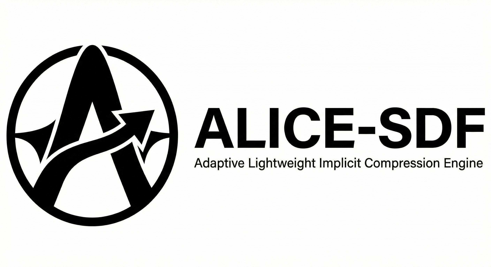

# ALICE-SDF

<p align="center">
  
</p>

[English](README.md) | **日本語**

**A.L.I.C.E. - Adaptive Lightweight Implicit Compression Engine**

> "ポリゴンを送るな。形の法則を送れ。"

## 概要

ALICE-SDFは、ポリゴンメッシュの代わりに**形状の数学的記述**（符号付き距離関数 = SDF）を伝送する3D/空間データスペシャリストです。これにより以下が実現されます:

- **10〜1000倍の圧縮** - 従来のメッシュフォーマットと比較
- **無限解像度** - あらゆるスケールで数学的に完全な形状
- **CSG演算** - メッシュオーバーヘッドなしの形状ブーリアン演算
- **リアルタイムレイマーチング** - GPU加速レンダリング
- **PBRマテリアル** - UE5/UE6/Unity/Godot互換のメタリック-ラフネスワークフロー
- **キーフレームアニメーション** - タイムライントラック付きパラメトリック変形
- **アセットパイプライン** - OBJ、glTF 2.0 (.glb)、FBX、USD、Alembic、Nanite、STL、PLY、3MF、ABM、Unity、UE5/UE6エクスポート
- **マニフォールドメッシュ保証** - バリデーション、修復、品質メトリクス
- **適応型マーチングキューブ** - オクツリーベースのメッシュ生成、必要な箇所にディテールを集中
- **Dual Contouring** - QEFベースのメッシュ生成、シャープエッジとコーナーを保持
- **V-HACD凸分解** - 物理用自動凸包分解
- **属性保存デシメーション** - UV/タンジェント/マテリアル境界保護付きQEM
- **デシメーションベースLOD** - 高解像度ベースメッシュからのプログレッシブLODチェーン
- **72プリミティブ、24演算、7トランスフォーム、23モディファイア**（126 total） - 業界最高水準のシェイプボキャブラリ
- **5層メッシュ永続化** - ABMバイナリフォーマット、LODチェーン永続化、FIFO排出チャンクキャッシュ、Unity/UE5/UE6ネイティブエクスポート
- **Chamfer & Stairsブレンド** - ハードエッジベベルおよびステップ状CSG遷移
- **区間演算（Interval Arithmetic）** - 空間プルーニング用の保守的AABB評価とリプシッツ定数追跡
- **緩和球トレーシング（Relaxed Sphere Tracing）** - リプシッツ適応ステップサイズによるオーバーリラクゼーション
- **ニューラルSDF** - 複雑シーンを~10-100倍高速に近似する純Rust MLP
- **SDF対SDFコリジョン** - 区間演算AABBプルーニング付きグリッドベース接触検出
- **CSGツリー最適化** - 恒等変換/モディファイア除去、ネスト変換マージ、Smooth→Standard降格
- **解析的勾配（Analytic Gradient）** - 連鎖律とヤコビアン伝播による単一パス勾配計算（9解析+44数値フォールバックプリミティブ）
- **自動微分（Automatic Differentiation）** - 双対数前方モードAD、ヘッシアン推定、平均曲率計算
- **2D SDFモジュール** - 純粋2Dプリミティブ（circle、rect、bezier、フォントグリフ）とバイリニアサンプリング
- **CSGツリーDiff/Patch** - アンドゥ/リドゥおよびネットワーク同期用のSDFツリー構造差分
- **パラメトリック拘束ソルバー** - 幾何拘束（固定、距離、和、比率）のガウス-ニュートン最適化
- **距離場ヒートマップ** - 4カラーマップ（coolwarm、binary、viridis、magma）による断面スライス
- **Shell / Offset Surface** - 内側/外側オフセット制御付き可変厚シェルモディファイア
- **体積・表面積** - 決定論的PRNGと標準誤差を用いたモンテカルロ推定
- **ALICE-Fontブリッジ** - フォントグリフ → 2D/3D SDF変換、テキストレイアウト、3D押し出し（`--features font`）
- **自動タイトAABB** - 区間演算＋二分探索によるSDF表面を含む最小バウンディングボックス計算
- **7つの評価モード** - インタプリタ、コンパイルVM、SIMD 8-wide、BVH、SoAバッチ、JIT、GPU
- **3つのシェーダーターゲット** - GLSL、WGSL、HLSLトランスパイル
- **エンジン統合** - Unity、Unreal Engine 5 / 6、VRChat、Godot、WebAssembly

## Text-to-3D パイプライン（サーバー）

ALICE-SDFには、LLM生成のSDFツリーを通じて**自然言語テキストを実際の3Dジオメトリに変換する**FastAPIサーバーが含まれています。

```
ユーザー: "中世の城"  →  LLM (Claude/Gemini)  →  SDF JSON  →  ALICE-SDF  →  GLB/OBJ
         テキスト           ~5-50秒              20ノード      <55ms        メッシュ
```

### アーキテクチャ

```
┌─────────────┐     ┌──────────────┐     ┌───────────────┐     ┌──────────┐
│  FastAPI     │     │  LLMサービス │     │  SDFサービス  │     │  出力    │
│  サーバー    │────▶│  Claude API  │────▶│  from_json()  │────▶│  GLB     │
│              │     │  Gemini API  │     │  compile()    │     │  OBJ     │
│  POST /gen   │     │  システム    │     │  to_mesh()    │     │  JSON    │
│  WS /ws/gen  │     │  プロンプト  │     │  export_glb() │     │  ビューア│
│  GET /viewer │     └──────────────┘     └───────────────┘     └──────────┘
└─────────────┘
```

### APIエンドポイント

| メソッド | パス | 説明 |
|--------|------|-------------|
| `POST` | `/api/generate` | テキスト → 3Dメッシュ (GLB/OBJ/JSON) |
| `POST` | `/api/validate` | SDF JSON構造のバリデーション |
| `POST` | `/api/mesh` | SDF JSON → メッシュ (GLB/OBJ) |
| `GET` | `/api/examples` | Few-shotサンプルシーン一覧 |
| `GET` | `/api/viewer` | Three.js GLBビューア（ブラウザ） |
| `GET` | `/api/health` | サーバーヘルスチェック |
| `WS` | `/ws/generate` | プログレッシブプレビュー付きストリーミング生成 |

### 生成シーンギャラリー

Gemini 2.5 Flashが自然言語プロンプトから生成したシーン:

| プロンプト | ノード数 | 頂点数 | 三角形数 | LLM時間 |
|--------|-------|----------|-----------|----------|
| "A medieval castle with towers" | 18 | 2,105 | 4,248 | 49.4秒 |
| "A robot standing on a platform" | 18 | 750 | 1,184 | 17.5秒 |
| "An underwater coral reef scene" | 15 | 2,666 | 5,166 | 63.3秒 |
| "A simple mushroom on grass" | 9 | 8,237 | 16,224 | 6.6秒 |
| "火山地帯に宇宙船" | 22 | 10,466 | 20,618 | 20.5秒 |

手作りFew-shotサンプル（LLMシステムプロンプトで使用）:

| シーン | 説明 | ノード数 | 頂点数 | 三角形数 |
|-------|-------------|-------|----------|-----------|
| `sphere_on_ground` | 平面上の球体 (Union + Plane) | 4 | 1,270 | 2,448 |
| `snowman` | 3球体の雪だるま (SmoothUnion) | 8 | 422 | 840 |
| `castle_tower` | 胸壁付きの塔 (PolarRepeat) | 11 | 1,030 | 2,244 |
| `alien_mushroom_forest` | キノコグリッド (RepeatFinite + Torusステム) | 9 | 4,167 | 7,854 |
| `twisted_pillar` | ねじれた箱 + 浮遊する中空球 (Twist + Onion) | 7 | 510 | 968 |
| `mechanical_gear` | 歯と軸穴のあるギア (PolarRepeat + Subtraction) | 9 | 465 | 912 |

シーンJSONファイルは [`server/examples/scenes/`](server/examples/scenes/) に格納されています。

### クイックスタート（サーバー）

```bash
# 1. Pythonバインディングをビルド
cd /path/to/ALICE-SDF
python -m venv .venv && source .venv/bin/activate
maturin develop --features python

# 2. サーバー依存関係をインストール
pip install -r server/requirements.txt

# 3. APIキーを設定
export ANTHROPIC_API_KEY="sk-..."   # Claude用
export GOOGLE_API_KEY="AI..."       # Gemini用

# 4. サーバー起動
uvicorn server.main:app --reload

# 5. テキストから3D生成
curl -X POST http://localhost:8000/api/generate \
  -H "Content-Type: application/json" \
  -d '{"prompt": "雪だるま", "provider": "gemini", "resolution": 64}' \
  -o snowman.glb

# 6. ブラウザビューアを開く
open http://localhost:8000/api/viewer
```

### LLMプロバイダー

| プロバイダー | モデル | 速度 | 最適な用途 |
|----------|-------|-------|----------|
| Claude | Haiku 4.5 | ~2-5秒 | シンプルなシーン、高速イテレーション |
| Claude | Sonnet 4.5 | ~5-15秒 | 複雑なシーン、高精度 |
| Gemini | 2.5 Flash | ~5-50秒 | 複雑なシーン（思考モデル） |
| Gemini | 2.5 Pro | ~10-60秒 | 最高品質 |

### パフォーマンスバジェット

| ステップ | 時間 | 備考 |
|------|------|-------|
| LLM推論 | 2-60秒 | モデルと複雑さに依存 |
| JSON解析 | <1ms | serde_json |
| SDFコンパイル | ~1ms | SdfNode → CompiledSdf |
| メッシュ生成 (res=64) | ~45ms | 並列マーチングキューブ |
| GLBエクスポート | ~5ms | |
| **合計（LLM除く）** | **<55ms** | リアルタイム対応可能 |

### 堅牢性機能

- **JSON修復**: 切り詰められたLLM出力の括弧自動補完
- **構造バリデーション**: ブーリアン演算(a/b)とトランスフォーム(child)をRust serdeの前に事前検証
- **フィードバック付きリトライ**: エラーメッセージをLLMにフィードバックして最大2回リトライ
- **レート制限処理**: 429エラー時の自動待機リトライ
- **複雑度制約**: システムプロンプトでシーンを15-20ノード、ネスト深度≤6に制限

### サーバーディレクトリ構造

```
server/
├── main.py                  # FastAPIアプリ、REST + WebSocketエンドポイント
├── config.py                # APIキー、モデル設定（環境変数）
├── models.py                # Pydantic リクエスト/レスポンスモデル
├── services/
│   ├── llm_service.py       # Claude/Gemini API（リトライロジック付き）
│   └── sdf_service.py       # alice_sdfラッパー（パース、メッシュ、エクスポート）
├── prompts/
│   ├── system_prompt.py     # 36ノードタイプのSDF文法（LLM用）
│   └── examples.py          # 6つのFew-shotサンプル
├── examples/
│   └── scenes/              # ビルド済みシーンJSONファイル
│       ├── sphere_on_ground.json
│       ├── snowman.json
│       ├── castle_tower.json
│       ├── alien_mushroom_forest.json
│       ├── twisted_pillar.json
│       └── mechanical_gear.json
├── static/
│   └── viewer.html          # Three.js GLBビューア
├── tests/
│   ├── test_api.py          # 7つのAPIエンドポイントテスト
│   ├── test_llm_service.py  # 17のJSON抽出/バリデーションテスト
│   └── test_sdf_service.py  # 13のSDFパイプラインテスト
└── requirements.txt
```

### テスト実行

```bash
source .venv/bin/activate
python -m pytest server/tests/ -v   # 37テスト、全パス
```

## ALICE-View（リアルタイム3Dビューア）

**[ALICE-View](../ALICE-View)** はwgpuで構築されたネイティブGPUレイマーチングビューアです。WGSLトランスパイルにより、メッシュ変換なしでSDFツリーをGPU上で直接レンダリングします。

```
SDF JSON → ALICE-SDF (WGSLトランスパイル) → wgpu GPUレイマーチング → リアルタイム3D
              ~1ms                               60 FPS
```

### 機能

- **GPUレイマーチング** — SdfNodeツリーをWGSLシェーダーにトランスパイル、GPU上でピクセルごとに評価
- **ドラッグ&ドロップ** — `.json` / `.asdf` / `.asdf.json` ファイルをウィンドウにドロップ
- **ファイルダイアログ** — File > Open (Ctrl+O) フォーマットフィルター付き
- **カメラ操作** — マウスオービット、スクロールズーム、WASD移動
- **ライブSDFパネル** — ノード数、レイマーチングパラメータ（最大ステップ、イプシロン、AO）

### サポートフォーマット

| 拡張子 | フォーマット | 説明 |
|-----------|--------|-------------|
| `.json` | SDF JSON | Text-to-3Dパイプライン出力、Few-shotサンプル |
| `.asdf.json` | ALICE SDF JSON | ネイティブALICE-SDF JSONフォーマット |
| `.asdf` | ALICE SDFバイナリ | CRC32付きコンパクトバイナリ |
| `.alice` / `.alz` | ALICEレガシー | 手続き型コンテンツ（Perlin、Fractal） |

### クイックスタート

```bash
cd /path/to/ALICE-View

# 特定のファイルを開く
cargo run --bin alice-view -- path/to/scene.json

# 空で起動してファイルをドラッグ&ドロップ
cargo run --bin alice-view
```

### キーボードショートカット

| キー | アクション |
|-----|--------|
| `W/A/S/D` | カメラ移動 |
| `マウスドラッグ` | カメラオービット |
| `スクロール` | ズームイン/アウト |
| `Ctrl+O` | ファイルダイアログを開く |
| `Q` | 終了 |

### Text-to-3D結果の閲覧

Text-to-3Dパイプラインで生成されたシーンJSONファイルを直接閲覧できます:

```bash
# 生成シーンを表示
cargo run --bin alice-view -- /path/to/ALICE-SDF/server/examples/scenes/snowman.json

# または以下のファイルをウィンドウにドラッグ:
#   server/examples/scenes/castle_tower.json
#   server/examples/scenes/mechanical_gear.json
#   server/examples/scenes/alien_mushroom_forest.json
```

---

## コアコンセプト

### SDF（符号付き距離関数）

SDFは任意の点から表面までの最短距離を返します:
- **負** = 形状の内部
- **ゼロ** = 表面上
- **正** = 形状の外部

### SdfNodeツリー構造

```
SdfNode
  |-- プリミティブ (68): Sphere, Box3D, Cylinder, Torus, Plane, Capsule, Cone, Ellipsoid,
  |                    RoundedCone, Pyramid, Octahedron, HexPrism, Link, Triangle, Bezier,
  |                    RoundedBox, CappedCone, CappedTorus, InfiniteCylinder, RoundedCylinder,
  |                    TriangularPrism, CutSphere, CutHollowSphere, DeathStar, SolidAngle,
  |                    Rhombus, Horseshoe, Vesica, InfiniteCone, Heart, Gyroid,
  |                    Tube, Barrel, Diamond, ChamferedCube, SchwarzP, Superellipsoid, RoundedX,
  |                    Pie, Trapezoid, Parallelogram, Tunnel, UnevenCapsule, Egg,
  |                    ArcShape, Moon, CrossShape, BlobbyCross, ParabolaSegment,
  |                    RegularPolygon, StarPolygon, Stairs, Helix,
  |                    Tetrahedron, Dodecahedron, Icosahedron,                    ← プラトン立体 (GDF)
  |                    TruncatedOctahedron, TruncatedIcosahedron,                 ← アルキメデス立体
  |                    BoxFrame,                                                   ← IQワイヤーフレームボックス
  |                    DiamondSurface, Neovius, Lidinoid, IWP, FRD,              ← TPMS曲面
  |                    FischerKochS, PMY,                                          ← TPMS曲面
  |                    Circle2D, Rect2D, Segment2D, Polygon2D,                   ← 2Dプリミティブ（押し出し）
  |                    RoundedRect2D, Annular2D                                    ← 2Dプリミティブ（押し出し）
  |-- 演算 (24): Union, Intersection, Subtraction,
  |              SmoothUnion, SmoothIntersection, SmoothSubtraction,
  |              ChamferUnion, ChamferIntersection, ChamferSubtraction,
  |              StairsUnion, StairsIntersection, StairsSubtraction,
  |              ExpSmoothUnion, ExpSmoothIntersection, ExpSmoothSubtraction,     ← IQ指数スムース
  |              XOR, Morph,                                                       ← ブーリアン/補間
  |              ColumnsUnion, ColumnsIntersection, ColumnsSubtraction,            ← hg_sdfカラム
  |              Pipe, Engrave, Groove, Tongue                                     ← hg_sdf高度操作
  |-- トランスフォーム (7): Translate, Rotate, Scale, ScaleNonUniform,
  |                        ProjectiveTransform,                                    ← 逆行列付き射影変換
  |                        LatticeDeform,                                          ← 自由形状変形（FFD）グリッド
  |                        SdfSkinning                                             ← ボーンウェイトスケルタル変形
  |-- モディファイア (23): Twist, Bend, RepeatInfinite, RepeatFinite, Noise, Round, Onion, Elongate,
  |                   Mirror, Revolution, Extrude, Taper, Displacement, PolarRepeat, SweepBezier,
  |                   Shear,                                                       ← 3軸せん断変形
  |                   OctantMirror,                                                ← 48重対称性
  |                   IcosahedralSymmetry,                                         ← 120重正二十面体対称性
  |                   IFS,                                                         ← 反復関数系フラクタル
  |                   HeightmapDisplacement,                                       ← ハイトマップ駆動表面変位
  |                   SurfaceRoughness,                                            ← FBMノイズラフネス
  |                   Animated,                                                    ← タイムライン駆動パラメータアニメーション
  |                   WithMaterial                                                 ← PBRマテリアル割り当て
```

## インストール

### Rust

```bash
cargo add alice-sdf
```

### Python

```bash
pip install alice-sdf
```

## 使い方

### ALICE-LOL DSL で書く（推奨）

SDF シーンを作る最も簡単な方法は [ALICE-LOL](https://github.com/ext-sakamoro/ALICE-LOL) です。`lol!` proc_macro で SDF ツリーを宣言的に記述でき、手動で `SdfNode` を組み立てる必要がありません。

```toml
# Cargo.toml
[dependencies]
alice-sdf = { path = "../ALICE-SDF" }
alice-lol = { path = "../ALICE-LOL/alice-lol" }
```

**従来（手動で SdfNode を構築）:**

```rust
use alice_sdf::prelude::*;

let scene = SdfNode::SmoothUnion {
    k: 0.3,
    children: vec![
        SdfNode::sphere(1.0),
        SdfNode::Translate {
            offset: glam::Vec3::new(2.0, 0.0, 0.0),
            child: Box::new(SdfNode::Round {
                radius: 0.05,
                child: Box::new(SdfNode::box3d(0.8, 0.8, 0.8)),
            }),
        },
    ],
};
```

**LOL DSL で書くと:**

```rust
use alice_lol::{lol, to_glsl, eval};

let scene = lol! {
    smooth_union(0.3,
        sphere(1.0),
        translate(2.0, 0.0, 0.0, round(0.05, box3d(0.8, 0.8, 0.8)))
    )
};
```

同じ `SdfNode` ツリーが、わずかなコードで完成します。76 構文（27 プリミティブ、23 CSG オペレーション、4 トランスフォーム、19 モディファイア、2 時間制御、3 法則制約）がすべて関数呼び出しで使えます。

**GPU シェーダにトランスパイル:**

```rust
let glsl = to_glsl(&scene);                      // GLSL
let wgsl = alice_lol::to_wgsl(&scene);            // WGSL (WebGPU)
let hlsl = alice_lol::to_hlsl(&scene);            // HLSL (DirectX)
```

**CPU で距離を評価:**

```rust
let dist = eval(&scene, glam::Vec3::new(0.0, 1.0, 0.0));
```

**Rust の変数を実行時に注入:**

```rust
let radius = 1.5_f32;
let height = compute_height();
let scene = lol! {
    smooth_union(0.2,
        sphere({radius}),
        translate(0.0, {height}, 0.0, cylinder(2.0, 0.5))
    )
};
```

**形状の制約をチェック:**

```rust
use alice_lol::law::{LawSet, Law, Priority};

let laws = LawSet::new()
    .add(Law::non_overlap(&a, &b), Priority::Hard)        // 形状が重ならないこと
    .add(Law::min_thickness(&scene, 0.1), Priority::Soft(0.5));  // 壁厚 >= 0.1
let report = laws.check();
```

LOL の詳細は [ALICE-LOL README](https://github.com/ext-sakamoro/ALICE-LOL) を参照してください。

---

### Rust（直接 SdfNode を構築する場合）

LOL DSL でカバーされていない高度なノード型を使う場合や、細かい制御が必要な場合は `SdfNode` を直接構築できます:

```rust
use alice_sdf::prelude::*;

// 半径1の球体を作成
let sphere = SdfNode::sphere(1.0);

// 箱でくり抜く
let result = sphere.subtract(SdfNode::box3d(1.5, 1.5, 1.5));

// ある点での距離を評価
let distance = eval(&result, glam::Vec3::ZERO);

// メッシュに変換
let mesh = sdf_to_mesh(
    &result,
    glam::Vec3::splat(-2.0),
    glam::Vec3::splat(2.0),
    &MarchingCubesConfig::default()
);
```

### Python

```python
import alice_sdf as sdf

# プリミティブを作成
sphere = sdf.SdfNode.sphere(1.0)
box3d = sdf.SdfNode.box3d(2.0, 1.0, 1.0)

# CSG演算（メソッド構文）
result = sphere.subtract(box3d)

# 演算子オーバーロード（Python的な構文）
a = sdf.SdfNode.sphere(1.0)
b = sdf.SdfNode.box3d(0.5, 0.5, 0.5)
union     = a | b    # a.union(b)
intersect = a & b    # a.intersection(b)
subtract  = a - b    # a.subtract(b)

# トランスフォーム
translated = result.translate(1.0, 0.0, 0.0)

# 点群で評価（NumPy配列）
import numpy as np
points = np.array([[0.5, 0.0, 0.0], [1.0, 1.0, 1.0]], dtype=np.float32)
distances = sdf.eval_batch(translated, points)

# コンパイル評価（繰り返し使用時2-5倍高速）
compiled = sdf.compile_sdf(sphere)
distances = compiled.eval_batch(points)               # コンパイルバッチ
vertices, indices = compiled.to_mesh((-2,-2,-2), (2,2,2), resolution=64)  # コンパイルメッシュ

# メッシュに変換
vertices, indices = sdf.to_mesh(translated, (-2.0, -2.0, -2.0), (2.0, 2.0, 2.0))

# 複数フォーマットにエクスポート
sdf.export_obj(vertices, indices, "model.obj")
sdf.export_glb(vertices, indices, "model.glb")
sdf.export_fbx(vertices, indices, "model.fbx")
sdf.export_usda(vertices, indices, "model.usda")
sdf.export_alembic(vertices, indices, "model.abc")

# UV展開 → (positions[N,3], uvs[N,2], indices[M])
positions, uvs, indices = sdf.uv_unwrap(vertices, indices)
```


詳細な技術セクション (マテリアル / アニメーション / アーキテクチャ / メッシュモジュール / プラトン立体 / 区間演算 / ニューラル SDF / コリジョン / 解析的勾配 / Dual Contouring / CSG最適化 / 自動タイト AABB / テクスチャフィッティング / レイマーチング / FFI / フィーチャーフラグ / 物理ブリッジ / 3D プリントパイプライン / パフォーマンス / ベンチマーク / Unity / VRChat / UE5・UE6 / Godot / クロスクレートブリッジ / Asset Delivery Network / Nanite ハイブリッドパイプライン) は [`docs/USAGE_JP.md`](docs/USAGE_JP.md) を参照。

## ライセンス

**オープンコアモデル** - クリエイターは無料、インフラは有償。

| コンポーネント | ライセンス | 用途 |
|-----------|---------|----------|
| **コアエンジン**（Rust） | MITライセンス | 自由に改変可能！ |
| **Unity統合** | ALICEコミュニティライセンス | インディー・ゲーム開発は無料 |
| **エンタープライズ / クラウドインフラ** | 商用ライセンス | 価格はお問い合わせください |

### 無料利用（ライセンス不要）

- 個人プロジェクト
- インディーゲーム開発（収益に関係なく）
- AAAゲームスタジオ（出荷ゲーム）
- 教育・研究
- オープンソースプロジェクト

### 商用ライセンスが必要

- メタバースプラットフォーム（10,000+ MAU）
- クラウドストリーミングサービス（SaaS/PaaS）
- インフラプロバイダー
- 競合製品

詳細は[LICENSE](LICENSE)（MIT）および[LICENSE-COMMUNITY](LICENSE-COMMUNITY)を参照。

**あなたが作成するコンテンツ（.asdfファイル、ワールド、ゲーム）は100%あなたのものです。ロイヤリティはありません。**

## LLM × 3D制作パイプライン（SDF + LOL + View + Physics）

4つのALICEプロジェクトを組み合わせることで、自然言語から物理シミュレーション付き3Dシーンまでの**エンドツーエンド**ワークフローが完成します:

```
ユーザー: 「シルクハットをかぶった雪だるま」
         │
         ▼
┌──────────────────┐  LOL DSL or JSON  ┌───────────────────┐  WGSL / GLB   ┌──────────────┐
│  LLM             │ ────────────────▶ │  ALICE-SDF        │ ────────────▶ │  ALICE-View  │
│  (Claude/Gemini) │                   │  parse → compile  │               │  GPUプレビュー│
│                  │                   │  → mesh / shader  │               │  60 FPS      │
└──────────────────┘                   └────────┬──────────┘               └──────────────┘
                                                │
                                                │ SdfField トレイト
                                                │ (feature = "physics")
                                                ▼
                                       ┌───────────────────┐
                                       │  ALICE-Physics     │
                                       │  Fix128 XPBD       │
                                       │  SDF CCD / 力場    │
                                       │  破壊 / 流体       │
                                       └───────────────────┘
```

| コンポーネント | 役割 |
|--------------|------|
| **[ALICE-LOL](https://github.com/ext-sakamoro/ALICE-LOL)** | LLM向けDSL — JSONより少ないトークンで低ハルシネーション率。`runtime_parser::parse_lol()` でLLMテキスト出力を `SdfNode` にランタイム変換 |
| **ALICE-SDF** | コアエンジン — SIMD/BVH/JIT評価、メッシュ生成（Marching Cubes / Dual Contouring）、GLSL/WGSL/HLSLトランスパイル、GLB/OBJ/STLエクスポート |
| **[ALICE-View](https://github.com/ext-sakamoro/ALICE-View)** | リアルタイムGPUレイマーチングビューア — JSON/ASDFファイルをドラッグ&ドロップで即座にプレビュー |
| **[ALICE-Physics](https://github.com/ext-sakamoro/ALICE-Physics)** | 決定論的128bit固定小数点物理エンジン — `SdfField` トレイトでSDF形状がそのまま衝突ジオメトリに。SDF CCD、力場、破壊、布、流体シミュレーション |

LLMで生成した形状は見た目だけではなく、**物理シミュレーション対応**です。`CompiledSdfField` ラッパーがSDFをO(1)衝突クエリ面として公開するため、凸分解なしで剛体・破壊・流体のインタラクションが可能です。

### クイックスタート

```bash
# 1. Text-to-3Dサーバー起動（LLMでLOL/JSON生成）
cd ALICE-SDF/server
python main.py

# 2. プロンプトをPOST — SDF JSONが返る
curl -X POST http://localhost:8000/api/generate \
  -H "Content-Type: application/json" \
  -d '{"prompt": "シルクハットをかぶった雪だるま", "format": "json"}'

# 3. リアルタイムで結果を確認
cd ALICE-View
cargo run --bin alice-view -- ../ALICE-SDF/server/output/latest.json
```

### プログラマティック（Rust）

```rust
use alice_lol::runtime_parser::parse_lol;
use alice_sdf::prelude::*;
use alice_sdf::physics_bridge::CompiledSdfField;

// LLM出力（テキスト） → SdfNode
let lol_text = r#"smooth_union(0.3, sphere(1.0), translate(0.0, 1.5, 0.0, sphere(0.7)))"#;
let scene = parse_lol(lol_text).unwrap();

// レンダリング用GPUシェーダー
let wgsl = alice_lol::to_wgsl(&scene);

// メッシュエクスポート
let mesh = alice_sdf::mesh::sdf_to_mesh(
    &scene,
    glam::Vec3::splat(-3.0),
    glam::Vec3::splat(3.0),
    &MeshConfig::default(),
);

// 物理対応の衝突形状（凸分解不要）
let field = CompiledSdfField::new(scene);
// field.distance(x, y, z)            → f32        (1回評価)
// field.distance_and_normal(x, y, z) → (f32, Vec3) (4回評価、四面体法)
```

### なぜJSONよりLOLか？

| 指標 | JSON (SdfNode) | LOL DSL |
|------|---------------|---------|
| 形状あたりトークン数 | ~120 | ~30 |
| LLMエラー率 | 高（括弧ネスト） | 低（関数呼び出しスタイル） |
| ランタイムパース | `serde_json` | `runtime_parser::parse_lol()` |
| コンパイル時マクロ | — | `lol! { ... }` |

複雑なシーンではLOLは**3〜4倍少ないトークン**で記述でき、LLMのコストとハルシネーションの両方を削減します。

---

## Mobile (iOS / Android)

ALICE-SDF は [UniFFI](https://mozilla.github.io/uniffi-rs/) ベースの mobile SDK を同梱しており、Rust コアを **Swift** (iOS) と **Kotlin** (Android) から直接呼び出せます。

### 対応ターゲット

| プラットフォーム | アーキテクチャ | 配布物 |
|-----------------|-------------|--------|
| **iOS** | `aarch64-apple-ios` (実機), `aarch64-apple-ios-sim`, `x86_64-apple-ios` | `AliceSDF.xcframework` (static lib + Swift bindings) |
| **Android** | `arm64-v8a`, `armeabi-v7a`, `x86_64`, `x86` | `libuniffi_alice_sdf.so` + Kotlin bindings |

### 実機動作確認済 (2026-06-06)

| プラットフォーム | デバイス | 結果 |
|-----------------|---------|------|
| iOS | iPhone 17 Pro Simulator (iOS 26.0, Xcode 26.2) | ✅ アプリ起動、2D SDF スライス描画 ([screenshot](mobile/samples/ios-swiftui/screenshots/AliceSDF-demo.png)) |
| Android | Pixel 6 emulator (Android 14 / API 34, arm64-v8a) | ✅ アプリ起動、2D SDF スライス描画 ([screenshot](mobile/samples/android-compose/screenshots/AliceSDF-android-demo.png)) |

両プラットフォームで **完全に同じ数値** (`sphere d = 0.2806`、`smooth_union(k=0.3) = 0.2056`) を出力 — Rust コアの Apple Silicon / Android ARM 間移植正確性を実機で実証。

### Swift クイックスタート

```swift
import AliceSDF

let d = sdfSphere(
    point:  Vec3(x: 1, y: 0, z: 0),
    center: Vec3(x: 0, y: 0, z: 0),
    radius: 1.0
)
// d ≈ 0 (球面上の点)

let blended = opSmoothUnion(a: 0.5, b: 0.6, k: 0.1)
// blended < 0.5 (smooth union が min より下に引っ張る)
```

### Kotlin クイックスタート

```kotlin
import uniffi.alice_sdf.*

val d = sdfSphere(
    point  = Vec3(1f, 0f, 0f),
    center = Vec3(0f, 0f, 0f),
    radius = 1.0f
)
// d ≈ 0

val blended = opSmoothUnion(a = 0.5f, b = 0.6f, k = 0.1f)
```

### SDK ビルド

```bash
# iOS XCFramework (実機 + シミュレータ)
cd mobile/packaging/ios && ./build-xcframework.sh

# Android .so + Kotlin bindings (4 ABI)
export ANDROID_NDK_HOME=/opt/homebrew/share/android-ndk
cd mobile/packaging/android && ./build-aar.sh
```

サンプルアプリ・統合手順は [`mobile/`](mobile/) を参照。

---

## Web (WebAssembly) / VFX (OpenVDB) / Bevy エンジン

### `wasm` feature — WebAssembly バインディング

ブラウザ側で SDF 評価 + スライス描画。`wasm-bindgen` ベース。

```bash
cargo build --target wasm32-unknown-unknown --no-default-features --features wasm
```

JavaScript 使用例:

```js
import init, { sdf_sphere, op_smooth_union, render_sphere_slice_rgba } from './alice_sdf.js';
await init();
const d = sdf_sphere(1, 0, 0, /*center*/ 0, 0, 0, /*radius*/ 1.0);  // ≈ 0
const rgba = render_sphere_slice_rgba(256, 256, 0, 0, 0, 1.0, 2.5);  // Uint8Array (canvas へ putImageData)
```

### `openvdb` feature — OpenVDB Float Grid I/O

SDF を voxel grid に bake、Houdini / Maya / Nuke / Blender 等の VFX/DCC ツール連携。

```rust
use alice_sdf::io::vdb::{bake_to_vdb, load_dense_grid_from_vdb};
use alice_sdf::prelude::*;

let node = SdfNode::sphere(1.0);
let bytes = bake_to_vdb(&node, (-2.0, 2.0), 64).unwrap();
std::fs::write("sphere.vdb", &bytes).unwrap();
```

[`vdb-rs`](https://crates.io/crates/vdb-rs) 0.6 (pure Rust) ベース。現状は `ALICEVDB1` コンパクト形式、`vdb-rs` の write API 整備に合わせて OpenVDB 正規バイナリへ移行予定。

### `alice-sdf-bevy` — Bevy 0.18 プラグイン

`SdfShape` Component を持つ Entity を spawn すれば、自動的に Mesh が生成・attach される ECS 統合。

```rust
use bevy::prelude::*;
use alice_sdf_bevy::{AliceSdfPlugin, SdfShape};

fn main() {
    App::new()
        .add_plugins(DefaultPlugins)
        .add_plugins(AliceSdfPlugin)
        .add_systems(Startup, |mut commands: Commands| {
            commands.spawn(SdfShape::Sphere { radius: 1.0 });
        })
        .run();
}
```

`bindings/bevy/alice-sdf-bevy/examples/sphere_demo.rs` にカメラ + ライト付きの 3 形状デモあり。

### 3D Gaussian Splatting (`.splat`)

SDF 表面を Inria 3DGS 互換 `.splat` ファイル (32 bytes/splat: position + scale + RGBA + 圧縮 quat) に変換。WebGL ベースのビューア (gsplat.tech / SuperSplat / antimatter15/splat) に drag&drop で即読込可能。

```rust
use alice_sdf::io::splat::{sdf_to_splats, save_splat, SplatConfig};
use alice_sdf::prelude::*;

let node = SdfNode::sphere(1.0);
let cfg = SplatConfig { bounds: (-2.0, 2.0), resolution: 64, base_color: [220, 220, 240, 255] };
let splats = sdf_to_splats(&node, &cfg);
save_splat("sphere.splat", &splats).unwrap();
```

### Blender アドオン (`bindings/blender/`)

Blender 4.0+ アドオン。`.asdf` を直接 import + N-panel に "ALICE-SDF" タブを追加して sphere / box / torus を生成。`alice_sdf` Python モジュール (`cargo build --release --features python`) が前提。

インストール: `alice_sdf_blender/` を zip 化し、`Edit > Preferences > Add-ons > Install...` から有効化。

### Houdini Python プラグイン (`bindings/houdini/`)

SideFX Houdini 20+ 用 Python モジュール + Python SOP body (`.asdf` ローダー / プリミティブ生成)。`install.sh` が `$HSITE` / `$HOUDINI_USER_PREF_DIR` を自動検出してコピー。

```python
import alice_sdf_hou
sdf = alice_sdf_hou.sphere(1.0)
alice_sdf_hou.sdf_to_hou_geo(sdf, hou.pwd().geometry(), bounds=(-2.0, 2.0), resolution=64)
```

### MagicaVoxel `.vox` IO

SDF を voxelize して MagicaVoxel `.vox` (v150 RIFF) で書き出し。indie / voxel art パイプライン向け。

```rust
use alice_sdf::io::vox::{sdf_to_vox, save_vox, VoxConfig};
use alice_sdf::prelude::*;

let node = SdfNode::sphere(1.0);
let cfg = VoxConfig { size: 64, bounds: (-1.5, 1.5), color_index: 79 };
save_vox("sphere.vox", &sdf_to_vox(&node, &cfg)).unwrap();
```

### `@alice-sdf/threejs` — Three.js / React Three Fiber ラッパー

`wasm` feature の上の TypeScript npm パッケージ。型付き `AliceSDF` クラス + Three.js `DataTexture` ヘルパ + R3F 用 `<AliceSDFSlicePlane>` + WebXR raymarching ヘルパを提供。

```ts
import { AliceSDF } from "@alice-sdf/threejs";
const sdf = await AliceSDF.load("/alice_sdf.js");
const tex = await sdf.createSliceTexture(512, 512, [0, 0, 0], 1.0, 2.5);
scene.add(new THREE.Mesh(new THREE.PlaneGeometry(2, 2), new THREE.MeshBasicMaterial({ map: tex })));
```

### Maya Python プラグイン (`bindings/maya/`)

Autodesk Maya 2024+ 用 Python モジュール — メイン メニューに「ALICE-SDF」を登録し、`MFnMesh` API でポリゴンメッシュを直接構築。

```python
import alice_sdf_maya
alice_sdf_maya.register_menu()
alice_sdf_maya.add_sphere(radius=1.5, resolution=64)
```

### Nuke Python プラグイン (`bindings/nuke/`)

Foundry Nuke 15 / 16+ 用 Python モジュール — `.asdf` をボリュームバイナリと 2D RGBA スライスへ書き出し、VFX コンポジット連携。

```python
import alice_sdf_nuke
alice_sdf_nuke.export_asdf_as_volume("/path/to/model.asdf", out_path="/tmp/model.alicevdb")
```

### Cinema 4D Python プラグイン (`bindings/cinema4d/`)

Maxon Cinema 4D 2024 / 2025 / 2026+ 用 Python モジュール — SDF プリミティブから `PolygonObject` を生成、`.asdf` を直接 C4D シーンに読み込み。

```python
import alice_sdf_c4d
alice_sdf_c4d.add_sphere(radius=100.0, resolution=64)   # C4D 単位は cm
alice_sdf_c4d.import_asdf("/path/to/model.asdf", bounds=(-300.0, 300.0), resolution=128)
```

### CAD 交換 — STEP / IGES (FEM 風メッシュエクスポート)

SDF tree を Marching Cubes で tessellate して以下のいずれかを書き出し可能:

- **STEP AP203** (ISO 10303-21 ASCII) — `CARTESIAN_POINT` + `POLY_LOOP` + `FACE_OUTER_BOUND` の三角形メッシュ。**注:** これは faceted mesh 表現であり、本格的な `ADVANCED_FACE` / `MANIFOLD_SOLID_BREP` BREP ではない。faceted STEP を受け入れるツール (FreeCAD、一部 Rhino plugin、mesh-aware CAD viewer) は開けるが、`MANIFOLD_SOLID_BREP` を厳格に要求するツールは拒否する場合あり。BREP wrap 化は今後 (`docs/PUBLISH.md` 参照)
- **IGES** (Entity 134 Node + Entity 136 Finite Element) — FEM mesh entity。FEM ソルバや該当 entity 対応 viewer 向け。Entity 144 (Trimmed Surface) を期待する標準 CAD では未対応

両方とも unit test で round-trip 検証済みだが、実 CAD ツールでの相互運用は個別検証が必要。

```rust
use alice_sdf::io::step::{export_step, StepConfig};
use alice_sdf::io::iges::{export_iges, IgesConfig};
use alice_sdf::prelude::*;

let node = SdfNode::sphere(1.0);
export_step("sphere.step", &node, &StepConfig::default()).unwrap();
export_iges("sphere.igs",  &node, &IgesConfig::default()).unwrap();
```

### `alice-sdf-openxr` — Native VR / AR ヘルパー (`bindings/openxr/`)

[`openxr`](https://crates.io/crates/openxr) Rust バインディングの上に乗る薄いヘルパー。Meta Quest standalone (Android APK)、PC VR (SteamVR / Oculus PC)、Microsoft Mixed Reality、Apple Vision Pro (OpenXR backend) で動く。

```rust
use alice_sdf_openxr::{XrPose, raymarch_sphere};
use glam::Vec3;

// XR frame コールバック内で
let head_pose: XrPose = openxr_pose.into();
let hit_dist = raymarch_sphere(head_pose, Vec3::new(0.0, 1.5, -1.0), 0.3, 5.0);
if hit_dist > 0.0 {
    // コントローラ / ヘッドが球を見ている
}
```

### `AliceSDFVisionOS` — Apple Vision Pro SwiftPM パッケージ (`mobile/swift-package-visionos/`)

iOS / iPadOS / macOS と同じ `AliceSDF.xcframework` を再利用しつつ、visionOS / RealityKit 向けの `ModelEntity` ファクトリヘルパーを追加した SwiftPM パッケージ。

```swift
import SwiftUI
import RealityKit
import AliceSDFVisionOS

struct ImmersiveView: View {
    var body: some View {
        RealityView { content in
            let sphere = AliceSDFRealityKit.makeSphereEntity(radius: 0.1)
            sphere.position = SIMD3(0, 1.5, -1.0)
            content.add(sphere)
        }
    }
}
```

### REST API サーバー (`server/`)

`axum` + `tokio` ベースの HTTP サーバー。ALICE-SDF の primitive 評価と operation を JSON で公開。クラウド配信型 SDF UI (例: `alicelaw.net/sdf-metaverse`) のバックエンドを想定。

```bash
cd server && cargo run --release
# → ALICE-SDF server listening on http://0.0.0.0:8787
```

```http
POST /eval
Content-Type: application/json

{ "shape": "sphere", "point": [1, 0, 0], "params": { "radius": 1.0, "center": [0, 0, 0] } }
```

レスポンス: `{ "distance": 0.0 }`

---

## 関連プロジェクト

| プロジェクト | 説明 | リンク |
|-------------|------|--------|
| **ALICE-LOL** | Law-Oriented Language — `lol!` proc_macro DSL で SDF シーンを宣言的に記述（76 構文、GLSL/WGSL/HLSL トランスパイル、法則制約、空間枝刈り） | [GitHub](https://github.com/ext-sakamoro/ALICE-LOL) |
| **Open Source SDF Assets** | ALICE-SDFで変換した991個のCC0 3Dアセット（.asdf.json形式） | [GitHub](https://github.com/ext-sakamoro/Open-Source-SDF-Assets) |
| **ALICE Ecosystem** | 52コンポーネントのエッジtoクラウドデータパイプライン | [GitHub](https://github.com/ext-sakamoro/ALICE-Eco-System) |
| **AI Modeler SaaS** | ALICE-SDFを搭載したブラウザベース3Dモデリング | [GitHub](https://github.com/ext-sakamoro/AI-Modeler-SaaS) |
| **ALICE SDF Metaverse** | ブラウザ実行デモ — WebGL2 レイマーチング世界 + JS 側 CCD 物理、ALICE-SDF の思想をブラウザで実証 | [Demo](https://alicelaw.net/sdf-metaverse) |
| **alicelaw.net** | 個人サイトソース — Cloudflare Pages + Pages Functions QR ルーター (`/0x01`〜`/0xFF`)、SDF Metaverse デモのホスト | [GitHub](https://github.com/ext-sakamoro/alicelaw-net) |

---

Copyright (c) 2025-2026 Moroya Sakamoto — https://alicelaw.net/
