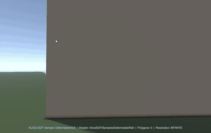
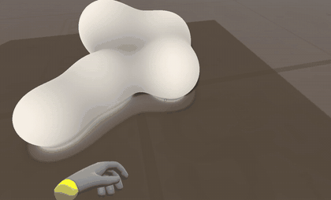
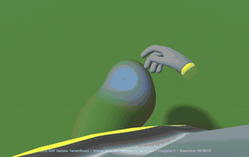

# ALICE-SDF for VRChat

**Stand on math.** A VRChat package that lets players walk on, collide with, and interact with Signed Distance Function surfaces — all via Drag & Drop.

[Japanese / 日本語版](README_JP.md)

Using a coding agent (Claude Code, Codex, Cursor) to set this up? Point it at [`AGENTS.md`](AGENTS.md): one install path with a check per step, what it can verify without Unity, the Mochi law / binding split for re-use on avatars or props, and known errors with fixes.

## Install

### Via Unity Package Manager (Recommended)

1. In Unity: **Window > Package Manager**
2. Click **+** > **Add package from disk...**
3. Select `package.json` from the ALICE-SDF folder

Or add via git URL in `Packages/manifest.json`:

```json
{
  "dependencies": {
    "com.alice.sdf": "https://github.com/ext-sakamoro/ALICE-SDF.git?path=vrchat-package"
  }
}
```

### Requirements

- Unity 2022.3.x (VRChat recommended version)
- A VRChat **Worlds** project from the Creator Companion (SDK3 with UdonSharp — needed for collision; the shader works without it)
- A project path with ASCII characters only (a non-ASCII path breaks the VRChat SDK's `UnityEventFilter` at Play, see Troubleshooting)

## Three Components

### 1. ALICE-Shader (Raymarching Kernel)

Pixel-level SDF rendering via HLSL raymarching.

- `AliceSDF_Include.cginc` — Full primitive & operation function library
- `AliceSDF_LOD.cginc` — Dynamic LOD for VRChat GPU budget (Deep Fried)
- `AliceSDF_Raymarcher.shader` — Main shader with SV_Depth output

**Deep Fried LOD**: Automatically adjusts ray step count based on camera distance.

| Distance | Steps | Epsilon | Quality |
|----------|-------|---------|---------|
| < 20m    | 128   | 0.0001  | High    |
| 20–60m   | 64    | 0.001   | Medium  |
| > 60m    | 32    | 0.005   | Low     |

### 2. ALICE-Udon (SDF Collider)

Evaluates the same SDF formula in UdonSharp (pure C#) to push players out of solid geometry.

- `AliceSDF_Primitives.cs` — 53 primitives + CSG operations + transforms (pure C#)
- `AliceSDF_Math.cs` — Vector math helpers
- `AliceSDF_Collider.cs` — Player collision detection & push-back

**How it works:**

1. Get player position **P**
2. Compute **d = SDF(P)**
3. If **d < 0** (inside), push along **gradSDF(P)** by **|d|**

### 3. ALICE-Baker v0.3 (Deep Fried Editor Tool)

Paste `.asdf.json` and auto-generate optimized Shader + Udon + Prefab.

- Open via **Window > ALICE-SDF Baker**
- Paste JSON or drag & drop a `.asdf.json` TextAsset
- Click **Bake!** to generate everything at once
- **Live preview**: code updates in real-time as you edit JSON

#### Baker v0.3 Optimizations

| Optimization | Target | Effect |
|-------------|--------|--------|
| Instruction Fusion | HLSL | Leaf nodes inlined directly — no temp variables for primitives |
| Branchless CSG | HLSL | `opUnion` expanded to `min()`, `opSubtraction` to `max(a, -(b))` |
| Division Exorcism | HLSL | `1/k` pre-computed at top of `map()` for smooth operations |
| Scalar Expansion | Udon | `Sdf.Union()` replaced with `Mathf.Min()` — eliminates function call overhead |
| Smooth Op Inline | Udon | `SmoothUnion/Intersection/Subtraction` fully expanded as scalar math with pre-computed `inv_k` |
| Translate Scalarization | Udon | `Vector3` subtraction split into `float x,y,z` when child is a leaf — reduces Udon VM struct copies |
| Smart Float Format | Both | `0.000000` becomes `0.0`, `1.500000` becomes `1.5` |
| Live Preview | Editor | JSON changes detected via hash — preview updates automatically |

## Samples (SDF Gallery)

Seven ready-to-play samples are included. Import via **Package Manager > Samples** tab.

| Sample | Description | SDF Formula |
|--------|-------------|-------------|
| **Basic** | Ground plane + floating sphere. The simplest SDF world. | `min(plane, sphere)` |
| **Cosmic** | Animated solar system — Sun, orbiting planet, tilted ring, moon, asteroid belt. | `SmoothUnion(sun, planet, ring, moon, asteroids)` |
| **Fractal** | A Menger Sponge labyrinth with twist deformation, seen from a viewing platform. | `Subtract(Box, Repeat(Cross))` — one formula, infinite complexity |
| **Mix** | Cosmic x Fractal fusion — fractal planet + torus ring + onion shell. | `SmoothUnion(Intersect(Sphere, Menger), Torus, Onion(Sphere))` |
| **DeformableWall** | Touch, punch (mouse) or walk into the wall and it dents. Dents recover over time. | `min(ground, SmoothSubtract(wall, dent_spheres...))` |
| **Mochi** | Squishy mochi blobs. Grab, merge, split, and grow. SmoothUnion soft-body physics. | `SmoothUnion(ground, SmoothUnion(mochi1, mochi2, ..., k))` |
| **TerrainSculpt** | Dig holes & build hills with VR hands or the mouse. You fall into holes you dig. **Only possible with SDF.** | `SmoothUnion(SmoothSub(plane, digs...), hills...)` |

Each sample includes:
- `*_Raymarcher.shader` — Raymarching shader with SV_Depth, LOD, AO, fog; every sample has `Cull Off` (the volume renders from inside), the closest-approach acceptance (no dark seam on silhouettes), a `Light Direction` property and, where there is a ground, a soft contact shadow
- `*_Collider.cs` — UdonSharp collider (with `#if UDONSHARP` guard). The four static samples derive from the package's `AliceSDF_Collider`: the body is sampled from the feet to the eyes and the deepest wall-like contact pushes the player back sideways (a floor-like contact is left to the scene's floor / platform collider, so nothing bobs). Cosmic and Mix animate; their colliders follow the shader through `animTime` (`Time.timeSinceLevelLoad`, the shader's `_Time.y`), so the orbiting planet pushes you where it is drawn
- `*.asdf.json` — Source definition for the Baker
- a Rust golden (`examples/vrchat_<sample>_golden.rs`) and a host parity check (`HostTests~`) that the collider's law is the crate's law

The scene generator gives every sample a `VRCSceneDescriptor` with a spawn, a floor collider where the SDF has a ground (Basic, Mochi, DeformableWall) and a viewing platform under the spawn in the space scenes (Cosmic, Fractal, Mix; their skybox is cleared so a raymarch miss is black). Walking off the platform is a long fall to the respawn height — standing on the SDF itself is only implemented for TerrainSculpt.

### Interactive Samples (VR and desktop)

The **DeformableWall**, **Mochi**, and **TerrainSculpt** samples demonstrate real-time SDF deformation driven by VR hand tracking or the mouse. Unlike the static samples above, these send dynamic data from UdonSharp to the shader every frame via `Material.SetVectorArray`.

#### DeformableWall — Touch & Dent



**Play it in VRChat:** published as the world **DeformableWall** — [vrchat.com/home/world/wrld_3fd67c2b-f712-4d6c-be7f-202eb2ecb2b9](https://vrchat.com/home/world/wrld_3fd67c2b-f712-4d6c-be7f-202eb2ecb2b9) (private while testing: the author and invited friends; press **Launch** on the page or **Invite Me** with the client open). PC only.

A flat wall standing on a ground plane. Touch it with a VR hand, punch it with the mouse, or walk into it: a dent appears at the contact and gradually recovers. The dents are real geometry — you collide with the dented wall, not the flat one.

**How it works:**
1. An impact is registered when a hand (or the view cursor with the left button held) is within `Impact Distance` of the wall's undented face and outside the hollow of every live dent — so a hand following a fresh dent inward does not drill through the 0.4 m wall; hitting within half a radius of a live dent refreshes it instead of using another slot
2. Each dent is (position, strength); strength starts at 1 and recovers as `exp(-Decay Speed * t)`; below 0.01 the slot is free (up to 16 live dents, the weakest is replaced when full)
3. Each frame the array is sent to the shader via `Material.SetVectorArray("_ImpactPoints", ...)` together with the wall size, `Dent Radius` and `Dent Smoothness`, so collision and rendering cannot drift
4. The shader carves each dent with `opSmoothSubtraction(wall, sphere(Dent Radius * strength))`, then presses the local player's body capsule in the same way
5. The collider samples the player's body from the feet to the eyes against the dented wall and pushes the deepest point out sideways (never up), with a dead band so the push stops

**Interaction:**

| Action | VR | Desktop | What Happens |
|--------|----|---------|--------------|
| **Dent** | Hand near the face | Hold left click, look at the wall | A dent at the contact, glowing while fresh |
| **Hammer** | Keep hitting the same spot | Keep the button held | The dent is refreshed to full depth (one slot), never deeper than one radius |
| **Many** | Hit around | Look around with the button held | Up to 16 dents at once, the weakest is recycled |
| **Recover** | Wait | Wait | Dents shrink back into the flat wall |
| **Lean in** | Walk into the wall | Walk into the wall | Your body presses a capsule-shaped groove into it and you are pushed back |

**Inspector Parameters:**

| Parameter | Default | Description |
|-----------|---------|-------------|
| Wall Width / Height / Thickness | 5 / 2.5 / 0.2 | Half extents of the wall (sent to the shader every frame) |
| Impact Distance | 0.08 | How close the hand / cursor must be to the undented face to register |
| Impact Cooldown | 0.15s | Minimum time between impacts from the same hand |
| Decay Speed | 0.15 | Recovery: strength decays as exp(-speed * t) — half strength after 4.6 s, gone after ~30 s (0.5 was gone in 3 s) |
| Dent Radius | 0.35 | Dent radius at full strength |
| Dent Smooth | 0.08 | SmoothSubtraction blend of a dent — pushed to the material every frame |
| Cursor Max Dist | 4.0 | Desktop: how far the view ray looks for the wall |
| Collision Margin / Push Strength / Body Samples | 0.1 / 1.0 / 5 | Player push-out: the body is sampled from the feet to the eyes |
| Player Radius / Body Dent K | 0.3 / 0.12 | The body capsule the shader presses into the wall (local only) |
| Log Events | off | One `Debug.Log` line per impact / click miss / push / ownership / received as `[Wall] ...` — grep the VRChat client `output_log_*.txt` |

**Shader parameters:** `Light Direction`, `Enable Soft Shadow` (the wall's shadow on the ground), `Fog Density`; the raymarcher has the same closest-approach acceptance and hard-union ambient occlusion as Mochi (no dark seam on the wall's edges, no dark ring around a dent).

#### Mochi — Grab, Merge, Split & Grow



**Play it in VRChat:** the sample is published as the world **Mochi** — [vrchat.com/home/world/wrld_0cb72970-948e-4212-b955-fd3dd567aa42](https://vrchat.com/home/world/wrld_0cb72970-948e-4212-b955-fd3dd567aa42), in **Community Labs** since 2026-09-18 (search for "Mochi" with Labs enabled in your settings, or open the link and press **Launch**). PC only (the raymarcher is not built for Quest).

Soft mochi (rice cake) blobs sitting on a ground plane. Grab them, pull them apart, push them together, and watch them grow — in VR with your hands, on desktop with the mouse (11 s from the VRChat client above: walking in dents the mochi around your body, a click grabs, a fast turn splits, carrying one onto another merges).

**How it works:**
1. Up to 16 mochi spheres are tracked as `(position, radius)` pairs
2. All mochis are blended together using `opSmoothUnion` — nearby mochis naturally appear to merge visually
3. Ground contact uses a separate `opSmoothUnion` with a lower `k` for a "squishy sitting on the floor" look
4. UdonSharp sends the mochi array to the shader every frame via `Material.SetVectorArray("_MochiData", ...)`

**VR Interaction:**

| Action | How | What Happens |
|--------|-----|--------------|
| **Grab** | Hold hand inside a mochi for 0.08s | Mochi sticks to your hand |
| **Move** | Move hand while grabbing | Mochi follows your hand |
| **Split** | Grip (VR) / right click (desktop) while holding | Mochi splits into two pieces (volume conserved: `r_new = r * cbrt(0.5)`), the other half stays where it was grabbed |
| **Release** | VR: carry it 4x radius, then flick the hand out (a slow hand grabs it again at once) / desktop: button up | Mochi drops and settles to the ground |
| **Merge** | Push two free mochis close together | They merge into one bigger mochi (`r = cbrt(r1^3 + r2^3)`) |
| **Grow** | Keep merging mochis | The merged mochi gets bigger and bigger |
| **Walk in** | Walk into a mochi | Your body dents it and it slides away by the mass ratio; you are pushed back |

**Desktop:** hold Use (left click) on a mochi — the point on your view ray nearest its centre becomes a virtual right hand, so Grab / Move / Split / Release / Merge above work by moving the view; releasing the button drops the mochi. Right click (InputDrop on desktop; the grip, InputGrab, in VR) splits the mochi you hold. With Log Events on, a release line says whether it was split while held and how far it was carried.

**Inspector Parameters:**

| Parameter | Default | Description |
|-----------|---------|-------------|
| Blend K | 0.5 | SmoothUnion factor between mochis (higher = stickier) — pushed to the material every frame, so collision and rendering always agree |
| Ground K | 0.15 | SmoothUnion factor with ground (squishy floor contact) — pushed to the material every frame |
| Min Radius | 0.1 | Smallest allowed mochi (won't split below this) |
| Grab Threshold | 0.8 | Hand must be within this fraction of radius to grab |
| Grab Dwell Time | 0.08s | Hold time before grab activates (prevents accidental grabs) |
| Split On Pull | off | The old tear-on-pull: pulling 2.5x radius from the grab point also splits (off, because carrying with the desktop cursor crosses that in a glance) |
| Split Distance | 2.5 | Pull distance (x radius) for Split On Pull |
| Release Distance | 4.0 | Carry distance (x radius) at which a VR hand drops the mochi; the desktop cursor drops on button up only |
| Merge Threshold | 0.7 | Distance (x combined radii) for auto-merge |
| Log Events | off | One `Debug.Log` line per grab / split / release / merge / click / push as `[Mochi] ...` — grep the VRChat client `output_log_*.txt` to see what happened without a debugger |

**Material Parameters** (shader only):

| Parameter | Default | Description |
|-----------|---------|-------------|
| Light Direction | (1, 1, -0.5) | Directional light for the wrap / diffuse shading |
| Enable Soft Shadow | 1 | Contact shadow from mochi onto the ground (32 / 16 / 8 steps by LOD tier) |
| Shadow Softness | 16 | Penumbra width (higher = sharper) |
| Shadow Max Distance | 10 | Shadow ray length |
| Fog Density | 0.005 | Exponential distance fog |

#### TerrainSculpt — Dig Holes & Build Hills

**The first VRChat experience where you can dig a hole and actually fall into it.**



**Play it in VRChat:** published as the world **TerrainSculpt** — [vrchat.com/home/world/wrld_6c134920-6d49-4d66-8b5d-11bbf79ef061](https://vrchat.com/home/world/wrld_6c134920-6d49-4d66-8b5d-11bbf79ef061) (private while testing: the author and invited friends; press **Launch** on the page or **Invite Me** with the client open). PC only.

A flat ground plane that players can sculpt in real-time — with VR hands or with the mouse. Both rendering and collision use the exact same SDF formula: what you see is what you stand on, even as the terrain changes.

This is fundamentally impossible with VRChat's mesh-based approach because MeshColliders cannot be recalculated at runtime. ALICE-SDF evaluates the same math for both pixels and physics.

**How it works:**
1. Base terrain is a ground plane at Y=0
2. Add → `opSmoothUnion(terrain, sphere)` — a hill at the hand / cursor
3. Dig → `opSmoothSubtraction(terrain, sphere)` — a hole at the hand / cursor
4. Operations are stored in a circular buffer (`Sculpt Capacity`, default 96, up to 128). When full, oldest operations are overwritten
5. UdonSharp sends the operation array to the shader every frame
6. Standing on it: VRChat's player controller needs a Unity collider under its feet, so the script moves a small invisible box (`TerrainSupport`) every frame onto the highest SDF surface under the foot (five points across `Foot Radius`, so a ridge carries you until your feet really leave it). Dig under yourself and the box drops with the terrain — you fall. Build under yourself and you are lifted onto the new top. The steep flank of a tall hill pushes you back like a wall; anything lower than a 0.3 m step you simply walk up

**Interaction:**

| Action | VR | Desktop | What Happens |
|--------|----|---------|--------------|
| **Dig** | Right hand near ground | Hold right click, look at the ground | A hemispherical hole is carved. You can fall in |
| **Build** | Left hand near ground | Hold left click, look at the ground | A hill appears. You can climb it |
| **Sculpt deeper** | Keep the right hand in the hole | Right click again on the hole | Dig deeper with each operation |
| **Build higher** | Keep the left hand on the mound | Left click again on the mound | Stack more terrain on top |
| **Paint** | Sweep the hand along the ground | Hold the button and look around | A trench or a ridge follows the hand / view (one operation every 0.12 s, on desktop only once the cursor has moved 0.75 r on) |

**Visual feedback:**
- Blue glow = add (left hand, or the view cursor while the left button is held or nothing is held)
- Red glow = dig (right hand, or the view cursor while the right button is held)
- In VR the glow only appears when the hand is near the terrain surface; on desktop the cursor is the point where the view meets the terrain (within `Cursor Max Dist`)

**Terrain coloring:**
- Green grass on flat surfaces
- Brown dirt on steep slopes
- Gray rock when digging deep underground

**Inspector Parameters:**

| Parameter | Default | Description |
|-----------|---------|-------------|
| Sculpt Radius | 0.3 | Size of each sculpt brush stroke |
| Sculpt Distance | 0.15 | How close the hand / cursor must be to the terrain surface to sculpt |
| Sculpt Cooldown | 0.12s | Minimum time between operations of one hand (prevents buffer spam) |
| Add Smooth | 0.25 | SmoothUnion blend for hills (higher = smoother) — pushed to the material every frame, so collision and rendering always agree |
| Sub Smooth | 0.15 | SmoothSubtraction blend for holes (higher = smoother edges) |
| Sculpt Capacity | 96 | Operations kept (1-128); beyond it the oldest is overwritten. Every ray step and every collision sample folds them all, so this is the GPU / Udon cost knob |
| Cursor Max Dist | 6.0 | Desktop: how far the view ray looks for terrain |
| Support | (scene) | The invisible collider that follows the player (the generator creates `TerrainSupport`; by hand: any box collider, assign it here or name it `TerrainSupport`) |
| Support Height | 0.2 | Thickness of that box; its top is placed on the surface |
| Foot Radius | 0.12 | Half-width of the foot: the support takes the highest surface under five points across it (centre and ±x / ±z), so a ridge holds you until your feet fully leave it instead of the floor flicking at its edge |
| Log Events | off | One `Debug.Log` line per add / dig / click / lift / wall push as `[Terrain] ...` — grep the VRChat client `output_log_*.txt` |

**Shader parameters:** `Light Direction` (match your scene light), `Enable Soft Shadow` (hills cast contact shadows on the ground, 48 / 24 / 12 steps by LOD tier), `Fog Density`. The raymarcher accepts the closest approach of a ray that runs out of steps within a pixel of the surface, so hill silhouettes have no dark seam, and its ambient occlusion samples the hard union so the smooth blend at the foot of a hill does not read as a dark ring.

**Scene requirements:** the terrain *is* the floor — do not put a floor collider at y = 0 in a TerrainSculpt world (you could never fall into a hole). Spawn players a little above the terrain (y ≈ 0.5). The sample scene generator sets this up; the volume cube is (20, 10, 20), so holes are limited to 2 m deep and hills to 8 m high.

#### Setup (All Interactive Samples)

1. Place a **Cube** in your scene (this is the raymarching bounding volume)
2. Scale it to cover the desired area (e.g. `(12, 8, 12)` for DeformableWall, `(20, 10, 20)` for TerrainSculpt)
3. Create a **Material** from `AliceSDF/Samples/DeformableWall`, `AliceSDF/Samples/Mochi`, or `AliceSDF/Samples/TerrainSculpt`
4. Assign the material to the Cube's **MeshRenderer**
5. Add the corresponding `*_Collider.cs` script to the same GameObject
6. **Build & Test** in VRChat — VR hands or, on desktop, the mouse

**Desktop mode:** every interactive sample works on desktop: Mochi — click (Use) on a mochi to grab it, move the view to drag it, right click to split it, release the button to drop it; TerrainSculpt — hold left click to build and right click to dig where you look; DeformableWall — hold left click to punch the wall where you look, or walk into it.

**Multiplayer note:** Mochi is synced (owner-authoritative manual sync: the mochi arrays are `[UdonSynced]`, the owner runs gravity and merging and serializes at 10 Hz while anything changed; grabbing or walking into a mochi takes ownership once per grab / contact, so the last player to act drives the state and everyone else sees it and is pushed by it; late joiners receive the current state; each player's body dent is drawn locally only). In practice one player sculpts at a time — two players holding different mochis at once will see the other's mochi freeze until they grab again. TerrainSculpt is synced the same way (the sculpt buffer is `[UdonSynced]`; whoever sculpts takes ownership at the start of a stroke and serializes at 10 Hz while anything changed; everyone stands on the same terrain). DeformableWall is synced too (the dent array is `[UdonSynced]`; whoever hits the wall takes ownership for that contact and serializes at 10 Hz while any dent is alive; everyone else recovers the dents locally between packets so they shrink smoothly; each player's body groove is local).

### Generate Sample Scenes

After importing samples, generate ready-to-play scenes:

1. **ALICE-SDF > Import All Samples** (Unity menu) — imports every sample that is not yet in `Assets/Samples/`; the Package Manager Samples tab does the same one by one
2. **ALICE-SDF > Generate Sample Scenes**
3. Scenes are created in `Assets/AliceSDF_SampleScenes/`
4. Open any `SDF_*.unity` scene and press **Play**

Both menus have headless entry points for scripts and agents (two invocations, the imported scripts compile in between; exit code 1 on failure):

```
Unity -batchmode -quit -nographics -projectPath <project> -executeMethod AliceSDF.Editor.SampleSceneGenerator.ImportAllSamplesBatch
Unity -batchmode -quit -nographics -projectPath <project> -executeMethod AliceSDF.Editor.SampleSceneGenerator.GenerateAllBatch
```

The generator auto-detects which samples have been imported and creates a scene with Camera, Light, and a Cube with the SDF shader applied. For DeformableWall / Mochi / TerrainSculpt it also sizes the Cube as in the setup above and adds the `*_Collider` UdonSharp behaviour, so the manual steps 1-5 are done for you; the mochis / dents / sculpting appear at Play.

## Quick Start

### Manual Setup

1. Create a Material from `AliceSDF_Raymarcher.shader`
2. Place a Cube in the scene (bounding volume)
3. Assign the material to the Cube
4. Attach `AliceSDF_Collider.cs` to a GameObject
5. Write your SDF formula in the `Evaluate()` method (must match the shader's `map()`)

### ALICE-Baker (Recommended)

1. **Window > ALICE-SDF Baker**
2. Paste your `.asdf.json`
3. Click **Bake!** — Shader + Udon + Prefab are generated
4. Drag the generated Prefab into your scene

## File Structure (UPM)

```
com.alice.sdf/
├── package.json                     # UPM manifest
├── CHANGELOG.md
├── README.md / README_JP.md
├── AGENTS.md                        # For coding agents: verifiable install path, law/binding split, known errors
├── Runtime/
│   ├── AliceSDF.Runtime.asmdef      # Assembly Definition
│   ├── Shaders/
│   │   ├── AliceSDF_Include.cginc   # SDF function library
│   │   ├── AliceSDF_LOD.cginc       # Deep Fried dynamic LOD
│   │   └── AliceSDF_Raymarcher.shader # Main raymarching shader
│   └── Udon/
│       ├── AliceSDF_Math.cs         # Vector math helpers
│       ├── AliceSDF_Primitives.cs   # SDF functions (C#)
│       └── AliceSDF_Collider.cs     # Player collision
├── Editor/
│   ├── AliceSDF.Editor.asmdef       # Editor Assembly Definition
│   ├── AliceSDF_Baker.cs            # Baker v0.3 (Deep Fried)
│   └── SampleSceneGenerator.cs      # Menus: ALICE-SDF > Import All Samples / Generate Sample Scenes (+ *Batch for -executeMethod)
├── Samples~/                        # UPM Samples (import via Package Manager)
│   └── SDF Gallery/
│       ├── SampleBasic/             # Ground + Sphere
│       ├── SampleCosmic/            # Solar system
│       ├── SampleFractal/           # Menger Sponge labyrinth
│       ├── SampleMix/              # Cosmic x Fractal fusion
│       ├── SampleDeformableWall/    # Interactive: touch wall → dent → recover
│       ├── SampleMochi/            # Interactive: grab, merge, split, grow
│       └── SampleTerrainSculpt/   # Interactive: dig holes, build hills, fall in
├── HostTests~/                      # Runs without Unity: Mochi collider vs alice_sdf golden (scripts/vrchat-host-parity.sh)
└── Documentation~/                  # README media (Unity skips ~ folders)
```

## Supported Primitives (53)

| Primitive | HLSL | C# | Formula |
|-----------|------|----|---------|
| Sphere    | `sdSphere`     | `Sdf.Sphere`     | `length(p) - r` |
| Box       | `sdBox`        | `Sdf.Box`        | Branchless min/max |
| Cylinder  | `sdCylinder`   | `Sdf.Cylinder`   | Capped vertical |
| Torus     | `sdTorus`      | `Sdf.Torus`      | XZ ring |
| Plane     | `sdPlane`      | `Sdf.Plane`      | `dot(p,n) + d` |
| Capsule   | `sdCapsule`    | `Sdf.Capsule`    | Line segment + r |
| Cone      | `sdCone`       | `Sdf.Cone`       | Capped Y-axis cone |
| Ellipsoid | `sdEllipsoid`  | `Sdf.Ellipsoid`  | Bound-corrected approx |
| HexPrism  | `sdHexPrism`   | `Sdf.HexPrism`   | Hexagonal prism (Z-axis) |
| Triangle  | `sdTriangle`   | `Sdf.Triangle`   | Exact 3D triangle |
| Bezier    | `sdBezier`     | `Sdf.Bezier`     | Quadratic curve + radius |
| RoundedCone | `sdRoundedCone` | `Sdf.RoundedCone` | Smooth-capped cone (r1, r2) |
| Pyramid   | `sdPyramid`    | `Sdf.Pyramid`    | 4-sided Y-axis pyramid |
| Octahedron | `sdOctahedron` | `Sdf.Octahedron` | Regular octahedron |
| Link      | `sdLink`       | `Sdf.Link`       | Chain link (torus + Y stretch) |
| RoundedBox | `sdRoundedBox` | `Sdf.RoundedBox` | Box with rounded edges |
| CappedCone | `sdCappedCone` | `Sdf.CappedCone` | Frustum (two radii + height) |
| CappedTorus | `sdCappedTorus` | `Sdf.CappedTorus` | Torus arc segment |
| InfiniteCylinder | — (inline) | `Sdf.InfiniteCylinder` | Infinite cylinder (XZ) |
| RoundedCylinder | `sdRoundedCylinder` | `Sdf.RoundedCylinder` | Cylinder with rounded edges |
| TriangularPrism | `sdTriangularPrism` | `Sdf.TriangularPrism` | Z-axis triangular prism |
| CutSphere | `sdCutSphere` | `Sdf.CutSphere` | Sphere with planar cut |
| CutHollowSphere | `sdCutHollowSphere` | `Sdf.CutHollowSphere` | Hollow sphere with cut |
| DeathStar | `sdDeathStar` | `Sdf.DeathStar` | Sphere with spherical carving |
| SolidAngle | `sdSolidAngle` | `Sdf.SolidAngle` | 3D cone sector |
| Rhombus   | `sdRhombus`    | `Sdf.Rhombus`    | 3D rhombus with rounding |
| Horseshoe | `sdHorseshoe`  | `Sdf.Horseshoe`  | Horseshoe / arc shape |
| Vesica    | `sdVesica`     | `Sdf.Vesica`     | Vesica piscis (lens) |
| InfiniteCone | `sdInfiniteCone` | `Sdf.InfiniteCone` | Infinite cone (Y-axis) |
| Heart     | `sdHeart`      | `Sdf.Heart`      | 3D heart (revolution) |
| Gyroid    | — (inline)     | `Sdf.Gyroid`     | Gyroid minimal surface |
| Tube      | `sdTube`       | `Sdf.Tube`       | Hollow cylinder (outer_r, thickness) |
| Barrel    | `sdBarrel`     | `Sdf.Barrel`     | Barrel with bulge |
| Diamond   | `sdDiamond`    | `Sdf.Diamond`    | Diamond / double cone |
| ChamferedCube | `sdChamferedCube` | `Sdf.ChamferedCube` | Box with chamfered edges |
| SchwarzP  | — (inline)     | `Sdf.SchwarzP`   | Schwarz P minimal surface |
| Superellipsoid | — (inline) | `Sdf.Superellipsoid` | Sphere↔Box morph (e1, e2) |
| RoundedX  | — (inline)     | `Sdf.RoundedX`   | Rounded X/cross shape |
| Pie       | `sdPie`        | `Sdf.Pie`        | Sector / fan shape |
| Trapezoid | `sdTrapezoid`  | `Sdf.Trapezoid`  | Trapezoid prism |
| Parallelogram | `sdParallelogram` | `Sdf.Parallelogram` | Skewed rectangle prism |
| Tunnel    | `sdTunnel`     | `Sdf.Tunnel`     | Tunnel / archway |
| UnevenCapsule | `sdUnevenCapsule` | `Sdf.UnevenCapsule` | Capsule with two radii |
| Egg       | `sdEgg`        | `Sdf.Egg`        | Egg (revolution) |
| ArcShape  | `sdArcShape`   | `Sdf.ArcShape`   | Arc / bridge |
| Moon      | `sdMoon`       | `Sdf.Moon`       | Crescent moon |
| CrossShape | `sdCrossShape` | `Sdf.CrossShape` | 3D cross / plus sign |
| BlobbyCross | `sdBlobbyCross` | `Sdf.BlobbyCross` | Organic cross |
| ParabolaSegment | `sdParabolaSegment` | `Sdf.ParabolaSegment` | Parabolic arch |
| RegularPolygon | `sdRegularPolygon` | `Sdf.RegularPolygon` | N-sided polygon prism |
| StarPolygon | `sdStarPolygon` | `Sdf.StarPolygon` | Star polygon prism |
| Stairs    | `sdStairs`     | `Sdf.Stairs`     | Staircase shape |
| Helix     | `sdHelix`      | `Sdf.Helix`      | Spiral tube (spring) |

## Supported Operations (17)

| Operation | HLSL | C# | Effect |
|-----------|------|----|--------|
| Union              | `opUnion` / `min`             | `Sdf.Union` / `Mathf.Min`     | Combine shapes |
| Intersection       | `opIntersection` / `max`      | `Sdf.Intersection` / `Mathf.Max` | Intersect shapes |
| Subtraction        | `opSubtraction` / `max(a,-b)` | `Sdf.Subtraction` / `Mathf.Max(a,-(b))` | Carve out |
| Smooth Union       | `opSmoothUnion`               | `Sdf.SmoothUnion` (inlined by Baker) | Smooth blend |
| Smooth Intersection| `opSmoothIntersection`        | `Sdf.SmoothIntersection` (inlined) | Smooth intersect |
| Smooth Subtraction | `opSmoothSubtraction`         | `Sdf.SmoothSubtraction` (inlined) | Smooth carve |
| Repeat Infinite    | `opRepeatInfinite`            | `Sdf.RepeatInfinite`          | Infinite tiling |
| Repeat Finite      | `opRepeatFinite`              | `Sdf.RepeatFinite`            | Bounded tiling |
| Polar Repeat       | `opPolarRepeat`               | `Sdf.PolarRepeat`             | Circular array (Y-axis) |
| Twist              | `opTwist`                     | `Sdf.Twist`                   | Y-axis twist |
| Bend               | `opBend`                      | `Sdf.Bend`                    | X-axis bend |
| Round              | `opRound`                     | `Sdf.Round`                   | Round edges |
| Onion              | `opOnion`                     | `Sdf.Onion`                   | Hollow shell |
| Taper              | `opTaper`                     | `Sdf.Taper`                   | Y-axis taper |
| Displacement       | `opDisplacement`              | `Sdf.Displacement`            | Noise surface |
| Symmetry           | `opSymmetry`                  | `Sdf.Symmetry`                | Axis mirroring |
| Elongate           | `opElongate`                  | `Sdf.Elongate`                | Stretch along axes |

## VRChat Compatibility

- **No native plugins**: Everything runs as Shader + UdonSharp — no DllImport
- **SV_Depth output**: Proper depth buffer occlusion with VRM avatars
- **`#if UDONSHARP` guard**: Compiles without VRC SDK installed (MonoBehaviour stub)
- **Performance Rank safe**: Deep Fried LOD keeps GPU within budget at any distance

## v1.1.0 Compatibility

ALICE-SDF v1.1.0 added 7 advanced operations to the native Rust compiled evaluator:

| Operation | Rust/FFI | VRChat (Shader+Udon) | Notes |
|-----------|----------|----------------------|-------|
| ProjectiveTransform | Yes | No | Requires aux_data buffer (compiled evaluator) |
| LatticeDeform | Yes | No | Variable-length control point grid |
| SdfSkinning | Yes | No | Bone-weight skeletal deformation |
| IcosahedralSymmetry | Yes | No | 120-fold fold requires 60 matrix multiplications |
| IFS | Yes | No | Iterated Function System with N transform matrices |
| HeightmapDisplacement | Yes | No | Bilinear heightmap sampling from aux_data |
| SurfaceRoughness | Yes | No | FBM noise with child distance |

These operations rely on the compiled bytecode VM with auxiliary data buffers and are not available in the VRChat UdonSharp sandbox. All existing primitives (53), CSG operations (17), and basic transforms/modifiers remain fully functional in VRChat.

## Troubleshooting

| Symptom | Cause | Fix |
|---------|-------|-----|
| `Illegal byte sequence` from `UnityEventFilter` / `Assembly.GetCodeBase` at Play | Non-ASCII characters in the project path | Move the project to an ASCII path and re-add it in the Creator Companion |
| `The type or namespace name 'UdonSharp' could not be found` | Not a VRChat Worlds project, or the package was copied into `Assets/` | Create the project with the Creator Companion (Worlds) and install through `Packages/manifest.json` |
| `[ALICE-SDF] Shader 'AliceSDF/Samples/Mochi' not found` | Sample not imported | **ALICE-SDF > Import All Samples**, then generate again |
| After a package update the sample behaves like the old version | Package Manager never overwrites `Assets/Samples/ALICE-SDF for VRChat/<old version>/` | Delete that folder, import again, generate the scene again (re-import assigns new shader GUIDs) |
| `EPERM` while resolving packages, then many `UnityEditor.TestTools` errors | A registry package download was locked mid-rename, `com.unity.test-framework` is missing | Back up `Packages/packages-lock.json`, delete the broken entry, focus Unity, Ctrl+R |
| **Build & Test** disabled | The VRChat client is not installed on this machine | Install the client |
| Desktop click never grabs a mochi (`[Mochi] click miss`) | The view ray misses every mochi, or the hold is shorter than Grab Dwell Time | Aim at the mochi's centre and hold the button |

More (with `grep`-able strings and the reasoning) in [`AGENTS.md`](AGENTS.md) §5.

## License

ALICE Community License

## Author

Moroya Sakamoto

- Website: https://alicelaw.net/
